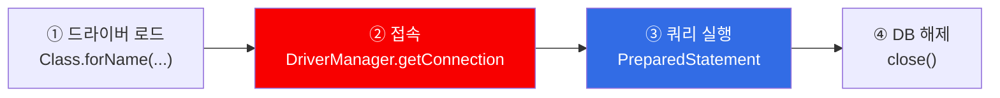

## 📌 들어가며

이번 글에서는 Oracle/MySQL로 작업하던 것을 **자바와 연동(JDBC)**해, 자바에서 DB에 데이터를 **추가(insert)**하고 **조회(select)**한다.

> **JDBC(Java Database Connectivity)란?**
> 자바로 데이터베이스를 연동하는 기술. `java.sql` 패키지에서 지원한다.

**DB 연동은 항상 4단계**를 따른다.



---

## 1. INSERT — 자바에서 DB에 추가

GUI(Swing)로 책 이름·가격을 입력받아 Oracle의 `book` 테이블에 넣는다. (코드가 길어 보이지만 대부분 Frame 디자인이고, 핵심은 `connect()`와 `insert()`다.)

### ① 접속 — connect()

```java
public void connect() {
    try {
        Class.forName("oracle.jdbc.driver.OracleDriver");   // ① 드라이버 로드
        con = DriverManager.getConnection(                  // ② 접속
            "jdbc:oracle:thin:@localhost:1521:XE", "batman", "1234");
    } catch (ClassNotFoundException e) {
        JOptionPane.showMessageDialog(this, "드라이버를 찾을 수 없습니다.");
    } catch (SQLException e) {
        JOptionPane.showMessageDialog(this, "SQL에 접속할 수 없습니다.");
    }
}
```

접속 URL을 뜯어보면 이렇다.

| 부분 | 값 | 의미 |
|------|------|------|
| 프로토콜 | `jdbc:oracle:thin` | Oracle thin 드라이버 |
| 호스트 | `@localhost` | 내 컴퓨터 |
| 포트 | `1521` | Oracle 기본 포트 |
| SID | `XE` | Oracle XE 버전 |
| | `"batman", "1234"` | 계정 / 비밀번호 |

> 💡 `Class.forName(...)`은 프로젝트에 설치한 **드라이버(java↔DB 다리)를 로드**한다. `DriverManager.getConnection`은 접속 후 **`Connection` 객체를 반환**하므로, 멤버변수 `con`에 담는다. `con`에 값이 잘 들어갔으면 접속 성공이다.

### ② 삽입 — insert()

```java
public void insert() {
    String name_value = book_name.getText();
    int price_value = Integer.parseInt(price.getText());   // String → int

    String sql = "insert into book(book_id, book_name, price) " +
                 "values(seq_book.nextval, '" + name_value + "', " + price_value + ")";
    PreparedStatement pstmt = null;
    try {
        if (con != null) {
            pstmt = con.prepareStatement(sql);       // 쿼리 준비
            int result = pstmt.executeUpdate();      // DML 실행 (insert/update/delete)
            if (result > 0) JOptionPane.showMessageDialog(this, "등록 성공");
            else            JOptionPane.showMessageDialog(this, "등록 실패");
        }
    } catch (SQLException e) {
        e.printStackTrace();
    } finally {
        if (pstmt != null) try { pstmt.close(); } catch (SQLException e) {}
    }
}
```

| 요소 | 역할 |
|------|------|
| `PreparedStatement` | 쿼리문을 수행하는 인터페이스 |
| `executeUpdate()` | **DML(insert/update/delete)** 실행, 영향받은 **행 수**를 반환 |

> 💡 `executeUpdate()`는 정상이면 처리된 행 수(>0), 에러면 0을 반환한다. 그래서 `if(result > 0)`으로 성공/실패를 구분한다.


### 종료 시 자원 해제

```java
this.addWindowListener(new WindowAdapter() {
    public void windowClosing(WindowEvent e) {
        try { con.close(); } catch (SQLException e1) {}   // DB 자원 해제
        System.exit(0);
    }
});
```

> ⚠️ 보통은 `setDefaultCloseOperation(EXIT_ON_CLOSE)`을 쓰지만, 여기서는 **WindowListener**를 익명 클래스로 만들었다. 프로그램 종료뿐 아니라 **접속해둔 DB 자원을 직접 해제**해야 하기 때문이다.

---

## 2. SELECT — DB에서 자바로 조회

```java
Class.forName("oracle.jdbc.driver.OracleDriver");
con = DriverManager.getConnection(url, user, pass);

String sql = "select * from book";
PreparedStatement pstmt = con.prepareStatement(
    sql, ResultSet.TYPE_SCROLL_INSENSITIVE, ResultSet.CONCUR_READ_ONLY);

ResultSet rs = pstmt.executeQuery();   // select 실행 → 결과 표를 자바 메모리로

rs.next(); rs.next();                  // 커서를 2번째 행으로
System.out.println(rs.getInt("book_id"));
System.out.println(rs.getString("book_name"));

rs.previous();                         // 이전 행으로
rs.beforeFirst();                      // 커서 원상복귀 (0번째)
while (rs.next()) {                    // 처음부터 끝까지 순회
    System.out.println(rs.getInt("book_id"));
}
```

INSERT와 달라지는 점을 정리하면 이렇다.

| 항목 | INSERT | SELECT |
|------|------|------|
| 실행 메소드 | `executeUpdate()` | **`executeQuery()`** |
| 반환형 | `int`(행 수) | **`ResultSet`**(결과 표) |
| 옵션 | 없음 | `TYPE_SCROLL_INSENSITIVE`, `CONCUR_READ_ONLY` |

> 💡 `prepareStatement`의 두 옵션: `TYPE_SCROLL_INSENSITIVE`는 커서를 **위아래로 자유롭게** 움직이게 하고, `CONCUR_READ_ONLY`는 자바의 조회가 실제 서버에 영향을 주지 않도록 **읽기 전용**으로 만든다. (기본값은 전방향 전용이라 `previous()`가 에러난다.)

**ResultSet의 커서**를 이해하는 게 핵심이다.

| 메소드 | 동작 |
|------|------|
| `next()` | 커서를 한 칸 앞으로 (레코드 있으면 true) |
| `previous()` | 한 칸 뒤로 |
| `beforeFirst()` | 0번째 행(맨 앞)으로 복귀 |
| `getInt/getString("컬럼")` | 현재 행의 컬럼 값 |

> 💡 `ResultSet`의 초기 커서 위치는 **0번째 행**(첫 행이 아님)이다. 그래서 `next()`를 한 번 해야 첫 행을 만난다. `while(rs.next())`는 다음 레코드가 없을 때까지(false) 순회하므로 전체 조회에 딱 맞는다.


---

## 📝 정리

```
JDBC DB 연동 (java.sql)
├─ 4단계    드라이버 로드 → 접속 → 쿼리 실행 → 해제
├─ INSERT   PreparedStatement + executeUpdate() (행 수 반환)
├─ SELECT   executeQuery() → ResultSet (커서로 순회)
├─ 커서     초기 0번째, next()/previous()/beforeFirst()
└─ 자원      finally / windowClosing에서 close() 필수
```

| 개념 | 한 줄 정의 |
|------|------|
| **JDBC** | 자바로 DB를 연동하는 기술 |
| **Connection** | DB와의 연결 객체 |
| **executeUpdate / executeQuery** | DML 실행 / SELECT 실행 |
| **ResultSet** | 조회 결과 표(커서로 접근) |

자바에서 DB를 다루는 것은 결국 **"드라이버 로드 → 접속 → 쿼리 → 해제"** 4단계다. INSERT는 `executeUpdate`(행 수), SELECT는 `executeQuery`(ResultSet)라는 차이, 그리고 ResultSet 커서가 0번째에서 시작한다는 점만 잡으면 이후 표 구현도 어렵지 않다.
