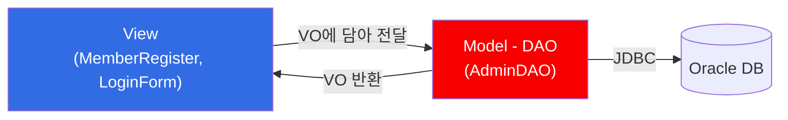

## 📌 들어가며

이번엔 알라딘 같은 **도서관리 애플리케이션**을 만든다. 힘들었지만, 실무의 핵심인 **MVC 패턴 · VO(DTO) · DAO**를 실제로 엮어보는 값진 예제다. 아직 완성은 아니지만 회원가입·로그인까지 구현했다.

> **MVC 패턴으로 패키지 분리**
> - `view` — 디자인(화면)을 담당하는 클래스들
> - `model` — 로직(DB 처리)을 담당하는 클래스들
>
> 역할을 나눠 **유지보수를 쉽게** 한다.



---

## 1. MainFrame — 탭 전환의 중심

여러 페이지를 만들고, 상단 버튼을 누르면 화면을 바꾼다. **버튼과 페이지를 인덱스로 짝지어** 관리하는 것이 핵심이다.

```java
public class MainFrame extends JFrame implements ActionListener {
    JPanel p_north, p_center;   // p_center: 모든 페이지가 공존
    JButton bt_main, bt_schedule, bt_regist, bt_cs, bt_login;

    ArrayList<JButton> btnList;   // 버튼을 규칙(숫자)으로 가리키기 위해
    ArrayList<Page> pageList;     // 페이지도 마찬가지
    Admin loginObj;               // 로그인 상태 (null이면 미로그인)

    public MainFrame() {
        // ... 버튼·페이지 생성 (각 페이지 생성자에 this 전달) ...
        bookMain = new BookMain(this);
        memberRegister = new MemberRegister(this);
        loginForm = new LoginForm(this);

        // 버튼·페이지를 순서대로 리스트에 추가 (index로 매칭)
        btnList.add(bt_main); ... btnList.add(bt_login);
        pageList.add(bookMain); ... pageList.add(loginForm);

        // 5개 페이지를 모두 p_center에 부착 → 서로 겹침
        p_center.add(bookMain); ... p_center.add(loginForm);
        add(p_center);

        for (JButton jbtn : btnList) jbtn.addActionListener(this);
        showHide(4);   // 초기화면(로그인)만 보이기
    }
    public static void main(String[] args) { new MainFrame(); }
}
```

> 💡 각 페이지 생성자에 **`this`(MainFrame 주소값)를 넘겨** 서로 연동한다. 5개 페이지를 한 패널(`p_center`)에 모두 붙이면 겹쳐서 안 보이므로, **하나만 보이게** 하는 메소드가 필요하다.

### showHide — 한 페이지만 보이기

```java
public void showHide(int n) {
    for (int i = 0; i < pageList.size(); i++) {
        pageList.get(i).setVisible(i == n);   // n번만 true, 나머지 false
    }
}
```

### actionPerformed — 버튼 → 인덱스 → 페이지

```java
@Override
public void actionPerformed(ActionEvent e) {
    JButton btn = (JButton) e.getSource();
    int index = btnList.indexOf(btn);         // 누른 버튼의 순번

    if (loginObj == null) {                    // 미로그인
        if (index == 0 || index == 1 || index == 3)
            JOptionPane.showMessageDialog(this, "로그인이 필요한 서비스입니다.");
        else showHide(index);                  // 회원가입(2)·로그인(4)만 허용
    } else {                                    // 로그인 상태
        if (index == 4) {                       // 로그아웃
            showHide(index);
            loginObj = null;
            bt_login.setText("Login");
        } else showHide(index);
    }
}
```


> 💡 `loginObj`가 null이면 미로그인이라 도서관리(0)·일정(1)·고객센터(3)를 막고, 로그인 상태면 로그아웃까지 처리한다.

---

## 2. VO(Value Object) — Admin

> **VO(DTO)란?** 로직이 아니라 **DB 레코드 한 건을 담는 용도**의 객체. 멤버변수와 getter/setter만 있다. (Value Object / Data Transfer Object)

```java
public class Admin {
    private int admin_id;
    private String id, name, password, email;
    // getter/setter만 존재 (로직 없음)
    public String getId() { return id; }
    public void setId(String id) { this.id = id; }
    // ... 나머지 getter/setter
}
```

> 💡 값을 **낱개로 전달하지 않고 하나의 VO에 담아** 전달한다. 회원가입·로그인 정보가 이 `Admin` 객체에 실려 view → DAO로 흐른다.

---

## 3. 회원가입 (MemberRegister → DAO.insert)

view에서 입력값을 VO에 담아 DAO로 넘긴다.

```java
bt_regist.addActionListener(new ActionListener() {
    public void actionPerformed(ActionEvent e) {
        Admin admin = new Admin();                 // VO 생성
        admin.setId(t_id.getText());
        admin.setName(t_name.getText());
        admin.setPassword(t_pass.getText());
        admin.setEmail(t_email.getText());

        int result = adminDAO.insert(admin);       // DAO로 전달
        if (result == 1)
            JOptionPane.showMessageDialog(getMainFrame(), "회원가입 성공");
    }
});
```

> **DAO(Data Access Object)란?** 오직 **CRUD(Create·Read·Update·Delete)**만 수행하는 모델 객체.

```java
public int insert(Admin admin) {
    Connection con = null; PreparedStatement pstmt = null;
    int result = 0;
    try {
        Class.forName("oracle.jdbc.driver.OracleDriver");   // ① 드라이버
        con = DriverManager.getConnection(url, user, pass); // ② 접속
        if (con != null) {
            String sql = "insert into admin(admin_id,id,name,pass,email)"
                       + " values(seq_admin.nextval,?,?,?,?)";  // ? = 바인드 변수
            pstmt = con.prepareStatement(sql);
            pstmt.setString(1, admin.getId());       // 바인드 변수는 1부터
            pstmt.setString(2, admin.getName());
            pstmt.setString(3, admin.getPassword());
            pstmt.setString(4, admin.getEmail());
            result = pstmt.executeUpdate();          // 영향받은 레코드 수 반환
        }
    } catch (Exception e) { e.printStackTrace(); }
    finally { /* pstmt, con close */ }
    return result;
}
```

> 💡 **바인드 변수(`?`)**: SQL에 `?`를 두고 `setString(순번, 값)`으로 나중에 값을 채운다. (순번은 1부터) SQL 인젝션을 막고 가독성도 좋다. `executeUpdate()`가 처리된 행 수(1)를 반환하면 성공이다.


---

## 4. 로그인 (LoginForm → DAO.select)

```java
bt_login.addActionListener(new ActionListener() {
    public void actionPerformed(ActionEvent e) {
        String id = t_id.getText();
        String pass = new String(t_pass.getPassword());   // char[] → String

        Admin admin = new Admin();       // VO에 id/pass 담기
        admin.setId(id);
        admin.setPassword(pass);
        Admin result = adminDAO.select(admin);   // 조회

        if (result == null) {
            JOptionPane.showMessageDialog(getMainFrame(), "로그인 정보가 올바르지 않습니다.");
        } else {
            JOptionPane.showMessageDialog(getMainFrame(), result.getName() + "님 반갑습니다!");
            getMainFrame().bt_login.setText("Logout");   // 버튼 전환
            getMainFrame().loginObj = result;            // 로그인 상태 저장
        }
    }
});
```

> 💡 비밀번호 입력엔 **`JPasswordField`**를 쓴다. 입력값이 특수문자로 가려지고, `getText()` 대신 **`getPassword()`**(char[])로 꺼내 String으로 변환한다.

```java
public Admin select(Admin admin) {
    // ... 드라이버 로드 + 접속 ...
    String sql = "select * from admin where id=? and pass=?";
    pstmt = con.prepareStatement(sql);
    pstmt.setString(1, admin.getId());
    pstmt.setString(2, admin.getPassword());
    rs = pstmt.executeQuery();             // SELECT → ResultSet

    Admin vo = null;
    if (rs.next()) {                       // 레코드가 있으면 = 로그인 성공
        vo = new Admin();
        vo.setAdmin_id(rs.getInt("admin_id"));
        vo.setId(rs.getString("id"));
        vo.setName(rs.getString("name"));
        vo.setEmail(rs.getString("email"));
    }
    return vo;   // 성공 시 회원정보 VO, 실패 시 null
}
```


> 💡 입력한 id·pass로 `select`해서 **레코드가 조회되면(rs.next()==true) 로그인 성공**이다. 성공하면 회원 정보를 담은 VO를 반환하고, 이를 `MainFrame.loginObj`에 저장해 이후 로그인 여부 판단에 쓴다.

---

## 📝 정리

```
도서 관리 앱 (MVC)
├─ View     화면 담당 (MainFrame, MemberRegister, LoginForm)
├─ Model    로직 담당 (Admin=VO, AdminDAO)
├─ 탭 전환   버튼-페이지를 index로 매칭 + showHide()
├─ VO/DTO   DB 레코드 한 건을 담는 객체
├─ DAO      CRUD 전담, 바인드 변수(?)로 쿼리
└─ 로그인   select 조회 → 레코드 있으면 성공 → loginObj 저장
```

| 개념 | 한 줄 정의 |
|------|------|
| **MVC** | View(화면)·Model(로직) 분리로 유지보수 향상 |
| **VO/DTO** | 데이터를 담아 전달하는 객체 |
| **DAO** | DB의 CRUD를 전담하는 객체 |
| **바인드 변수** | SQL의 `?`에 값을 나중에 채움 |

이 앱의 핵심은 UI가 아니라 **"View는 화면만, Model(DAO)은 DB만, 데이터는 VO로 오간다"**는 MVC 구조다. 이 뼈대를 잡으면 규모가 큰 애플리케이션도 체계적으로 확장할 수 있다. 다음에 이어서 완성해나가겠다.
