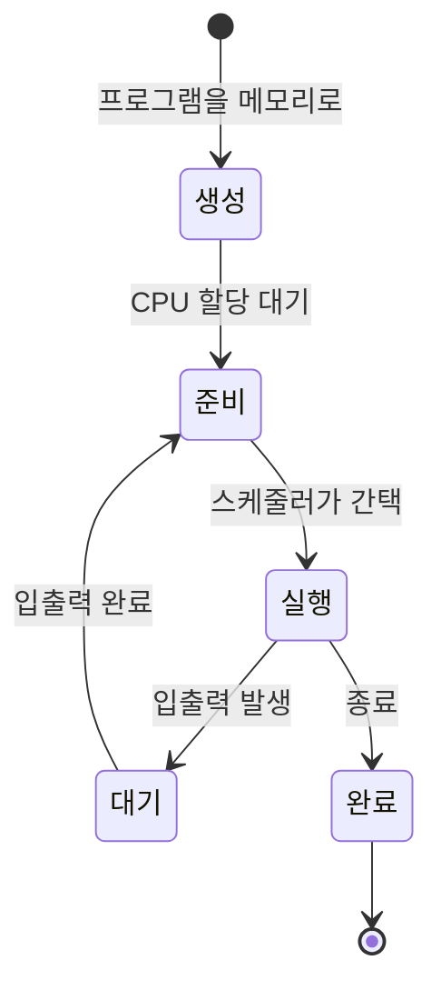

## 📌 들어가며

이번 글에서는 운영체제의 핵심 개념인 **프로세스와 스레드**를 정리한다. 프로그램과 프로세스의 차이, 프로세스 상태와 PCB·문맥 교환, `fork`/`exec`, 그리고 스레드와 멀티스레드 모델까지 다룬다.

> **프로그램 vs 프로세스** — **프로그램**은 저장장치에 정적으로 저장된 파일이고, **프로세스**는 그 프로그램이 실행을 위해 **메모리에 올라온 상태**다. 메모리는 저장장치보다 작으므로 공간을 효율적으로 써야 한다.

---

## 1. 프로세스의 상태



| 상태 | 설명 |
|------|------|
| **생성** | 프로그램을 메모리로 가져옴 |
| **준비** | CPU 할당 대기(스케줄러 관리) |
| **실행** | CPU 사용 중 |
| **대기** | 입출력 완료 대기 |
| **완료** | 종료(데이터 소각) |

> 💡 **대기 → 실행이 아니라 대기 → 준비**로 간다. 입출력이 끝나도 곧바로 CPU를 얻는 게 아니라, 다시 준비 큐에 줄을 서서 스케줄러의 간택을 기다린다.

---

## 2. PCB & 문맥 교환

**PCB(프로세스 제어 블록)**는 모든 프로세스가 가지는, CPU가 프로세스를 관리하기 위한 정보다.

| PCB 항목 | 역할 |
|------|------|
| **포인터** | 준비/대기 큐 구현 |
| **프로세스 구분자** | 프로세스 식별 |
| **프로그램 카운터** | 다음 실행 명령 위치 |
| **우선순위** | 중요도 큐 |
| **메모리 정보** | 프로세스 위치 |

> 💡 **문맥 교환(Context Switch)** — 한 프로세스가 끝나거나 대기로 갈 때, 다른 프로세스를 불러오며 **작업 환경(문맥)을 통째로 바꾸는** 작업이다. 요리사가 다른 주문서의 요리로 넘어갈 때 도구·재료를 바꾸는 것과 같다.

---

## 3. fork() & exec()

| 시스템 호출 | 역할 | 비유 |
|------|------|------|
| **fork()** | 실행 중 프로세스를 **복사** | 같은 요리를 복제해 제공 |
| **exec()** | 기존 프로세스를 **새 프로세스로 전환** | 그 요리를 다른 요리로 교체 |

> 💡 **왜 exec()를 쓰나?** 프로세스를 새로 만들면 PCB 생성·메모리 확보가 필요하다. exec()는 **이미 만들어진 프로세스 구조를 재활용**해 내용만 바꾸므로 효율적이다. `fork()`한 자식은 부모의 사본이지만 **구분자는 다르다.**

**계층 구조**: `init` → `login`(사용자 인증, 접속마다 fork) → `shell`(명령 처리). login→shell 전환은 새로 만들지 않고 **exec()로 교체**한다. 부모는 자식에게 자원을 상속하고, 자식이 끝나면 회수한다.

---

## 4. 스레드

> **스레드란?** CPU 스케줄러가 CPU에 전달하는 **하나의 일 단위**. 하나의 프로세스 안에 여러 스레드가 있을 수 있다. 주문서(프로세스) 하나의 레시피대로 요리를 실제 만드는 일(스레드)에 비유된다.

- **프로세스끼리는 약한 연결, 스레드끼리는 강한 연결** — 스테이크와 케이크는 무관하지만, 스테이크 레시피의 순서는 서로 크게 영향을 준다.

| 개념 | 설명 |
|------|------|
| **멀티스레드** | 한 프로세스를 여러 스레드로 분할 |
| **멀티태스킹** | CPU 시간을 잘게 나눠 배분(시분할) |
| **멀티프로세싱** | 여러 CPU로 진짜 동시 처리 |
| **CPU 멀티스레드** | 파이프라인으로 한 CPU에서 여러 스레드(하드웨어) |

> 💡 시분할 시스템에서 **CPU에 전달되는 작업 단위는 프로세스가 아니라 스레드**다. 멀티태스킹은 시간을 나눠 빠르게 번갈아 하는 것이고, 멀티프로세싱은 여러 CPU로 실제 동시에 하는 것이다.

**멀티스레드 장단점:**

| 장점 | 단점 |
|------|------|
| 응답성↑(입출력 중 다른 스레드 진행) | 강한 연결 → **한 스레드 문제가 전체 프로세스에 영향** |
| 자원 공유·효율↑·다중 CPU 활용 | |

---

## 5. 멀티스레드 모델

| 모델 | 매핑 | 특징 |
|------|:---:|------|
| **사용자 레벨** | 1:N | 라이브러리가 처리(문맥 교환 X, 빠름), OS 미지원 시·보안 취약 |
| **커널 레벨** | 1:1 | 커널이 지원(스레드 간 영향↓), 문맥 교환 필요(느릴 수 있음) |
| **멀티레벨(하이브리드)** | M:N | 둘의 혼합(빠름은 사용자, 안정은 커널) |

> 💡 **사용자 레벨은 결국 커널 스레드 하나에 연결**된다. 그래서 한 스레드가 블로킹되면 전체가 멈출 수 있다. 커널 레벨은 1:1이라 이런 문제가 적지만 문맥 교환 비용이 든다. 멀티레벨은 둘의 장점을 취한다.

---

## 📝 정리

```
프로세스 & 스레드
├─ 프로세스  프로그램이 메모리에 올라온 상태(상태·PCB)
├─ 전환      문맥 교환(작업 환경 교체)
├─ 호출      fork(복사) / exec(교체·재활용)
└─ 스레드    프로세스 내 일 단위(강한 연결), 멀티스레드 모델(1:N/1:1/M:N)
```

| 개념 | 한 줄 정의 |
|------|------|
| **프로세스** | 실행 중인 프로그램 |
| **PCB** | 프로세스 관리 정보 |
| **스레드** | CPU에 전달되는 일 단위 |

핵심은 **프로세스는 실행의 단위, 스레드는 그 안의 일 단위**라는 것이다. PCB와 문맥 교환으로 여러 프로세스를 번갈아 실행하고, 스레드로 한 프로세스 안의 작업을 병렬화해 응답성과 효율을 높인다.
