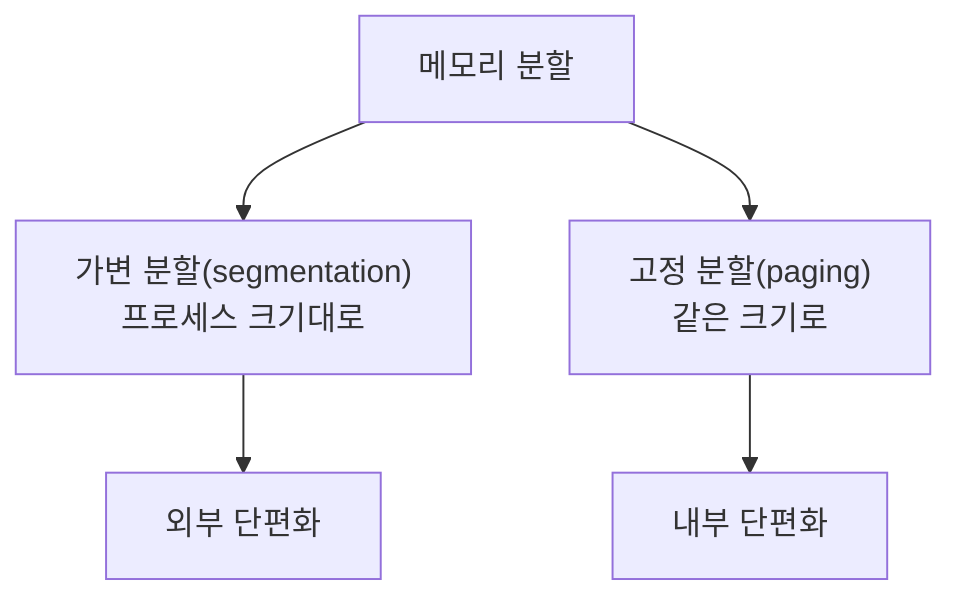

## 📌 들어가며

이번 글에서는 운영체제의 **물리 메모리 관리**를 정리한다. 메모리 관리자의 역할(가져오기·배치·재배치), 주소 체계(절대/상대), 단일·다중 프로그래밍 환경의 메모리 할당(오버레이·스왑·분할 방식·버디 시스템)을 다룬다.

> **메모리 관리가 복잡한 이유** — 시분할 시스템에서는 **OS를 포함한 모든 응용 프로그램이 메모리에 올라오기** 때문이다. CPU는 메모리 접근에 **MAR(메모리 주소 레지스터)**를 쓴다. 재료(프로그램)가 전부 도마 위에 올라와 있는 상태라 관리가 까다롭다.


---

## 1. 메모리 관리자의 역할

> **관리의 이중성** — 프로세스는 메모리를 **독차지**하고 싶고, 관리자는 **효율적으로** 관리하고 싶다. 이 상충이 이중성이다.


| 역할 | 설명 |
|------|------|
| **가져오기(fetch)** | 프로세스·데이터를 메모리로(크면 일부만) |
| **배치(placement)** | 메모리 어디에 올릴지(paging/segmentation) |
| **재배치(replacement)** | 꽉 차면 오래된 프로세스 내보냄 |

**컴파일러 vs 인터프리터**: 컴파일러(자바)는 소스 전체를 목적코드로 변환(최적화·복잡), 인터프리터(자바스크립트)는 한 행씩 번역·실행(편리·느림).


---

## 2. 메모리 주소 — 절대 vs 상대

| 구분 | 최대 메모리 |
|------|------|
| **32bit** | 2³² ≈ **4GB** |
| **64bit** | 2⁶⁴ ≈ 약 1,600만 TB |

- **물리 주소**: 하드웨어 입장의 주소 / **논리 주소**: 사용자 입장의 주소.


> 💡 **절대주소 vs 상대주소** — 메모리는 OS 영역과 사용자 영역이 엄격히 분리된다. 사용자가 매번 OS 영역(예: 0~360)을 피하는 건 번거롭다. 그래서 사용자는 **항상 0번지부터 시작하는 상대주소**를 쓰고, 실제 접근 시 관리자가 **재배치 레지스터**로 `상대주소 + OS범위`를 더해 절대주소로 변환한다.

---

## 3. 단일 프로그래밍 — 오버레이 & 스왑

작은 메모리(옛날 640KB)에서 큰 프로그램을 돌리려면 프로그램을 나눠야 한다.

| 기법 | 설명 |
|------|------|
| **메모리 오버레이** | 프로그램을 모듈로 나눠 **필요한 모듈만** 메모리에 올림 |
| **스왑(swap)** | 안 쓰는 모듈을 저장장치의 **스왑 영역**에 임시 보관 |


> 💡 스왑 영역으로 내보내는 것을 **swap out**, 다시 메모리로 가져오는 것을 **swap in**이라 한다. 덕분에 사용자가 인식하는 메모리 크기는 **실제 메모리 + 스왑 크기**가 된다(가상 메모리의 기초).

---

## 4. 다중 프로그래밍 — 분할 방식



| 방식 | 특징 | 단점 |
|------|------|------|
| **가변 분할(segmentation)** | 프로세스 크기대로 분할(통째로 올림) | **외부 단편화**(사이 빈 공간) → 조각모음 필요 |
| **고정 분할(paging)** | 같은 크기로 분할(관리 수월) | **내부 단편화**(남는 공간 낭비) |


> 💡 **외부 단편화 vs 내부 단편화** — 가변 분할은 프로세스가 드나들며 **사이사이 못 쓰는 틈**이 생기고(외부), 고정 분할은 칸보다 작은 프로세스가 들어가 **칸 안에 남는 공간**이 생긴다(내부). 조각모음은 흩어진 빈 공간을 합치는 작업이다.

**메모리 배치 방식:**

| 방식 | 설명 |
|------|------|
| **최초 배치** | 처음 보이는 공간에 배치(단편화 무시) |
| **최적 배치** | 가장 작은 적당한 공간 |
| **최악 배치** | 가장 큰 공간 |

---

## 5. 버디 시스템

가변 분할의 **외부 단편화를 완화**하는 방법이다(가변+고정 절충).

```
① 프로세스 크기에 맞게 메모리를 1/2씩 계속 자름
② 각 구역엔 프로세스 1개만
③ 종료 시 주변 빈 조각과 합침
```


> 💡 **버디 시스템은 통합이 수월하다.** 계속 1/2로 나누므로 작은 프로세스들이 뒤쪽에 몰려 있어, 중간에 빈자리가 나도 여러 프로세스를 옮길 필요 없이 **인접한 짝(buddy)끼리만 합치면** 된다.

---

## 📝 정리

```
물리 메모리 관리
├─ 관리자   가져오기·배치·재배치
├─ 주소     상대주소 → 재배치 레지스터로 절대주소 변환
├─ 단일     오버레이·스왑(swap in/out)
├─ 다중     가변(외부 단편화) / 고정(내부 단편화)
└─ 버디     1/2 분할 + 짝 통합(외부 단편화 완화)
```

| 개념 | 한 줄 정의 |
|------|------|
| **상대주소** | 0번지 기준(변환 필요) |
| **외부/내부 단편화** | 사이 빈 공간 / 칸 안 낭비 |
| **버디 시스템** | 1/2 분할 절충 방식 |

물리 메모리 관리의 핵심은 **한정된 메모리를 여러 프로세스가 효율적으로 나눠 쓰는 것**이다. 분할 방식마다 생기는 단편화를 이해하고, 스왑·버디 시스템 같은 기법으로 이를 완화하는 흐름을 잡는 것이 중요하다.
