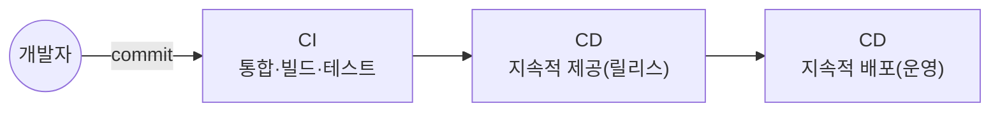

## 📌 들어가며

이번 글에서는 CI/CD 파이프라인의 대표 도구 **Jenkins**를 정리한다. CI/CD 개념부터 Jenkins의 기능, 설치, SVN 연동, 그리고 파이프라인으로 JUnit 테스트를 연동하는 과정까지 다룬다.

> **Jenkins란?** 모든 언어와 소스 저장소에 대해 **지속적 통합(CI)·지속적 배포(CD)** 환경을 구축하는 도구. 빌드·테스트·배포를 자동화해 소프트웨어 품질과 개발 생산성을 높인다.


---

## 1. CI/CD 개념




| 단계 | 의미 |
|------|------|
| **CI**(지속적 통합) | 코드 변경을 공유 브랜치에 자주 병합 + **테스트·머지 자동화**(충돌 방지) |
| **CD**(지속적 제공) | 빌드·테스트 후 유효한 코드를 **리포지토리에 자동 릴리스** |
| **CD**(지속적 배포) | 릴리스된 제품을 **자동으로 배포**(테스트 자동화가 전제) |

> 💡 **CI가 없던 시절엔 일정 시간마다 수동 빌드**했다. Jenkins는 Git·SVN과 연동해 **커밋을 감지하면 자동으로 테스트 포함 빌드**를 돌려준다. 컴파일 오류 검출·정적 분석·성능 감시·배포까지 자동화 범위가 넓다.

---

## 2. 설치

Jenkins 홈페이지에서 설치 파일을 받아 **계정·포트·JDK**를 지정하고, `initialAdminPassword`를 입력해 초기 설정을 마친다.


> 출처: [yeonyeon.tistory.com/56](https://yeonyeon.tistory.com/56)


---

## 3. SVN 연동

새 item을 만들고 프로젝트 설정 → **credential**을 등록한 뒤 빌드로 연동을 확인한다.


> 출처: [yeonyeon.tistory.com/59](https://yeonyeon.tistory.com/59)


| 빌드 결과 | 의미 |
|:---:|------|
| 🔵 파란불 | 연동 완료 |
| 🔴 빨간불 | 오류 로그 확인 필요 |

---

## 4. Pipeline으로 JUnit 연동

파이프라인 스크립트로 **Checkout → Build → JUnit Test** 단계를 정의한다.

```groovy
pipeline {
    agent any
    tools { gradle 'gradle' }
    stages {
        stage('Checkout') {
            steps { git credentialsId: 'yeon-06', url: '깃주소' }
        }
        stage('Build') {
            steps { bat "./gradlew.bat build" }
        }
        stage('JUnit Test') {
            steps { junit '**/build/test-results/test/*.xml' }
        }
    }
}
```

> ⚠️ **자주 만나는 에러 두 가지**
> - **`compileJava` 실패** → Java 경로가 **JRE**로 잡힌 경우. `tools.jar`가 있는 **JDK 경로로 재설정**한다.
> - **`No test report files were found`** → 리포트 위치가 틀림. Gradle 3.0 이전엔 `**/build/test-results/*.xml`였으니 경로를 확인한다.


---

## 📝 정리

```
Jenkins
├─ 개념   CI/CD 파이프라인 자동화 도구
├─ CI     커밋 감지 → 자동 빌드·테스트·머지
├─ CD     릴리스(제공) + 배포(운영) 자동화
├─ 설치   계정·포트·JDK + initialAdminPassword
└─ 연동   SVN/Git credential → Pipeline(Checkout/Build/Test)
```

| 개념 | 한 줄 정의 |
|------|------|
| **Jenkins** | CI/CD 자동화 서버 |
| **CI/CD** | 통합/배포 자동화 |
| **Pipeline** | 단계별 빌드 스크립트 |

Jenkins의 핵심은 **커밋을 감지해 빌드·테스트·배포를 자동으로 이어주는 것**이다. 파이프라인으로 단계를 코드화하면, 사람 개입 없이 품질을 검증하며 배포까지 흘려보낼 수 있다.
