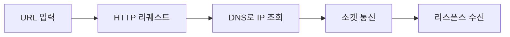

## 📌 들어가며

이번 글에서는 브라우저에 **URL을 입력한 순간부터** 웹 서버와 메시지를 주고받기까지의 전체 여정을 정리한다. URL 해독 → HTTP 요청/응답 → DNS로 IP 조회 → 소켓 통신으로 이어지는 흐름을 따라간다.

> **URL이란?** **Uniform Resource Locator** — 웹 서버에 어떤 기능(정보 가져오기·보내기)을 요청하는 하나의 문장. 구성은 **프로토콜 + 도메인 + 경로**다. 예: `http://localhost:8080/dir/file1.html`



---

## 1. URL 해독 & HTTP 메시지

브라우저는 URL을 해독해 **리퀘스트 메시지**를 만든다. 파일명을 생략하면(`.../dir/`) `index.html`·`default.html` 같은 **기본 파일**로 요청이 간다.

| 개념 | 설명 |
|------|------|
| **URI** | 액세스 대상('무엇을') — URL 포함 |
| **메소드** | GET·POST 등 '어떻게'를 담당 |

**HTTP 리퀘스트 메시지 구조:**

```
① 리퀘스트 라인: <메소드> <URI> <HTTP 버전>
② 메시지 헤더:  키: 밸류 형태의 헤더 필드
③ 메시지 본문:  송신 데이터(바이너리)
```

응답(리스폰스)은 첫 행에 **스테이터스 코드(200·404 등)**가 온다는 점만 다르다.

> 💡 **리퀘스트-리스폰스는 짝꿍**이고, **하나의 리퀘스트에 URI는 1개**다. 그래서 페이지에 여러 파일(이미지·CSS)이 있으면, 파일마다 요청을 따로따로 보내야 한다.

---

## 2. IP 주소와 DNS

브라우저는 직접 네트워크 송신을 하지 않고 **OS에 의뢰**한다. 그 전에 도메인명을 **IP 주소로 변환**해야 한다.

> **왜 도메인명과 IP를 나누나?** 전화번호를 다 외울 수 없어 이름으로 저장하는 것과 같다. **DNS(Domain Name System)**가 사람이 읽는 도메인(`localhost`)과 기계가 쓰는 IP(`127.0.0.1`)를 대응시킨다.

IP는 **네트워크 번호(동) + 호스트 번호(번지)**로 구성된다.

**리졸버(resolver)의 동작:**

```
① 앱이 IP 조회 요청 → 잠시 일시정지(제어가 리졸버로)
② 리졸버가 프로토콜 스택 호출 → DNS 서버로 조회 메시지 송신
③ DNS 서버가 답변 → 리졸버가 해독해 IP 추출
④ 제어가 다시 앱으로 → OS에 송신 의뢰
```

> 💡 **리졸버**는 Socket 라이브러리 안의 부품화된 프로그램이다. 앱은 IP를 직접 찾지 않고 리졸버에 위임하며, 이 사이 앱은 잠시 멈춰 응답을 기다린다.

---

## 3. DNS 서버의 동작

DNS 서버는 클라이언트로부터 **이름·클래스·타입** 3가지를 받는다.

| 항목 | 설명 |
|------|------|
| **이름** | 서버/메일 배송 목적지 |
| **클래스** | 네트워크 종류(현재는 `IN`만) |
| **타입** | `A`=IP 주소, `MX`=메일 배송지 |

**도메인 계층 조회** — 도메인은 뒤에서부터 최상위다(`com > cyber > lab > www`). 요청은 가장 가까운 DNS → `com` DNS → `naver.com` DNS 순으로 타고 올라가 최종 IP를 가진 서버까지 도달한다.

> 💡 DNS는 한 번 조사한 도메인을 **캐시**에 저장해 다음 조회를 빠르게 한다. 단 등록 정보가 바뀔 수 있어 **유효 기간이 지나면 삭제**한다.

---

## 4. 소켓으로 데이터 송수신

IP를 알아냈으면 **양끝에 소켓이 달린 파이프라인**으로 데이터를 주고받는다.

```
① 소켓 생성 (socket) → 디스크립터로 식별
② 서버 소켓에 파이프 연결 (connect: 디스크립터·IP·포트)
③ 데이터 송수신 (write / read)
④ 파이프 분리 + 소켓 말소 (close)
```

| 단계 | 함수 | 역할 |
|------|------|------|
| 생성 | `socket()` | 소켓 생성 + 디스크립터 발급 |
| 연결 | `connect()` | 서버 소켓에 연결(포트로 상대 소켓 지정) |
| 통신 | `write`/`read` | 송신/수신(수신 버퍼 사용) |
| 종료 | `close()` | 연결 끊고 소켓 말소 |

> 💡 **포트 번호가 상대 소켓을 지정**한다. 웹은 80, 메일은 25처럼 목적지 소켓을 포트로 식별한다. 디스크립터는 내 쪽 소켓을, 포트는 상대 쪽 소켓을 가리킨다.

---

## 📝 정리

```
URL → 웹 서버 통신
├─ URL     프로토콜+도메인+경로, 리퀘스트/리스폰스 짝꿍
├─ DNS     도메인 → IP (리졸버가 조회·캐시)
├─ 계층    가까운 DNS → com → naver.com 순 조회
└─ 소켓    socket→connect→write/read→close
```

| 개념 | 한 줄 정의 |
|------|------|
| **URL/URI** | 요청 문장 / 액세스 대상 |
| **DNS/리졸버** | 도메인→IP 변환 / 그 부품 |
| **소켓** | 통신 파이프의 양 끝 |

URL 입력 한 번 뒤에는 **해독 → DNS 조회 → 소켓 연결 → 송수신**이라는 정교한 과정이 숨어 있다. 이 큰 그림을 잡으면, 이후 소켓·프로토콜 스택의 세부 동작이 훨씬 자연스럽게 이어진다.
