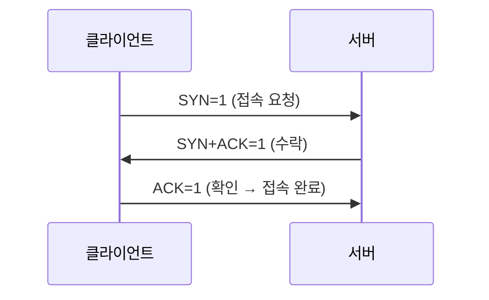

## 📌 들어가며

이번 글에서는 [URL과 송수신](/posts/Network-URL/)에 이어, **프로토콜 스택과 소켓**이 실제로 어떻게 동작하는지 파고든다. 소켓의 정체부터 TCP 접속(3-way), 데이터 송수신(ACK·윈도우 제어), 연결 종료, IP/이더넷 패킷, UDP까지 다룬다.

> **소켓이란?** 눈에 보이는 실체가 아니라, **프로토콜 스택 내부 메모리에 기록된 제어 정보**다. IP·포트·진행 상태 등이 담겨 있고, 프로토콜 스택은 이 제어 정보를 따라 움직인다. `netstat` 출력의 각 행이 하나의 소켓이다.

---

## 1. 프로토콜 스택의 구성

OS는 메시지를 서버로 보내기 위해 **소프트웨어(프로토콜 스택) + 하드웨어(LAN 어댑터)**를 쓴다.

```
APP  │ 네트워크 앱(브라우저·서버) + Socket 라이브러리(리졸버)
─────┼──────────────────────────────────────────
OS   │ 프로토콜 스택: TCP(일반 통신) / UDP(짧은 제어) / IP(패킷 운반·ICMP·ARP)
─────┼──────────────────────────────────────────
SW   │ LAN 드라이버
HW   │ LAN 어댑터
```


| 프로토콜 | 용도 |
|------|------|
| **TCP** | 브라우저·메일 등 일반적인 데이터 송수신 |
| **UDP** | DNS 조회 등 짧은 제어용 데이터 |
| **IP** | 패킷을 상대까지 운반(+ICMP·ARP) |

---

## 2. 소켓 생성 & 접속(connect)

`socket()` 호출 시 메모리에 제어 정보를 할당하고 **디스크립터(꼬리표)**를 발급한다. 앱은 이후 이 디스크립터만으로 소켓을 지정한다.

**접속(connect)의 실체 — TCP 3-way:**



`connect()`에 서버 IP·포트를 넘기면 **컨트롤 비트 SYN을 1**로 만들어 접속을 시작한다. 서버가 받으면 **ACK를 1**로 반송하고, 클라이언트가 다시 확인을 보내면 접속이 완성된다.

> 💡 **패킷에는 헤더(제어 정보)가 동행**한다. 이더넷·IP·TCP 헤더에 송수신 포트·컨트롤 비트·옵션이 담기며, `socket/connect/write/read/close` 각 단계마다 이 제어 정보가 부가된다.

---

## 3. 데이터 송수신 — TCP의 신뢰성

프로토콜 스택은 받은 데이터를 **바로 안 보내고 버퍼에 모았다가** 보낸다(네트워크 효율). 기준은 **MTU**(= MSS + 헤더)와 **타이밍**이다.

**ACK로 도착 확인:**

```
시퀀스 번호 = 패킷의 첫 데이터 순번
ACK 번호   = 시퀀스 번호 + 데이터 길이
→ ACK 번호와 다음 시퀀스 번호가 일치하면 누락 없음
```

| 메커니즘 | 역할 |
|------|------|
| **시퀀스/ACK 번호** | 데이터 누락 여부 확인 |
| **타임아웃** | ACK 대기 시간(왕복 평균으로 동적 조정) |
| **윈도우 제어** | ACK를 기다리지 않고 연속 송신 |

> 💡 **윈도우 제어**가 TCP 효율의 핵심이다. 매번 ACK를 기다리면 느리므로, 수신 버퍼의 빈 공간(윈도우) 크기만큼 **미리 연속 송신**한다. 수신측은 ACK와 윈도우 통지를 하나의 패킷으로 합쳐 보내 오버헤드를 줄인다.

---

## 4. 연결 종료 & 소켓 말소

데이터를 다 보낸 쪽이 **`close()`로 FIN 비트를 1**로 만들어 종료를 시작한다. 상대가 ACK를 반송하면 연결이 끊긴다.

> ⚠️ **소켓은 즉시 말소하지 않는다.** 바로 지우면 같은 포트로 새 소켓이 생겨 뒤늦게 오는 데이터를 잘못 받을 수 있다. 그래서 **몇 분간 기다린 뒤** 말소한다(TIME_WAIT).

---

## 5. IP·이더넷 패킷

패킷은 **헤더 + 데이터**다. TCP/IP 패킷은 여러 헤더가 겹겹이 붙는다.

```
[ MAC 헤더 | IP 헤더 | TCP 헤더 | 데이터 조각 ]
   ↑다음 라우터   ↑최종 목적지
```

| 헤더 | 담는 정보 |
|------|------|
| **IP 헤더** | 최종 목적지 IP |
| **MAC 헤더** | 다음 라우터의 MAC 주소 |

> 💡 **IP는 송출만** 한다(누락 확인 X, 그건 TCP 몫). 목적지 판단은 **경로표**를 쓰고, 넷마스크 `0.0.0.0`이면 기본 게이트웨이를 뜻한다. **ARP(Address Resolution Protocol)**로 IP 주소에 대응하는 MAC 주소를 알아낸다.

---

## 6. UDP — 간단한 송수신

수정 송신이 필요 없는 데이터는 **UDP가 효율적**이다.

| 상황 | 이유 |
|------|------|
| **짧은 제어**(DNS 조회) | 패킷 하나로 끝 → TCP 불필요 |
| **음성·영상** | 정해진 시간 내 '전부' 전달해야 함 |

> 💡 TCP는 누락 회복 과정이 복잡하다. UDP는 **전부 보내고 안 되면 다시 전부** 보내는 단순함이 장점이라, 조회성 짧은 통신이나 실시간 스트리밍에 적합하다.

---

## 📝 정리

```
네트워크 소켓
├─ 소켓    프로토콜 스택 메모리의 제어 정보(디스크립터로 지정)
├─ 접속    connect → SYN/ACK 3-way
├─ 송수신  MTU 단위 + 시퀀스/ACK + 윈도우 제어
├─ 종료    close → FIN, 소켓은 몇 분 뒤 말소
├─ 패킷    MAC(다음)+IP(최종)+TCP 헤더, ARP로 MAC 조회
└─ UDP     짧은 제어·실시간에 효율적
```

| 개념 | 한 줄 정의 |
|------|------|
| **소켓** | 통신 제어 정보(메모리) |
| **윈도우 제어** | ACK 안 기다리고 연속 송신 |
| **ARP** | IP → MAC 변환 |

소켓 통신의 핵심은 **제어 정보(소켓)를 따라 TCP가 신뢰성 있게 데이터를 나르는 것**이다. 시퀀스/ACK로 누락을 잡고, 윈도우 제어로 효율을 높이며, 단순한 통신은 UDP로 가볍게 처리한다.
