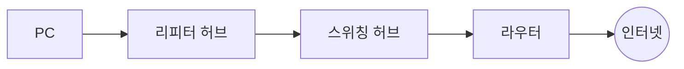
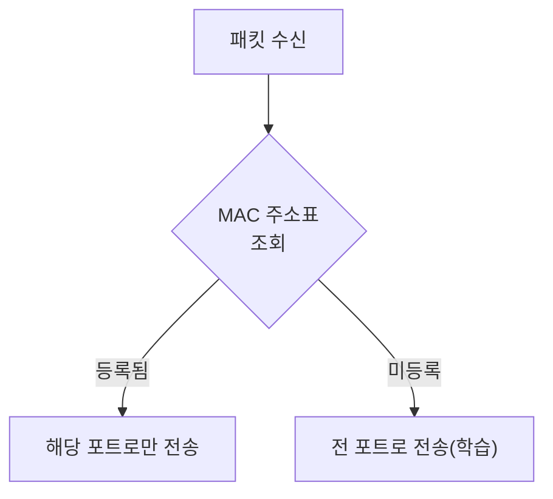

## 📌 들어가며

이번 글에서는 패킷을 실제로 나르는 중계 장치 **리피터 허브**와 **스위칭 허브**를 정리한다. LAN 케이블이 신호를 어떻게 전달하는지, 두 허브가 패킷을 중계하는 방식이 어떻게 다른지 살펴본다.

> **중계 장치의 원칙** — 허브·라우터는 데이터의 **내용을 보지 않는다.** 헤더의 제어 정보만 보고 패킷을 전송할 뿐이다. 송신 순서는 **리피터 → 스위치 → 라우터 → 인터넷**으로 나간다.



---

## 1. LAN 케이블과 '꼼'

LAN 어댑터의 **PHY 회로**가 패킷을 전기 신호로 바꾸고, RJ-45 커넥터를 거쳐 **트위스트 페어 케이블**로 들어간다. 케이블을 지나며 신호는 각이 둥글어진다.

> 💡 **선을 꼬는(twist) 이유는 잡음 상쇄**다. 금속선에 전자파가 닿으면 전류(잡음)가 생기는데, 선을 꼬면 그 방향이 반대가 되어 서로 상쇄된다. 신호와 잡음 모두 전류라서 섞일 수 있기 때문에, 꼬임으로 이를 막는다.

---

## 2. 리피터 허브 — 전체 뿌리기

리피터 허브는 **연결된 모든 케이블에 신호를 뿌린다.** 각 PC는 받은 패킷의 수신처 MAC 주소를 대조해 자기 것만 취한다.

- PHY 회로에서 신호를 받아 **다듬지 않고 그대로 모든 커넥터로 송출**한다.
- MDI/MDI-X 전환 스위치는 송수신 회로를 직접/교차 결선한다.

> ⚠️ 리피터 허브는 신호를 모든 포트에 뿌리므로, **동시에 두 개 이상 신호가 들어오면 패킷 충돌**이 발생한다. 이것이 스위칭 허브가 등장한 이유다.

---

## 3. 스위칭 허브 — 주소 테이블로 중계

스위칭 허브는 **MAC 주소 테이블**을 보고 목적지 포트로만 정확히 중계한다.



| 특징 | 설명 |
|------|------|
| **주소 학습** | 중계 시 MAC 주소표를 갱신(일정 시간 후 삭제) |
| **불필요 폐기** | 수신 포트 = 송신 포트면 중계 안 함 |
| **동시 중계** | 서로 다른 포트 간 통신을 동시에 처리 |

---

## 4. 전이중 모드 & 자동 조정

**전이중(Full Duplex) 모드**는 송신과 수신을 동시에 하는 성질로, 리피터 허브엔 없고 스위칭 허브에만 있다.

> 💡 이더넷은 데이터가 흐르지 않을 때 **링크 펄스**라는 신호를 계속 흘려보낸다. 이를 통해 상대가 전이중 모드를 지원하는지 검출하고 최적 모드로 자동 전환한다.

**리피터 vs 스위칭 요약:**

| 구분 | **리피터 허브** | **스위칭 허브** |
|------|-----------------|-----------------|
| 중계 방식 | 전 포트로 뿌림 | 목적지 포트로만 |
| 충돌 | 발생(반이중) | 없음(전이중) |
| 동시 중계 | 불가 | 가능 |
| 주소 학습 | 없음 | MAC 주소표 |

---

## 📝 정리

```
리피터 & 허브
├─ 케이블   트위스트 페어(꼬임으로 잡음 상쇄)
├─ 리피터   전 포트로 뿌림 → 충돌 발생
├─ 스위칭   MAC 주소표로 목적지 포트만 중계
└─ 전이중   송수신 동시 + 동시 중계 가능
```

| 개념 | 한 줄 정의 |
|------|------|
| **리피터 허브** | 신호를 전 포트에 뿌림 |
| **스위칭 허브** | MAC 주소표 기반 정확한 중계 |
| **전이중 모드** | 송수신 동시 처리 |

중계 장치의 발전은 **"무작정 뿌리기(리피터) → 목적지만 골라 보내기(스위칭)"**의 흐름이다. 스위칭 허브의 MAC 주소 학습과 전이중 모드 덕분에 충돌 없이 효율적인 네트워크가 가능해졌다.
