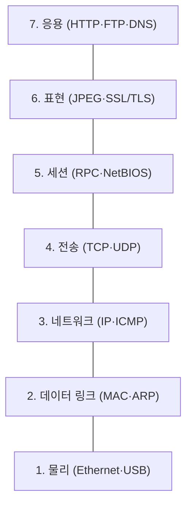

## 📌 들어가며

이번 글에서는 네트워크 통신을 7개 계층으로 나눈 **OSI 7계층**을 정리한다. 각 계층이 어떤 역할을 하고 어떤 프로토콜·장비가 동작하는지 계층별로 살펴본다.

> **OSI 모델이란?** **Open Systems Interconnection** — 네트워크 통신의 각 단계를 **7개 계층으로 나눈 모델**. 각 계층이 독립적으로 동작해, 통신의 효율성과 안정성을 높이고 문제를 계층 단위로 진단할 수 있게 한다.

---

## 1. 7계층 한눈에 보기

아래(물리) → 위(응용) 방향으로, 데이터가 계층을 거치며 헤더가 붙고 벗겨진다.



| 계층 | 이름 | 단위 | 장비 | 대표 프로토콜 |
|:---:|------|------|------|------|
| **7** | 응용 | 데이터 | - | HTTP·FTP·DNS |
| **6** | 표현 | 데이터 | - | JPEG·SSL/TLS |
| **5** | 세션 | 데이터 | - | RPC·NetBIOS |
| **4** | 전송 | 세그먼트 | - | **TCP·UDP** |
| **3** | 네트워크 | 패킷 | 라우터 | **IP·ICMP·OSPF** |
| **2** | 데이터 링크 | 프레임 | 스위치·브릿지 | **MAC·ARP·PPP** |
| **1** | 물리 | 비트 | 허브·리피터 | Ethernet·USB |

---

## 2. 하위 계층 (1~3) — 전달

### 1. 물리 계층

데이터를 **전기/광 신호로 변환**해 케이블로 전송한다. 장비는 허브·리피터.

### 2. 데이터 링크 계층

**프레임** 단위로 오류·흐름을 관리하고, **MAC 주소**로 특정 장치에 전달한다. 장비는 스위치·브릿지.

- **MAC**: 네트워크 카드 고유 식별자 → 출발지/목적지 식별
- **ARP**: IP 주소를 MAC 주소로 매핑

### 3. 네트워크 계층

여러 네트워크를 거칠 때 **경로를 찾는(라우팅)** 역할. **IP 주소** 기반으로 목적지까지 전달하며 라우터가 동작한다.

- **IP**: 목적지 식별·경로 선택 / **ICMP**: `ping`·`traceroute`에 사용

> 💡 **2계층 MAC vs 3계층 IP** — MAC은 "바로 옆 장비"를 가리키는 물리 주소, IP는 "최종 목적지"를 가리키는 논리 주소다. 그래서 패킷은 IP로 최종 목적지를, MAC으로 다음 홉(hop)을 지정하며 라우터를 넘어간다.

---

## 3. 상위 계층 (4~7) — 처리

### 4. 전송 계층

**종단 간(End-to-End)** 통신을 제공하고, 데이터 분할·조립·흐름 제어·오류 복구를 담당한다.

| 프로토콜 | 특징 |
|------|------|
| **TCP** | 신뢰성 있는 연결 기반(분할→재조립) |
| **UDP** | 신뢰성 낮지만 빠름(실시간에 적합) |

### 5. 세션 계층

양 끝단의 연결을 **설정·유지·종료**하고 데이터 동기화를 담당한다(RPC·NetBIOS).

### 6. 표현 계층

데이터를 앱이 이해할 형태로 **변환·압축·암호화**한다(JPEG·SSL/TLS).

### 7. 응용 계층

최종 사용자 인터페이스를 제공한다(HTTP·FTP·DNS).

> 💡 **암기 팁** — 아래에서 위로 "**물·데·네·전·세·표·응**"으로 외우면 편하다. 실무 트러블슈팅도 이 순서로 "케이블(1) → 스위치(2) → IP 라우팅(3) → 포트(4) → 앱(7)"을 따라 내려가며 원인을 좁힌다.

---

## 📝 정리

```
OSI 7계층
├─ 1 물리     비트 · 허브/리피터 (Ethernet)
├─ 2 데이터링크 프레임 · 스위치 (MAC·ARP)
├─ 3 네트워크  패킷 · 라우터 (IP·ICMP)
├─ 4 전송     세그먼트 (TCP·UDP)
├─ 5 세션     연결 관리 (RPC)
├─ 6 표현     변환·암호화 (SSL/TLS)
└─ 7 응용     사용자 (HTTP·DNS)
```

| 개념 | 한 줄 정의 |
|------|------|
| **OSI 7계층** | 통신을 7단계로 나눈 모델 |
| **MAC vs IP** | 다음 홉 / 최종 목적지 |
| **TCP vs UDP** | 신뢰성 / 속도 |

OSI 7계층의 핵심은 **역할을 계층으로 분리**해, 각 단계를 독립적으로 이해하고 문제를 계층별로 진단하는 것이다. 하위(전달)와 상위(처리)를 구분하면 네트워크 전체 그림이 명확해진다.
