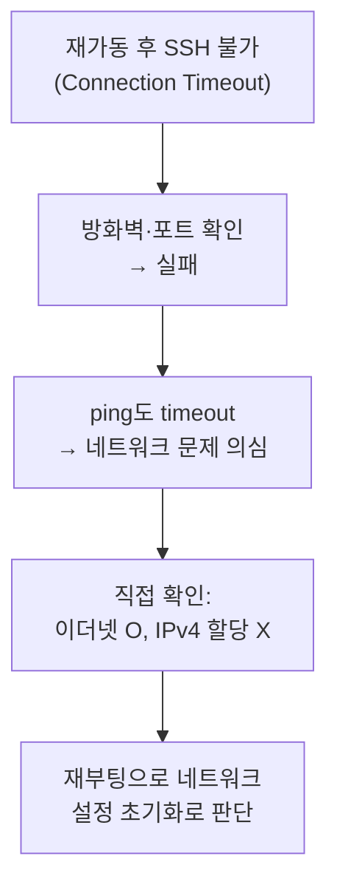

## 📌 들어가며

이번 글에서는 회사 서버실 재가동 후 **SSH가 안 되던 장애를 해결한 삽질기**와 함께, CentOS 7 기반의 **리눅스 네트워크 명령어**를 정리한다. 실제 트러블슈팅 흐름을 따라가며 `ifconfig`·`ip a`·`nmcli` 등을 살펴본다.

> **상황** 서버실 전체를 10분 다운 후 재가동했는데, 관리하던 리눅스 서버 한 대의 **SSH 접속이 `Connection Timeout`**으로 안 됐다. 하루 종일 원인을 좇은 과정을 공유한다.

---

## 1. 삽질 타임라인



| 단계 | 시도 | 결과 |
|------|------|------|
| 1 | 방화벽·포트·`systemctl start sshd` | 실패(강제 shutdown까지) |
| 2 | `ping`·웹앱 직접 실행 | 모두 실패 → **네트워크 문제** |
| 3 | 네트워크 상태 확인 | 이더넷 OK, **IPv4 미할당** |

> ⚠️ **원인 착각을 조심하자.** 처음엔 SSH·하드웨어 문제로 의심해 엉뚱한 곳을 팠다. `ping`조차 안 되는 걸 보고서야 "SSH가 아니라 네트워크 자체"임을 깨달았다. 트러블슈팅은 **가장 넓은 범위(네트워크 연결)부터** 좁혀가야 한다.

---

## 2. 네트워크 상태 확인 명령어

| 명령 | 역할 |
|------|------|
| `ifconfig` | 인터페이스 IP·서브넷·MAC 확인(구식) |
| `ip a` | 인터페이스 정보(현대적·간결) |
| `route` | 라우팅 테이블 확인 |

```bash
ifconfig        # 인터페이스 상태
ip a            # IP 주소(권장)
route           # 라우팅 테이블
```

> 💡 `ifconfig`는 오래된 명령이라 최신 배포판에는 없을 수 있다. **`ip a`(= `ip addr`)**가 후속 표준이니, 새 환경에서는 `ip` 계열 명령을 쓰는 것이 좋다.

---

## 3. 네트워크 연결 관리 명령어

```bash
# 인터페이스 활성화/비활성화
sudo ifup eth0
sudo ifdown eth0

# NetworkManager CLI (권장)
sudo nmcli connection up eth0
sudo nmcli connection down eth0
```

### ifcfg 설정 파일

`ifup`은 `/etc/sysconfig/network-scripts/ifcfg-eth0` 설정을 참조한다.

```
DEVICE=eth0            # 인터페이스 이름
BOOTPROTO=none        # 부팅 프로토콜(none=고정 IP)
ONBOOT=yes            # 부팅 시 자동 활성화
IPADDR=192.168.1.100  # IP 주소
NETMASK=255.255.255.0 # 서브넷 마스크
GATEWAY=192.168.1.1   # 게이트웨이
```

| 항목 | 의미 |
|------|------|
| `ONBOOT=yes` | 부팅 시 자동으로 인터페이스 활성화 |
| `BOOTPROTO` | `none`(고정) / `dhcp`(자동) |

> 💡 **`ifup` vs `nmcli`** — `ifup`은 NetworkManager를 안 쓰는 구버전 방식(단일 인터페이스 활성화)이고, `nmcli`는 NetworkManager를 통해 더 유연하게 관리한다. 요즘은 `nmcli`가 표준이다. 이번 장애도 재부팅으로 초기화된 설정을 다시 잡아 해결했다.

---

## 📝 정리

```
리눅스 네트워크 명령어
├─ 확인   ifconfig / ip a / route
├─ 관리   ifup·ifdown / nmcli up·down
├─ 설정   ifcfg-eth0 (ONBOOT·IPADDR·GATEWAY)
└─ 교훈   넓은 범위(연결)부터 좁혀 진단
```

| 명령 | 역할 |
|------|------|
| `ip a` | 인터페이스·IP 확인 |
| `nmcli` | NetworkManager 관리 |
| `ifcfg-*` | 인터페이스 설정 파일 |

이번 장애의 핵심 교훈은 **"주관을 내려놓고 넓은 범위부터 테스트"**하는 것이다. SSH·하드웨어에 매달리기 전에 `ping`으로 네트워크 연결부터 확인했다면 훨씬 빨리 원인(IPv4 미할당)을 찾았을 것이다.
