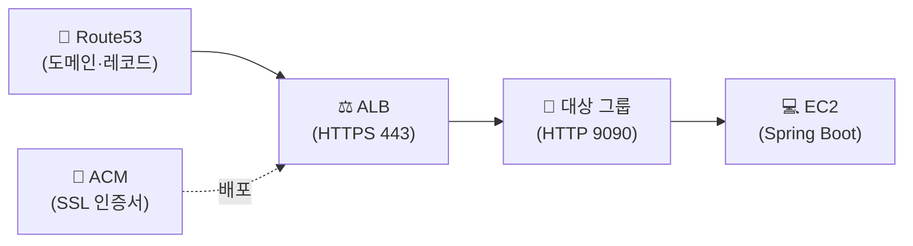

## 📌 들어가며

이번 글에서는 AWS에서 **HTTPS를 적용**하는 전체 과정을 정리한다. **Route53(도메인) + ACM(인증서) + ALB(로드밸런서)**를 조합해, 스프링부트 애플리케이션에 안전한 보안 통신을 붙인다.

> **왜 ALB로 HTTPS를 적용하나?** EC2마다 인증서를 설치·갱신하는 대신, **ALB에서 HTTPS를 종료(SSL 오프로딩)**하면 인증서 관리가 한 곳으로 모인다. ACM 인증서는 무료이고 자동 갱신되므로 운영 부담이 크게 줄어든다.

---

## 1. 전체 흐름

도메인 → 인증서 → 대상 그룹 → 로드밸런서 → 레코드 순으로 연결한다.



---

## 2. 호스팅 영역 생성 & 네임서버 연결

Route53에서 **호스팅 영역**을 생성한다. 도메인(가비아 구매)을 입력하고 퍼블릭 호스팅 영역으로 만든 뒤, EC2 퍼블릭 IP(EIP)로 A 레코드를 생성한다.


NS 레코드의 **네임서버 4개**를 복사해, **끝의 온점(`.`)을 뺀 상태**로 가비아에 1차~4차 순서대로 등록한다.


> ⚠️ 네임서버 주소 끝의 **온점 제거**를 잊지 말자(`...com.` → `...com`). 이걸 놓치면 도메인 위임이 정상 동작하지 않는다.

---

## 3. ACM 인증서 발급 (와일드카드)

ACM에서 **인증서 요청 → 퍼블릭 인증서**를 선택한다. 도메인은 유연하게 쓰도록 **와일드카드(`*.도메인`)**로 지정하고, DNS 검증을 거치면 **발급됨** 상태가 된다.


> 💡 **와일드카드(`*.example.com`)** 인증서 하나면 `api.example.com`, `jenkins.example.com` 등 모든 하위 도메인을 커버한다. 서브도메인마다 인증서를 따로 발급할 필요가 없다.

---

## 4. 대상 그룹 생성 + 상태 검사

`EC2 → 로드 밸런싱 → 대상 그룹`에서 대상 그룹을 만든다. 스프링부트가 **9090 포트**이므로 **HTTP:9090**으로 지정한다.


상태 검사(Health Check)는 대상이 살아있는지 확인하는 요청이다. 기본 경로 `/`에 응답하도록 간단한 헬스 체크 컨트롤러를 둔다.

```java
@RestController
public class HealthController {
    @GetMapping
    public String healthCheck(){
        return "health ok-test";
    }
}
```

인스턴스를 체크해 **보류 중으로 포함**하고, 실행 포트를 입력해 대상 그룹에 넣는다.


> 💡 **상태 검사**는 ALB가 "이 인스턴스에 트래픽을 보내도 되는가"를 판단하는 근거다. 지정 경로로 요청해 정상 응답(2xx)이 오면 `healthy`, 아니면 `unhealthy`로 보고 트래픽을 제외한다.

---

## 5. ALB 생성 + HTTPS 리스너

`EC2 → 로드 밸런서`에서 **ALB**를 만든다. 인스턴스가 속한 **가용 영역을 반드시 체크**하고, 보안 그룹은 기본을 지우고 인스턴스에 적용된 것을 고른다.


리스너에 **HTTPS(443)**를 추가하고 대상 그룹을 연결한다. 보안 리스너에는 앞서 ACM에서 만든 **인증서**를 선택한다.


---

## 6. API 레코드 추가 & 확인

Route53으로 돌아와 서브도메인 `api`로 레코드를 추가한다. HTTPS로 `api.도메인`에 요청하면, 헬스 체크 컨트롤러가 정상 응답한다!


---

## 📝 정리

```
AWS HTTPS 적용
├─ 도메인   Route53 호스팅 영역 + NS 위임(온점 제거)
├─ 인증서   ACM 와일드카드(*.도메인) 발급
├─ 대상그룹 HTTP:9090 + 헬스 체크(/)
├─ ALB      HTTPS 443 리스너 + ACM 인증서
└─ 레코드   api 서브도메인 → ALB
```

| 개념 | 한 줄 정의 |
|------|------|
| **ACM 와일드카드** | 모든 하위 도메인 커버 |
| **대상 그룹** | ALB가 트래픽 보낼 대상 묶음 |
| **SSL 오프로딩** | ALB에서 HTTPS 종료 |

HTTPS 적용의 핵심은 **ACM 인증서를 ALB에 붙이고, ALB에서 HTTPS를 종료**하는 것이다. Route53(도메인) → ACM(인증서) → ALB(리스너) → 대상 그룹(EC2)으로 이어지는 연결 순서를 기억하자.
