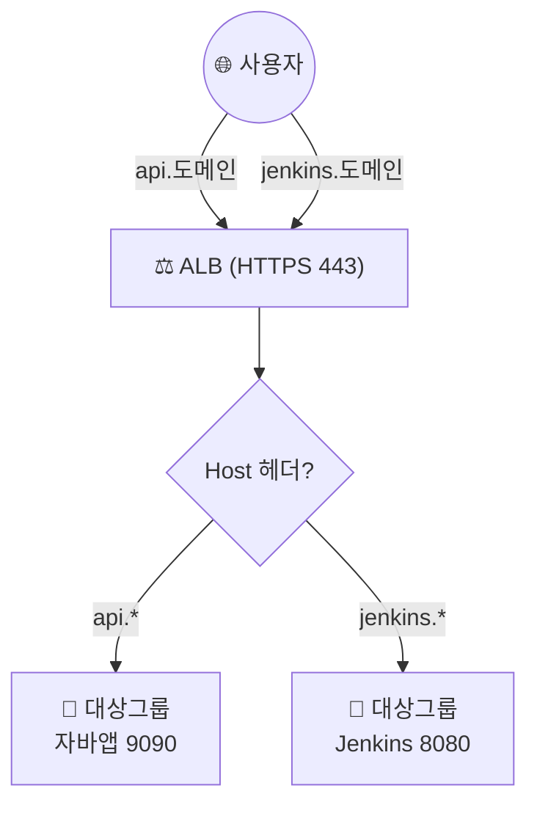

## 📌 들어가며

[지난 글](/posts/AWS-Https/)에서는 자바 애플리케이션에 HTTPS를 적용했다. 이번에는 **하나의 ALB로 여러 서비스에 HTTPS를 적용**한다. 서로 다른 포트를 쓰는 대상 그룹(Jenkins 8080)을 추가하고, **호스트 헤더 기반 리스너 규칙**으로 서브도메인에 따라 트래픽을 나눠 보낸다.

> **핵심 아이디어 — 호스트 기반 라우팅** ALB는 L7이라 **HTTP 헤더(Host)를 읽을 수 있다.** `api.도메인`은 자바 앱(9090)으로, `jenkins.도메인`은 Jenkins(8080)로 — 같은 ALB·같은 443 포트로 들어와도 **도메인에 따라 다른 대상 그룹**으로 보낼 수 있다.

---

## 1. 구성 그림

ALB 하나가 두 서브도메인을 받아, 호스트 헤더로 구분해 각각의 서비스로 분기한다.



---

## 2. Jenkins용 대상 그룹 추가

`EC2 → 로드밸런싱 → 대상 그룹`에서 대상 그룹을 하나 더 만든다. 유형은 인스턴스, 이름은 `*-jenkins`, 프로토콜/포트는 Jenkins가 쓰는 **HTTP:8080**으로 한다.


기존 인스턴스를 **8080 포트**로 라우팅하도록 등록한다.


> 💡 Jenkins처럼 **응답을 커스텀할 수 없는 앱**은 헬스 체크 경로를 신경 쓰기 어렵다. 자바 앱은 헬스 체크 컨트롤러를 만들 수 있었지만, Jenkins는 기본 경로 응답으로 상태 검사를 처리한다.

---

## 3. Jenkins 서브도메인 레코드 추가

`Route53 → 호스팅 영역`에서 레코드를 추가한다. 서브도메인은 `jenkins`, 유형은 **A + 별칭(Alias) On**으로 하고, 트래픽 라우팅 대상을 **Application/Classic Load Balancer 별칭 → 서울 리전 → 기존 ALB**로 지정한다.


> ⚠️ 두 서브도메인(`api`, `jenkins`)이 **같은 ALB를 별칭으로 가리킨다.** IP가 아니라 ALB DNS를 별칭으로 연결하는 것이 핵심이며, 실제 분기는 다음 단계의 **리스너 규칙**이 담당한다.

---

## 4. 리스너 규칙 편집 (호스트 헤더)

`EC2 → 로드 밸런서`에서 기존 ALB의 **HTTPS:443 리스너**를 편집한다. 기본은 자바 앱 대상 그룹으로 가지만, **`jenkins.도메인`으로 오면 8080 대상 그룹**으로 보내는 규칙을 추가한다.


**규칙 추가 → 조건 추가**에서 조건 유형을 **호스트 헤더**로, 값을 `jenkins.도메인`으로 지정한다.


조건이 충족되면 작업은 **대상 그룹으로 전달** → Jenkins(8080) 대상 그룹을 선택한다. 우선순위는 1로 두고 생성한다.


이제 `jenkins.도메인`으로 접속하면 **HTTPS로 Jenkins**에 연결된다!


| 조건(호스트 헤더) | 전달 대상 그룹 | 우선순위 |
|------|------|:---:|
| `jenkins.도메인` | Jenkins (8080) | 1 |
| (기본) | 자바 앱 (9090) | 마지막 |

> 💡 리스너 규칙은 **우선순위 낮은 번호부터** 평가되고, 어느 규칙에도 안 걸리면 **기본 규칙**으로 간다. 그래서 특정 조건(`jenkins.*`)에 우선순위 1을 주고, 나머지는 기본(자바 앱)으로 흘려보낸다.

---

## 📝 정리

```
ALB 호스트 기반 HTTPS 분기
├─ 대상그룹  서비스별로(자바 9090 / Jenkins 8080)
├─ 레코드    api·jenkins 서브도메인 → 같은 ALB(별칭)
├─ 리스너규칙 호스트 헤더 조건 → 대상 그룹 분기
└─ 우선순위  특정 조건 먼저, 나머지는 기본
```

| 개념 | 한 줄 정의 |
|------|------|
| **호스트 기반 라우팅** | Host 헤더로 대상 분기(L7) |
| **리스너 규칙** | 조건 → 대상 그룹 전달 |
| **별칭 레코드** | 여러 서브도메인 → 한 ALB |

하나의 ALB로 여러 서비스에 HTTPS를 적용하는 핵심은 **호스트 헤더 기반 리스너 규칙**이다. 서브도메인마다 별칭 레코드로 같은 ALB를 가리키고, ALB가 Host 헤더를 보고 알맞은 대상 그룹으로 분기시킨다.
