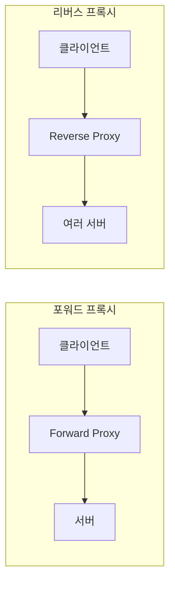

## 📌 들어가며

이번 글에서는 네트워크의 **중개자, 프록시(Proxy)**를 정리한다. 클라이언트와 서버 사이에서 트래픽을 제어·필터링하는 서버로, 역할(보안·캐싱·로드밸런싱)과 종류(포워드·리버스·게이트웨이)를 살펴본다.

> **프록시란?** 클라이언트와 서버 간 통신을 **중개하는 서버/애플리케이션**. 트래픽을 제어·필터링하며, 보안 강화·캐싱·로드 밸런싱·접근 제어 등의 기능을 수행한다.

---

## 1. 프록시의 역할

| 역할 | 설명 |
|------|------|
| **보안 강화** | 통신 감시·보안 정책 적용(악성 차단·접근 제한) |
| **캐싱** | 이전 요청 데이터를 저장해 네트워크 부하 감소 |
| **로드 밸런싱** | 여러 서버로 요청 분산 → 부하 분산·성능 최적화 |
| **접근 제어** | 특정 사이트·콘텐츠 필터링 |

---

## 2. 프록시의 종류

**"클라이언트를 숨기느냐, 서버를 숨기느냐"**로 포워드와 리버스가 갈린다.



| 종류 | 숨기는 대상 | 위치 | 용도 |
|------|-------------|------|------|
| **포워드 프록시** | **클라이언트** | 내부망 출구 | 회사·학교 인터넷 제어·보안 |
| **리버스 프록시** | **서버** | 웹 서버 앞 | 부하 분산·안정성 |
| **게이트웨이 프록시** | 프로토콜 변환 | 네트워크 경계 | 서로 다른 시스템 중계 |

### 포워드 프록시

클라이언트를 **대신하여** 서버에 접근한다.

```bash
# curl로 포워드 프록시를 통해 접근
curl --proxy http://forward-proxy-server:8080 http://example.com
```

### 리버스 프록시

클라이언트 요청을 **여러 서버로 분배**한다(Nginx 예시).

```nginx
location / {
    proxy_pass http://backend-server;
}
```

### 게이트웨이 프록시

서로 다른 프로토콜/시스템 간 통신을 중계한다(HTTP → HTTPS).

```nginx
server {
    listen 80;
    location / {
        proxy_pass https://backend-server;
    }
}
```

> 💡 **포워드 vs 리버스** — 포워드는 **"누가 접속하는지(클라이언트)를 숨기고"** 내부 사용자의 인터넷 사용을 통제한다. 리버스는 **"어떤 서버가 처리하는지(서버)를 숨기고"** 외부 요청을 뒤의 여러 서버로 분산한다. 앞서 본 Nginx·HAProxy가 대표적인 리버스 프록시다.

---

## 3. 활용 예시

| 목적 | 프록시 | 방법 |
|------|--------|------|
| **보안 강화** | 포워드 | 외부 직접 통신 차단·접근 제어 |
| **캐싱** | 리버스 | 정적 콘텐츠 캐시 → 서버 부하↓ |
| **로드 밸런싱** | 리버스 | 여러 서버로 트래픽 균등 분배 |

Nginx·Apache 같은 웹 서버나 언어 내장 라이브러리로 설정하며, 요구에 따라 다양하게 활용된다.

---

## 📝 정리

```
프록시(Proxy)
├─ 역할   보안·캐싱·로드밸런싱·접근제어
├─ 포워드 클라이언트 숨김(내부망 제어)
├─ 리버스 서버 숨김(부하 분산·웹 앞단)
└─ 게이트웨이 프로토콜/시스템 중계
```

| 개념 | 한 줄 정의 |
|------|------|
| **프록시** | 통신 중개 서버 |
| **포워드** | 클라이언트 대신 접속 |
| **리버스** | 서버 앞 부하 분산 |

프록시의 핵심은 **중개자로서 트래픽을 제어**하는 것이다. 클라이언트를 숨기면 포워드(내부 통제), 서버를 숨기면 리버스(부하 분산)로, 목적에 맞는 종류를 선택하는 것이 중요하다.
