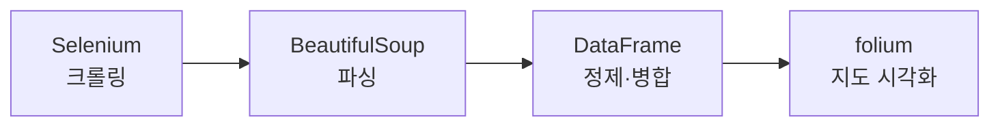

## 📌 들어가며

이번 글에서는 스타벅스 홈페이지를 **크롤링**해 서울시 전 매장을 수집하고, **folium 지도에 시각화**한다. Selenium으로 동적 페이지를 조작하고, BeautifulSoup으로 정보를 추출한 뒤, 인구·사업체 통계와 합쳐 지도에 찍는다.

> **전체 흐름** — Selenium(클릭·페이지 로드) → BeautifulSoup(HTML 파싱) → DataFrame(정제) → 통계 병합 → folium(지도 시각화).



---

## 1. Selenium으로 페이지 조작

CSS Selector로 버튼을 찾아 클릭한다(매장찾기 → 서울 → 전체).

```python
from selenium import webdriver
driver = webdriver.Chrome('star.exe')
driver.get("https://www.starbucks.co.kr/store/store_map.do")

# 검사 → Copy → Copy selector로 얻은 경로
driver.find_element_by_css_selector(area_btn).click()   # 매장찾기
driver.find_element_by_css_selector(seoul_btn).click()  # 서울
driver.find_element_by_css_selector(total_btn).click()  # 전체
```


> 💡 **CSS Selector 얻는 법** — 요소 위에서 우클릭 → 검사 → 해당 코드 우클릭 → Copy → **Copy selector**. 스타벅스 매장 목록은 JavaScript로 동적 로드되므로, `requests`가 아니라 **Selenium으로 실제 클릭**해야 데이터가 나타난다.

---

## 2. BeautifulSoup으로 정보 추출

전체 탭을 누른 후의 페이지 소스를 파싱한다. 각 매장은 `li.quickResultLstCon`이다.

```python
from bs4 import BeautifulSoup
soup = BeautifulSoup(driver.page_source, "html.parser")
stores = soup.select("li.quickResultLstCon")

name = stores[0].select('strong')[0].text.strip()   # 매장명
lat = stores[0]['data-lat'].strip()                  # 위도
lng = stores[0]['data-long'].strip()                 # 경도
```


> 💡 위도·경도가 **`data-lat`·`data-long` 속성**에 딕셔너리처럼 들어 있는 것이 포인트다. 매장명은 `<strong>`, 주소·전화는 `p.result_details`에서 `split()`으로 잘라낸다.

---

## 3. 전체 매장 → DataFrame → 엑셀

```python
starbucks_list = []
for item in stores:
    name = item.select('strong')[0].text.strip()
    lat, lng = item['data-lat'].strip(), item['data-long'].strip()
    add = str(item.select('p.result_details')[0]).split('<br/>')[0].split('>')[1]
    tel = str(item.select('p.result_details')[0]).split('<br/>')[1].split('<')[0]
    starbucks_list.append([name, lat, lng, add, tel])

df = pd.DataFrame(starbucks_list, columns=['매장명','위도','경도','주소','전화번호'])
df.to_excel('seoul_starbucks_list.xls', index=False)
```

---

## 4. 통계 데이터 병합

주소에서 **구(區)를 추출**해 인구·사업체 통계와 합친다.

```python
# 주소 → 시군구명
seoul_starbucks['시군구명'] = [add.split()[1] for add in seoul_starbucks['주소']]

# 구별 매장 수 집계
count = seoul_starbucks.pivot_table(index='시군구명', values='매장명', aggfunc='count')

# 인구·사업체 통계와 병합
seoul_sgg = pd.merge(seoul_sgg, count, how='left', on='시군구명')
seoul_sgg = pd.merge(seoul_sgg, seoul_biz, how='left', on='시군구명')
```


> 💡 **`pivot_table(aggfunc='count')`**로 구별 매장 수를 세고, **`merge(on='시군구명')`**으로 인구·사업체 통계와 합친다. 공통 키(시군구명)로 여러 데이터를 하나로 엮는 것이 분석의 핵심 단계다.

---

## 5. folium 지도 시각화

서울에 포커스한 지도에 매장을 **CircleMarker**로 찍는다.

```python
import folium
starbucks_map = folium.Map(location=[37.55, 126.99], zoom_start=11, tiles="Stamen Terrain")

for idx in seoul_starbucks.index:
    lat = seoul_starbucks.loc[idx, '위도']
    lng = seoul_starbucks.loc[idx, '경도']
    folium.CircleMarker(
        location=[lat, lng], radius=3,
        fill=True, fill_color='green', fill_opacity=1, color='yellow', weight=1
    ).add_to(starbucks_map)
```


> 💡 `folium.Map()`을 그냥 쓰면 세계지도가 나온다. **`location`에 서울 좌표, `zoom_start=11`**로 서울에 포커스한다. 결과를 보면 **종로·강남**에 매장이 집중된 것이 한눈에 보인다.

---

## 📝 정리

```
스타벅스 지도 시각화
├─ 크롤링   Selenium(동적 클릭) → page_source
├─ 파싱     BeautifulSoup(li.quickResultLstCon, data-lat/long)
├─ 정제     DataFrame → 엑셀, 구별 pivot_table
├─ 병합     merge(on='시군구명')로 통계 결합
└─ 시각화   folium CircleMarker로 지도에 찍기
```

| 개념 | 한 줄 정의 |
|------|------|
| **Selenium** | 동적 페이지 자동 조작 |
| **BeautifulSoup** | HTML 파싱 |
| **folium** | 지도 시각화 |

핵심은 **동적 페이지는 Selenium으로 크롤링하고, folium으로 좌표를 지도에 찍는 것**이다. 위도·경도가 있으면 어떤 데이터든 지도로 시각화할 수 있어, 지역 분포 분석에 강력한 방법이다.
