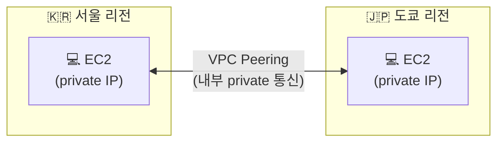

## 📌 들어가며

이번 글에서는 AWS의 **VPC 네트워크 아키텍처**를 직접 설계하고, 서로 다른 리전의 VPC를 내부망으로 잇는 **VPC 피어링(Peering)**까지 실습한다. 먼저 VPC를 이루는 구성 요소를 정리한 뒤, 나만의 네트워크를 만들고 서울↔도쿄 리전을 연결한다.

> **VPC란?** 사용자의 AWS 계정 전용 **가상 네트워크**. 자체 데이터센터의 네트워크와 매우 유사하게, AWS의 확장 가능한 인프라 위에 **격리된 나만의 네트워크 공간**을 구성할 수 있다.

---

## 1. VPC 구성 요소

VPC는 여러 요소가 **계층적으로(리전 → AZ → 서브넷 → 인스턴스)** 맞물려 동작한다.

| 구성 요소 | 역할 | 단위 |
|------|------|------|
| **VPC** | 계정 전용 가상 네트워크 | 리전 |
| **Subnet** | VPC를 쪼갠 IP 범위(AZ에 배치) | AZ |
| **Routing Table** | 트래픽을 어디로 보낼지 결정 | 서브넷 |
| **Internet Gateway** | VPC ↔ 인터넷 통신 활성화 | VPC |
| **Network ACL** | 서브넷 경계 방화벽(허용/거부) | 서브넷 |
| **Security Group** | 인스턴스 경계 방화벽 | 인스턴스 |

> 💡 **NACL vs 보안 그룹** — 기본값이 정반대다. NACL은 인바운드/아웃바운드를 **기본 허용**하고, 보안 그룹은 인바운드를 **기본 거부**·아웃바운드를 **허용**한다. 서브넷은 넓게, 인스턴스는 좁게 통제하는 구조다.

---

## 2. 나만의 네트워크 아키텍처

`my-vpc`를 `10.0.0.0/16`(약 65,536개 IP)으로 잡고, 4개의 AZ에 `/20` 서브넷을 배치한다.

```
my-vpc  10.0.0.0/16  (10.0.0.0 ~ 10.0.255.255)
├─ my-pub-2a  10.0.0.0/20   (10.0.0.0 ~ 10.0.15.255)
├─ my-pub-2b  10.0.16.0/20  (10.0.16.0 ~ 10.0.31.255)
├─ my-pub-2c  10.0.32.0/20  (10.0.32.0 ~ 10.0.47.255)
└─ my-pub-2d  10.0.48.0/20  (10.0.48.0 ~ 10.0.63.255)
```

> ⚠️ 각 서브넷의 `/20`은 4,096개 IP지만, AWS가 **처음 4개(네트워크·VPC 라우터·DNS·향후 예약)와 마지막 1개(브로드캐스트)**를 예약하므로 **실제 사용 가능한 IP는 4,091개**다. 서브넷 크기를 계산할 때 이 5개를 빼야 한다.

---

## 3. VPC Peering이란?

**VPC 피어링**은 서로 다른 VPC를 **외부 인터넷이 아닌 내부망으로** 연결하는 기능이다. 여기서는 **서울 리전 ↔ 도쿄 리전**의 VPC를 잇는다.



---

## 4. 피어링 연결 생성

도쿄 리전에서 기본 VPC ID를 복사한다.


서울 리전으로 돌아와 **피어링 연결 생성**을 누른다. 요청자는 내 VPC, 수락자는 **내 계정 → 다른 리전(도쿄)**을 선택하고 복사한 도쿄 VPC ID를 붙여넣는다.


도쿄 리전의 **피어링 연결** 탭에 **수락 대기 중**이 뜨면, 작업 → 요청 수락을 누른다.


---

## 5. 상대 리전에 EC2 생성 (약식)

도쿄 리전에 확인용 EC2를 만든다. 키페어 없이, **HTTP 트래픽 허용**을 체크하고, 사용자 데이터로 초기 스크립트를 넣어 SSH 없이 바로 확인만 한다.


---

## 6. 라우팅 추가 & 프라이빗 통신 확인

피어링만으로는 통신이 안 되고, **양쪽 라우팅 테이블에 상대 리전의 IP 대역을 추가**해야 한다. 도쿄에는 서울 private IP, 서울에는 도쿄 private IP를 라우팅한다.


이제 서울 EC2에서 `curl`로 도쿄 리전 인스턴스에 **프라이빗 IP로 접속**된다.


> 💡 VPC 피어링은 **연결 수립 + 양방향 라우팅**이 세트다. 한쪽 라우팅만 넣으면 요청은 가도 응답이 못 돌아온다. 반드시 **양쪽 라우팅 테이블 모두**에 상대 대역을 추가해야 한다.

---

## 📝 정리

```
VPC 네트워크
├─ 구성   VPC / Subnet / Routing / IGW / NACL / SG
├─ 설계   my-vpc 10.0.0.0/16 → /20 서브넷 4개(AZ)
├─ IP     /20 = 4096개, 예약 5개 빼면 4091개 사용
└─ 피어링 리전 간 내부 연결 + 양쪽 라우팅 추가
```

| 개념 | 한 줄 정의 |
|------|------|
| **VPC** | 계정 전용 가상 네트워크 |
| **Subnet** | AZ에 배치된 VPC의 IP 범위 |
| **VPC Peering** | VPC 간 내부(private) 연결 |

VPC 설계의 핵심은 **CIDR로 IP 대역을 나누고, 서브넷을 AZ에 배치**하는 것이다. 피어링은 리전을 넘어 내부망을 잇지만, **양쪽 라우팅 테이블 등록**을 빠뜨리면 통신되지 않는다는 점을 꼭 기억하자.
