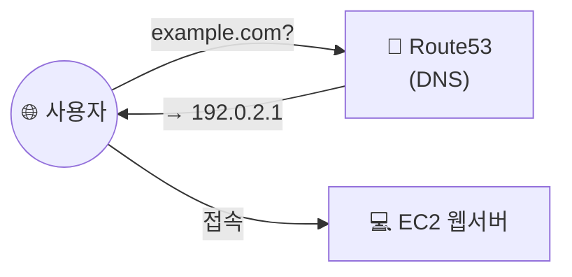

## 📌 들어가며

이번 글에서는 AWS의 **Route53**을 정리한다. Route53은 **도메인 이름을 IP로 변환**해주는 관리형 DNS 서비스로, 내가 구매한 도메인을 EC2 웹 서버로 연결하는 실습을 한다.

> **Route53이란?** AWS의 **DNS(Domain Name System) 서비스**. `www.example.com` 같은 사람이 읽는 도메인을 컴퓨터가 쓰는 `192.0.2.1` 같은 IP 주소로 변환해, 인터넷 트래픽을 웹사이트로 **라우팅**한다.

---

## 1. DNS 동작 흐름

사용자가 도메인을 입력하면, 그 질의가 Route53에 도달해 IP로 응답되고, 브라우저는 그 IP의 서버에 접속한다.



---

## 2. 호스팅 영역 생성 & 네임서버 연결

AWS 콘솔의 Route53에서 **호스팅 영역**을 생성한다. 이때 가비아 등에서 **도메인을 미리 구매**해 두어야 한다.


도메인 이름을 입력하고 나머지는 기본값으로 호스팅 영역을 생성한다.


생성하면 **NS(네임서버) 레코드**에 4개의 네임서버 주소가 보인다. 이를 모두 복사해 도메인 구매 사이트(가비아)로 가져간다.


가비아의 **도메인 관리 → 네임서버 설정**에 복사한 주소를 차례대로 입력한다.


> ⚠️ **네임서버 주소 끝의 온점(`.`)을 반드시 제거**하고 가비아에 입력해야 한다.
> 예: `ns-123.awsdns-12.com.` → `ns-123.awsdns-12.com`
>
> 또한 호스팅 영역 생성은 **프리 티어라도 소액 요금**이 부과된다.

---

## 3. 연결할 EC2 생성 (사용자 데이터)

연결할 웹 서버 `web01`을 Amazon Linux 2로 만든다. VPC·서브넷은 앞서 만든 `my-vpc`를 쓰고, 보안 그룹에 필요한 규칙을 추가한 뒤 **사용자 데이터**로 httpd를 자동 설치한다.

```bash
#!/bin/bash
yum install -y httpd
systemctl enable --now httpd
echo "<h1>WEB01</h1>" > /var/www/html/index.html
```


두 번째 서버 `web02`는 **Ubuntu**로 만든다. OS가 달라 패키지 명령이 다르므로 사용자 데이터도 다르게 넣는다.

```bash
#!/bin/bash
apt update
apt install -y apache2
echo "<h1>TOKYO</h1>" > /var/www/html/index.html
```


> 💡 **Amazon Linux는 `yum` + `httpd`, Ubuntu는 `apt` + `apache2`**로 웹 서버 패키지 이름과 설치 명령이 다르다. 사용자 데이터를 OS에 맞게 작성해야 부팅 시 자동 설치가 정상 동작한다.

---

## 4. A 레코드 생성

다시 Route53에서 두 인스턴스 이름으로 **레코드를 생성**한다. 유형은 **A**, 값에는 각 인스턴스의 **퍼블릭 IP**를 넣는다. 이제 도메인으로 각 웹 서버에 접속할 수 있다.


| 레코드 유형 | 의미 |
|------|------|
| **A** | 도메인 → IPv4 주소 |
| **CNAME** | 도메인 → 다른 도메인(별칭) |
| **NS** | 이 도메인을 관리하는 네임서버 |

---

## 📝 정리

```
Route53
├─ 개념      도메인 ↔ IP 변환 관리형 DNS
├─ 호스팅영역 생성 → NS 4개를 도메인 업체에 등록(온점 제거)
├─ 대상      EC2 웹서버(사용자 데이터로 자동 설치)
└─ 레코드    A 레코드 = 도메인 → 퍼블릭 IP
```

| 개념 | 한 줄 정의 |
|------|------|
| **Route53** | AWS 관리형 DNS |
| **호스팅 영역** | 한 도메인의 레코드 모음 |
| **A 레코드** | 도메인을 IP로 연결 |

Route53의 핵심은 **호스팅 영역을 만들고 → 네임서버를 도메인 업체에 등록 → A 레코드로 IP 연결**하는 3단계다. 특히 네임서버 주소 끝의 온점 제거가 실습의 흔한 함정이다.
