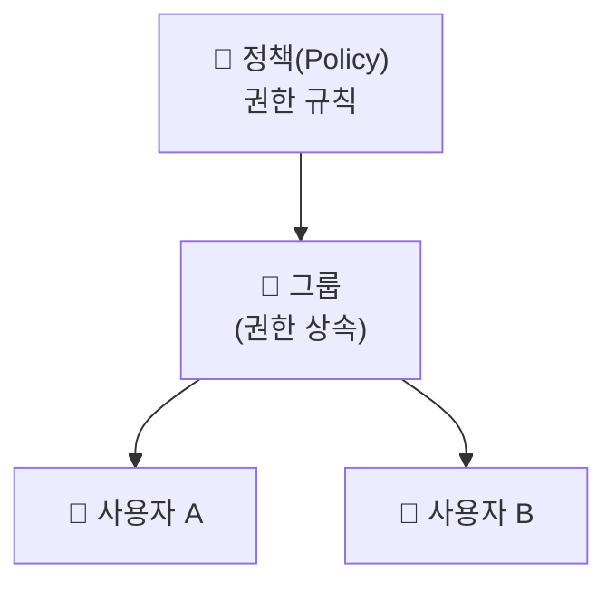

## 📌 들어가며

이번 글에서는 AWS의 **IAM(Identity and Access Management)**을 정리한다. IAM은 **누가(사용자) 무엇을(리소스) 할 수 있는가(권한)**를 한 곳에서 관리하는, AWS 보안의 출발점이다.

> **IAM이란?** AWS 서비스에 대한 액세스를 **안전하게 제어**하는 웹 서비스. 사용자·그룹·역할, 액세스 키 같은 보안 자격 증명, 그리고 각 주체가 어떤 리소스에 접근할 수 있는지를 정하는 **권한(Policy)**을 통합 관리한다.

---

## 1. IAM 핵심 구성 요소

IAM은 **주체(누가)**와 **정책(무엇을 할 수 있는가)**의 조합으로 동작한다.

| 구성 요소 | 역할 |
|------|------|
| **User(사용자)** | AWS를 사용하는 개별 계정(사람/앱) |
| **Group(그룹)** | 사용자 묶음. 그룹에 권한을 주면 소속 사용자가 상속 |
| **Policy(정책)** | 권한 규칙(JSON). 무엇을 허용/거부할지 정의 |
| **Role(역할)** | 임시 권한. 서비스·다른 계정이 필요 시 위임받아 사용 |



> 💡 권한은 **사용자마다 개별 부여하기보다 그룹에 부여**하는 것이 관리에 유리하다. 예를 들어 `개발자` 그룹에 권한을 한 번 걸어두면, 그룹에 넣는 것만으로 새 사용자가 동일 권한을 상속받는다.

---

## 2. 그룹 생성

AWS 콘솔에서 `IAM → 사용자 그룹 → 그룹 생성`을 누른다. 이 화면에서 기존 사용자를 그룹에 추가하고, 관련 권한(정책)을 붙일 수 있다.


---

## 3. 사용자 생성

사용자 이름을 정하고 **AWS Management Console 액세스** 옵션을 체크하면 콘솔 암호 설정이 나온다. **자동 생성**으로 하고, **로그인 시 새 암호 생성** 옵션을 체크한 뒤 다음으로 넘어간다.


이때 앞서 만든 그룹에 체크하면, 그 사용자는 **해당 그룹의 권한을 상속받은 상태**로 생성된다.


> ⚠️ **루트 계정은 일상 작업에 쓰지 않는다.** 루트는 모든 권한을 가지므로, 실제 작업용 IAM 사용자를 별도로 만들고 **최소 권한 원칙(least privilege)**에 따라 필요한 권한만 부여하는 것이 보안 기본이다.

---

## 📝 정리

```
IAM
├─ User    개별 계정(사람/앱)
├─ Group   사용자 묶음 → 권한 상속
├─ Policy  권한 규칙(JSON)
└─ Role    임시 위임 권한
```

| 개념 | 한 줄 정의 |
|------|------|
| **IAM** | 누가·무엇을·할 수 있는가를 관리 |
| **Group** | 권한을 상속시키는 사용자 묶음 |
| **최소 권한** | 필요한 만큼만 권한을 부여 |

IAM의 핵심은 **그룹에 정책을 걸고, 사용자를 그룹에 넣어 권한을 상속**시키는 구조다. 개별 사용자에게 권한을 흩뿌리는 대신 그룹으로 묶으면, 권한 관리가 훨씬 단순하고 안전해진다.
