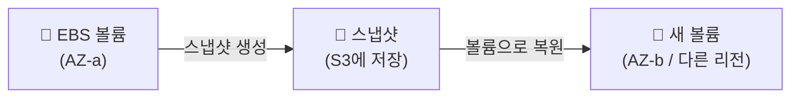

## 📌 들어가며

이번 글에서는 EBS 볼륨의 **스냅샷(Snapshot)**을 정리한다. 스냅샷은 EBS 볼륨의 특정 시점을 **S3에 백업**하는 기능으로, 이를 이용해 볼륨을 복구하거나 **다른 가용 영역·리전으로 볼륨을 복제**할 수 있다. 앞선 [EBS 볼륨 생성·연결](/posts/AWS-EBS/) 흐름에 이어 백업 관점을 더한다.

> **스냅샷이란?** EBS 볼륨의 특정 시점 상태를 **S3에 저장하는 증분(incremental) 백업**. 최초 한 번은 전체를, 이후에는 **변경된 블록만** 저장해 효율적이다. 스냅샷으로 새 볼륨을 만들면 **AZ·리전 제약을 넘어** 볼륨을 옮길 수 있다.

---

## 1. 스냅샷이 필요한 이유

EBS 볼륨은 **같은 AZ 안에서만** 인스턴스에 연결된다. 다른 AZ로 옮기거나 백업본을 남기려면 **스냅샷**을 거쳐야 한다.



| 상황 | 스냅샷 활용 |
|------|------|
| 데이터 백업 | 특정 시점 볼륨을 S3에 저장 |
| 다른 AZ로 이동 | 스냅샷 → 새 AZ에 볼륨 생성 |
| 다른 리전 복제 | 스냅샷 복사 후 볼륨 생성 |
| AMI 생성 | 루트 볼륨 스냅샷 기반 이미지 |

---

## 2. 백업 대상 볼륨 준비

먼저 스냅샷을 뜰 볼륨을 확인한다. `EC2 → 볼륨` 탭에서 대상 볼륨(`web01-add`)을 인스턴스에 연결해 데이터를 담아둔 상태를 가정한다.


> ⚠️ 스냅샷은 **연결된 볼륨을 대상으로도** 생성할 수 있지만, 일관성을 위해 쓰기가 많은 볼륨은 **잠시 마운트를 정지(또는 파일시스템 flush)** 한 뒤 스냅샷을 뜨는 것이 안전하다.

---

## 3. 볼륨 연결 & 스냅샷 생성

대상 볼륨을 선택하고 **작업 → 볼륨 연결**로 인스턴스에 붙인 뒤, 같은 **작업** 메뉴에서 **스냅샷 생성**을 선택하면 해당 시점이 S3에 백업된다.


리눅스에서 볼륨을 실제로 쓰려면 EBS와 동일하게 **포맷·마운트**가 필요하다.

```bash
lsblk                          # 연결된 블록 디바이스 확인

sudo mkfs -t xfs /dev/xvdb     # 파일시스템 생성(신규 볼륨일 때)
sudo mount /dev/xvdb /mnt      # /mnt 에 마운트
sudo umount /mnt               # 언마운트
```

> 💡 **스냅샷으로 복원한 볼륨은 `mkfs`를 다시 하면 안 된다.** 포맷은 데이터를 지우는 작업이라, 복원 볼륨은 곧바로 `mount`만 하면 된다. `mkfs`는 **비어 있는 새 볼륨**에만 사용한다.

---

## 📝 정리

```
스냅샷(Snapshot)
├─ 개념   EBS 볼륨의 시점 백업(S3, 증분 저장)
├─ 목적   백업 / AZ·리전 이동 / AMI 생성
├─ 흐름   볼륨 → 스냅샷 생성 → 새 볼륨 복원
└─ 주의   복원 볼륨은 mkfs 금지, mount만
```

| 개념 | 한 줄 정의 |
|------|------|
| **스냅샷** | 볼륨의 시점 백업(증분) |
| **AZ 극복** | 스냅샷으로 다른 AZ에 볼륨 생성 |
| **증분 백업** | 변경된 블록만 저장 |

스냅샷은 EBS의 **AZ 제약을 넘고 데이터를 지키는 백업 수단**이다. 핵심은 **볼륨 → 스냅샷 → 새 볼륨**으로 이어지는 복원 흐름과, 복원 볼륨은 포맷 없이 마운트만 한다는 점이다.
