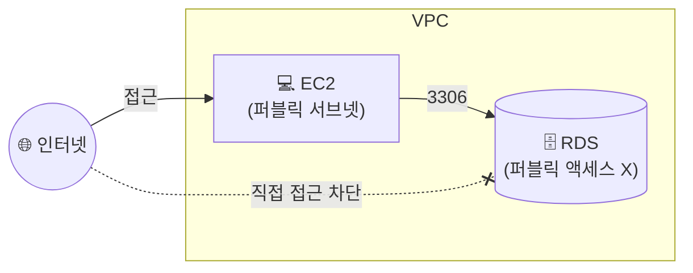

## 📌 들어가며

이번 글에서는 AWS의 **RDS(Relational Database Service)**를 정리한다. DB를 EC2에 직접 설치·운영하는 대신, **설치·백업·패치·확장 같은 관리 작업을 AWS에 맡기는** 완전 관리형 관계형 데이터베이스다.

> **RDS란?** AWS 클라우드에서 **관계형 DB를 쉽게 설치·운영·확장**하는 웹 서비스. 크기 조절이 가능한 용량을 제공하고, **백업·패치·복제 같은 공통 관리 작업을 자동화**한다. DB 인스턴스는 클라우드 안의 **격리된 데이터베이스 환경**이다.

---

## 1. RDS를 쓰는 이유

직접 EC2에 DB를 올리면 백업·패치·이중화를 모두 손수 해야 한다. RDS는 이를 관리형으로 대신해준다.

| 항목 | **EC2에 직접 설치** | **RDS** |
|------|---------------------|---------|
| 설치/패치 | 수동 | **자동** |
| 백업 | 직접 스크립트 | **자동 백업/스냅샷** |
| 이중화 | 직접 구성 | **Multi-AZ 옵션** |
| 확장 | 수동 | **스토리지 자동 조정** |
| 지원 엔진 | 자유 | MySQL·MariaDB·PostgreSQL·Oracle 등 |

> 💡 예시에서는 원래 MySQL을 쓰려 했으나 **과금 정책 변경**으로 **MariaDB**를 선택한다. 또 '손쉬운 생성'보다 **'표준 생성'**이 오히려 옵션을 명확히 보여줘 실습에 편하다.

---

## 2. RDS 생성 — 엔진·템플릿

`RDS` 탭에서 생성을 시작한다. 엔진은 **MariaDB**, 방식은 **표준 생성**, 템플릿은 **프리 티어**를 선택한다.


식별자 이름과 **root 계정의 이름·암호**를 지정한다. 여기서는 자체 관리 암호를 사용한다.


---

## 3. 인스턴스 클래스 & 스토리지

인스턴스 클래스는 **t3.micro**(프리 티어)를 사용한다. 스토리지는 기본값으로 두되, **스토리지 자동 조정**을 체크해 임계값 초과 시 자동으로 늘어나게 한다.


---

## 4. 네트워크 & 보안 (핵심)

VPC는 내가 만든 VPC를 쓰고, **퍼블릭 액세스는 '아니오'**로 둔다. DB는 인터넷에 직접 노출하지 않고 **EC2에서만 접근**하도록 하기 위함이다. 보안 그룹은 새로 만들고, 가용 영역은 기존 EC2(2a, 2c)와 겹치지 않게 **2b**로 지정한다.




> ⚠️ **퍼블릭 액세스를 켜지 않는 것**이 DB 보안의 기본이다. RDS는 프라이빗하게 두고, **EC2를 경유해서만** 접속하게 한다. 이때 RDS 보안 그룹의 인바운드에 **EC2 보안 그룹(또는 3306 포트)**을 허용해야 연결된다.

---

## 5. 초기 DB 생성 & 완료

추가 구성에서 **초기 데이터베이스 이름**을 지정하면, 기본 DB를 가진 채로 생성된다. 나머지는 기본값으로 두고 생성을 마치면 데이터베이스가 만들어진다.


---

## 📝 정리

```
RDS
├─ 개념   관리형 관계형 DB(백업·패치·이중화 자동)
├─ 엔진   MariaDB / MySQL / PostgreSQL ...
├─ 보안   퍼블릭 액세스 X → EC2 경유 접속
└─ 확장   스토리지 자동 조정 옵션
```

| 개념 | 한 줄 정의 |
|------|------|
| **RDS** | 관리형 관계형 데이터베이스 |
| **퍼블릭 액세스 X** | DB를 인터넷에 노출하지 않음 |
| **엔드포인트** | EC2가 접속할 DB 주소 |

RDS는 DB 운영의 번거로운 부분을 AWS에 넘기는 서비스다. 실습의 핵심은 **프리 티어 + 프라이빗(퍼블릭 액세스 X) 구성**이며, 실제 연결은 다음 글의 **2-tier 환경**에서 EC2를 통해 이어진다.
