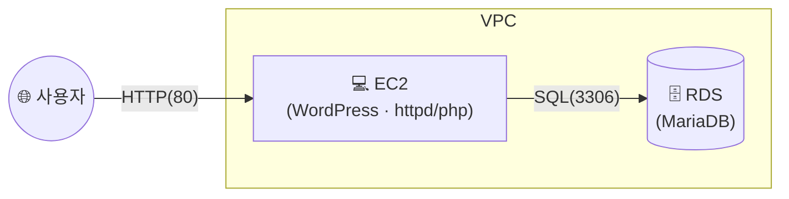

## 📌 들어가며

이번 글에서는 **웹 서버(EC2)**와 **DB(RDS)**를 분리한 **2-tier 아키텍처**를 직접 구축한다. 앞서 만든 [RDS](/posts/AWS-RDS/)에 [EC2](/posts/AWS-My-EC2/) 웹 서버를 연결하고, WordPress 블로그를 띄워 **웹 계층 ↔ DB 계층**이 실제로 통신하는 것까지 확인한다.

> **2-tier 아키텍처란?** 애플리케이션을 **웹/애플리케이션 계층**과 **데이터 계층**으로 나눈 구조. 웹 서버(EC2)는 요청을 처리하고, 데이터는 별도의 DB(RDS)가 담당한다. 계층을 분리하면 **각각 독립적으로 확장·관리**할 수 있다.


---

## 1. 구성 그림

사용자는 웹 서버에 접속하고, 웹 서버는 그 뒤의 RDS와만 통신한다. DB는 외부에 노출되지 않는다.



---

## 2. 웹 서버(EC2) 생성 + 사용자 데이터

웹 서버용 EC2를 Amazon Linux 2로 만든다. 프리 티어 유형과 기존 키페어를 선택하고, VPC·서브넷(2c)·웹 서버용 보안 그룹을 지정한다.


**사용자 데이터(init)**로 접속 없이 초기 세팅을 자동화한다. `httpd`·`php`를 설치하고, WordPress 자료를 받아 기본 웹 루트에 넣은 뒤 권한을 조정하고 서비스를 시작한다.


> 💡 **사용자 데이터(User Data)**는 인스턴스 최초 부팅 시 한 번 실행되는 스크립트다. SSH로 접속해 손으로 설치하는 대신, 생성과 동시에 웹 서버가 구동되도록 자동화할 수 있다.

---

## 3. Route53 레코드 생성

구입한 도메인의 Route53에서, 값에 방금 만든 EC2의 IP를 넣어 A 레코드를 생성한다. 이제 도메인으로 웹 서버에 접속할 수 있다.


---

## 4. RDS에 WordPress용 DB·계정 생성

SSH로 EC2에 접속한 뒤, RDS **엔드포인트**를 지정해 MariaDB에 접속한다.

```bash
sudo mysql -h (RDS 엔드포인트) -u (사용자이름) -p
```

WordPress가 쓸 **DB와 전용 사용자**를 만들고 권한을 부여한다.

```sql
CREATE USER 'wpuser'@'%' IDENTIFIED BY 'pass123#';        -- 전용 계정
CREATE DATABASE IF NOT EXISTS wordpress;                  -- DB 생성
GRANT ALL PRIVILEGES ON wordpress.* TO 'wpuser'@'%';      -- 권한 부여
FLUSH PRIVILEGES;                                         -- 권한 반영
quit
```


> ⚠️ RDS에 EC2에서 접속하려면, **RDS 보안 그룹의 인바운드에 웹 서버의 접근(3306)**이 허용되어 있어야 한다. `-h`에는 **RDS 엔드포인트**를 정확히 넣는다.

---

## 5. WordPress ↔ RDS 연결

EC2 도메인으로 접속하면 WordPress 설치 페이지(`index.php`)가 열린다. **데이터베이스 호스트에 RDS 엔드포인트**를 적고 나머지 정보를 입력한다.


연결이 끝나면 블로그 관리자(Admin) 페이지가 나타나고, 기본 게시글이 보인다. 댓글도 남겨본다.


---

## 6. DB에 데이터가 쌓였는지 확인

앞서 접속했던 SSH 세션에서 `show tables;`를 실행하면, WordPress가 만든 테이블들이 **설정한 접두사** 기반으로 생성된 것을 볼 수 있다. 웹에서 남긴 데이터가 실제로 RDS에 저장된 것이다.


---

## 📝 정리

```
2-tier 아키텍처
├─ 웹 계층   EC2 + httpd/php (사용자 데이터로 자동 세팅)
├─ 데이터 계층 RDS(MariaDB), 퍼블릭 노출 X
├─ 도메인    Route53 A 레코드 → EC2
└─ 연결      WordPress DB 호스트 = RDS 엔드포인트
```

| 개념 | 한 줄 정의 |
|------|------|
| **2-tier** | 웹 계층과 DB 계층 분리 |
| **사용자 데이터** | 부팅 시 1회 실행 초기화 스크립트 |
| **RDS 엔드포인트** | EC2가 접속하는 DB 주소 |

2-tier의 핵심은 **웹과 DB를 분리하고, 웹 서버만 외부에 노출**하는 것이다. WordPress를 통해 "사용자 → EC2 → RDS"로 이어지는 요청·저장 흐름이 실제로 동작함을 확인했다.
