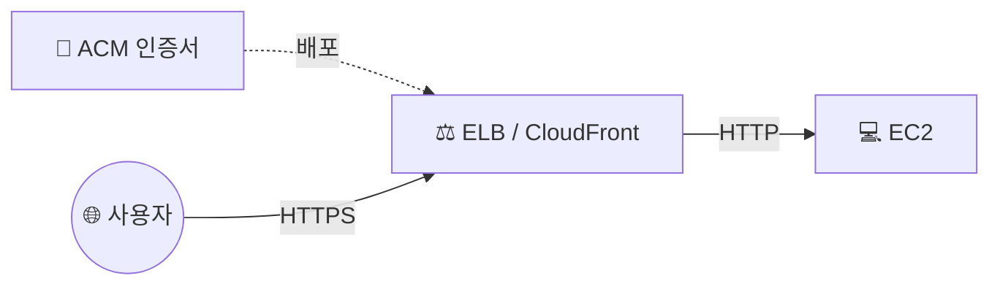

## 📌 들어가며

이번 글에서는 AWS의 **ACM(AWS Certificate Manager)**으로 **SSL/TLS 인증서를 발급**하고, HTTPS 통신을 준비하는 과정을 정리한다. 직접 구매·갱신하던 인증서를 AWS가 **무료로 발급하고 자동 갱신**해준다는 점이 핵심이다.

> **ACM이란?** TLS 기반 보안 웹이 필요한 서비스를 위해 **인증서를 관리**하는 서비스. 발급한 인증서는 **ELB, CloudFront, API Gateway** 등에 배포되며, **만료되는 인증서의 갱신을 자동화**해 보안 관리를 단순화한다.

---

## 1. ACM 인증서를 어디에 붙이나

ACM 인증서는 EC2에 직접 설치하는 것이 아니라, **트래픽을 받는 프론트 서비스(ELB, CloudFront 등)**에 연결한다. 클라이언트~프론트 구간을 HTTPS로 암호화하는 구조다.



| 통합 서비스 | 용도 |
|------|------|
| **ELB** | 로드밸런서에서 HTTPS 종료 |
| **CloudFront** | CDN 엣지에서 HTTPS 제공 |
| **API Gateway** | API 엔드포인트 HTTPS |

> 💡 ACM 인증서는 **퍼블릭 인증서가 무료**이고, **자동 갱신**되므로 만료 걱정이 없다. 다만 위와 같은 **AWS 통합 서비스에만 배포**할 수 있고, EC2에 직접 파일로 내려받아 설치할 수는 없다.

---

## 2. 인증서 요청 (퍼블릭 인증서)

`ACM` 탭에서 **인증서 요청 → 퍼블릭 인증서**를 선택한다.


도메인 이름에는 소유한 도메인(예: 가비아에서 구매한 `campinggo.store`)과 하위 도메인을 지정한다. 검증 방법과 키 알고리즘은 기본값을 따른다.


---

## 3. DNS 검증 (Route53 레코드 생성)

요청 후 **도메인 소유권을 검증**해야 한다. Route53을 쓰면 ACM 화면의 **레코드 생성** 버튼 한 번으로 검증용 CNAME 레코드가 자동 등록된다.


레코드가 전파되어 검증이 끝나면 인증서 상태가 **'발급됨'**으로 바뀌고, 이제 ELB·CloudFront 등에 붙여 쓸 수 있다.


> ⚠️ **DNS 검증**은 도메인 소유권을 CNAME 레코드로 증명하는 방식이라, 레코드를 그대로 두면 **갱신 시에도 자동 재검증**된다. 반면 **이메일 검증**은 갱신마다 수동 확인이 필요하므로, DNS 검증을 권장한다.

---

## 📝 정리

```
ACM
├─ 개념   무료 SSL/TLS 인증서 발급 + 자동 갱신
├─ 배포   ELB / CloudFront / API Gateway 에 연결
├─ 검증   DNS(CNAME) 검증 → 자동 재검증 유리
└─ 상태   '발급됨' 이 되면 사용 가능
```

| 개념 | 한 줄 정의 |
|------|------|
| **ACM** | AWS 관리형 무료 인증서 |
| **DNS 검증** | CNAME으로 소유권 증명(자동 갱신) |
| **발급됨** | 인증서를 서비스에 붙일 수 있는 상태 |

ACM의 핵심은 **인증서를 무료로 발급받아 ELB·CloudFront에 붙이고, 갱신은 AWS에 맡기는 것**이다. DNS 검증으로 받아두면 만료·갱신에 신경 쓸 필요 없이 HTTPS를 유지할 수 있다.
