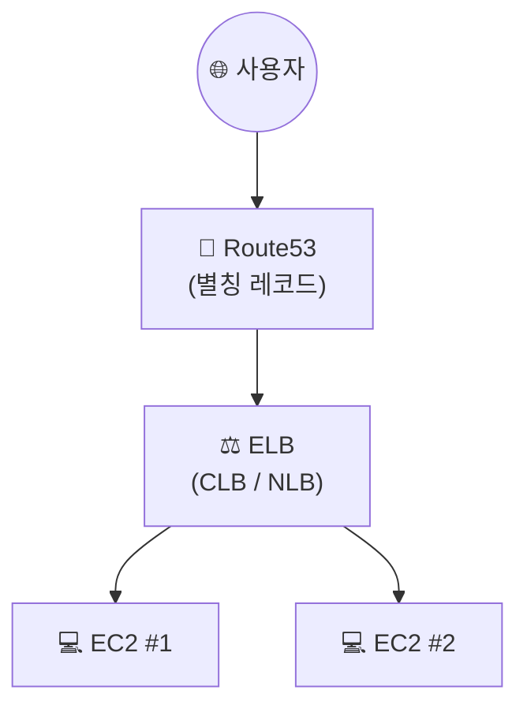

## 📌 들어가며

이번 글에서는 AWS의 **ELB(Elastic Load Balancer)**를 정리한다. 여러 EC2에 트래픽을 **분산**해 가용성과 내결함성을 높이는 서비스로, **CLB**와 **NLB**를 각각 만들어 HTTPS까지 연결한다.

> **ELB란?** 수신 트래픽을 여러 가용 영역의 **여러 대상(EC2·컨테이너·IP)에 분산**하는 로드밸런서. 트래픽 변화에 맞춰 자동으로 확장되며, 애플리케이션의 **고가용성(High Availability)**과 **내결함성(Fault Tolerant)**을 높인다.

---

## 1. ELB 종류 (계층별)

ELB는 동작하는 **OSI 계층**에 따라 나뉜다. HTTP/HTTPS를 다루면 L7, TCP/UDP를 다루면 L4다.

| 종류 | 계층 | 프로토콜 | 특징 |
|------|------|----------|------|
| **ALB** | **L7** | HTTP/HTTPS | 경로·호스트 기반 라우팅 |
| **CLB** | L7/L4 | HTTP/HTTPS/TCP | 이전 세대(Classic) |
| **NLB** | **L4** | TCP/UDP/TLS | 초고성능, 고정 IP |



---

## 2. 보안 그룹 (HTTPS용)

먼저 EC2 탭에서 **ELB 전용 보안 그룹**을 만든다. HTTPS(443) 인바운드 규칙을 담은 별도 그룹을 두기 위함이다.


---

## 3. CLB(Classic Load Balancer) 생성

로드밸런서 생성에서 **Classic Load Balancer(이전 세대)**를 선택한다. 네트워크 매핑은 내 VPC와 2a·2c 서브넷, 보안 그룹은 방금 만든 것으로 지정한다.


리스너는 **HTTPS 443 → 인스턴스 HTTP 80**으로 매핑하고, 보안 리스너에는 앞서 만든 **ACM 인증서**를 선택한다. 상태 검사는 기본 `index.html`, 대상 인스턴스는 Cloud9 인스턴스와 개별 인스턴스 2개를 고른다.


> 💡 **443(HTTPS) → 80(HTTP) 매핑**이 핵심이다. 사용자~ELB 구간은 ACM 인증서로 암호화(HTTPS)하고, ELB~EC2 내부 구간은 HTTP로 처리한다. 이렇게 하면 각 EC2에 인증서를 개별 설치할 필요가 없다(**SSL 오프로딩**).

---

## 4. Route53 별칭 레코드 연결

생성된 로드밸런서의 **DNS 엔드포인트**를 복사한다. 아직 HTTPS 접속이 안 되는데, Route53에서 레코드를 만들어야 한다.


이번에는 값에 IP를 넣는 대신 **'별칭(Alias)'** 옵션을 체크하고, 트래픽 라우팅 대상으로 **Application/Classic Load Balancer**를 골라 복사한 DNS를 붙여넣는다.


이제 HTTPS 접속이 되고, 새로고침할 때마다 **두 인스턴스가 번갈아(Round Robin)** 응답한다!


> ⚠️ ELB는 IP가 고정되지 않고 바뀔 수 있어, A 레코드에 IP를 직접 넣으면 안 된다. 반드시 **별칭(Alias) 레코드로 ELB의 DNS**를 가리켜야 한다.

---

## 5. 대상 그룹(Target Group) 생성

NLB에 앞서, EC2 탭에서 **대상 그룹**을 만든다. 대상 유형은 인스턴스, 프로토콜/포트는 **TCP 80**, VPC는 내 VPC, 상태 검사는 `/`로 한다.


---

## 6. NLB(Network Load Balancer) 생성

로드밸런서 생성에서 **NLB**를 선택하고, 체계는 **인터넷 경계(Internet-facing)**로 한다. NLB는 L4라서 리스너 프로토콜이 HTTP/HTTPS가 아니라 **TCP(80)·TLS(443)**다. 대상 그룹은 앞서 만든 것을 연결한다.


마찬가지로 Route53에서 별칭 레코드를 만들면 정상 접속된다.


> 💡 **`Internet-facing` = 인터넷 경계**. 콘솔 번역이 오락가락하니 영어 단어를 기억해두자. 또 **CLB는 Round Robin**이라 새로고침마다 서버가 바뀌지만, **NLB는 IP Hash** 방식이라 같은 클라이언트는 같은 서버로 고정된다.

---

## 📝 정리

```
ELB
├─ 종류    ALB(L7) / CLB(구세대) / NLB(L4)
├─ HTTPS   443 → 80 매핑 + ACM 인증서(SSL 오프로딩)
├─ 연결    Route53 별칭(Alias) 레코드 → ELB DNS
└─ 분산    CLB=Round Robin / NLB=IP Hash
```

| 개념 | 한 줄 정의 |
|------|------|
| **ELB** | 여러 대상에 트래픽 분산 |
| **별칭 레코드** | ELB DNS를 가리키는 Route53 레코드 |
| **L7 vs L4** | ALB(HTTP) vs NLB(TCP) |

ELB의 핵심은 **트래픽 분산으로 고가용성 확보 + ACM으로 HTTPS 처리**다. 계층(L7/L4)에 따라 프로토콜과 분산 알고리즘이 다르며, 연결은 반드시 **Route53 별칭 레코드**로 한다는 점을 기억하자.
