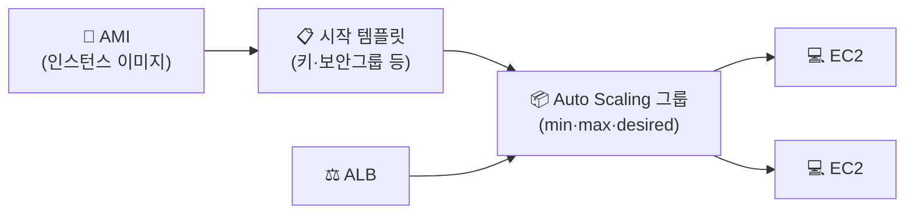

## 📌 들어가며

이번 글에서는 AWS의 **Auto Scaling**을 정리한다. 트래픽에 따라 EC2 인스턴스 수를 **자동으로 늘리고 줄여**, 부하는 감당하면서 비용은 아끼는 기능이다. **AMI 생성 → 시작 템플릿 → Auto Scaling 그룹(ASG)**의 순서로 구축한다.

> **Auto Scaling이란?** 애플리케이션 부하를 처리할 **정확한 수의 인스턴스를 유지**하는 서비스. **Auto Scaling 그룹(ASG)**에 최소·최대·희망 용량을 지정하면, AWS가 그 범위 안에서 인스턴스 수를 자동으로 조절한다.

---

## 1. 핵심 구성과 흐름

Auto Scaling은 **"어떤 인스턴스를(AMI) → 어떤 설정으로(시작 템플릿) → 몇 개나(ASG)"** 유지할지를 정의하는 구조다.



| 용어 | 역할 |
|------|------|
| **AMI** | 복제할 인스턴스의 이미지(스냅샷 기반) |
| **시작 템플릿** | 인스턴스 생성 설정(AMI·키·보안그룹) |
| **ASG** | 인스턴스 수를 관리(최소/최대/희망) |
| **ALB** | 늘어난 인스턴스로 트래픽 분산 |

---

## 2. 기존 인스턴스로 AMI 생성

Auto Scaling에는 **복제 기준이 되는 이미지(AMI)**가 필요하다. 기존 web 서버 인스턴스를 이미지로 만든다. 스냅샷이 먼저 생성되어 대기 중이 되고, **사용 가능** 상태가 되면 AMI 목록에서 확인할 수 있다.


---

## 3. 시작 템플릿 생성

스케일링할 대상을 정의하는 **시작 템플릿**을 만든다. OS 이미지로 방금 만든 **AMI**를 고르고, 키페어와 보안 그룹은 기존 web 서버용을 선택한다.


---

## 4. Auto Scaling 그룹 + 로드밸런서

시작 템플릿을 선택해 실제 ASG를 만든다. VPC·서브넷은 내가 만든 것으로 하고, 로드밸런서는 **새 ALB**를 **Internet-facing** 체계로 생성한다.


> ⚠️ 콘솔 언어에 따라 **Internet-facing**이 한글/영어로 번갈아 표시되니, **"Internet-facing"** 이라는 단어 자체를 기억해두자. 외부 트래픽을 받으려면 반드시 이 옵션이어야 한다.

---

## 5. 용량 · 유지 관리 · 알림

**희망 용량(그룹 크기)**은 초기 인스턴스 수다. 2로 하면 AMI 기반 인스턴스 2개로 시작한다. **최소/최대 용량**으로 범위를 정하고, **대상 추적 정책**을 걸면 지표에 따라 동적으로 조정된다(여기서는 정책 없음으로 수동 실습).


| 용량 설정 | 의미 |
|------|------|
| **희망(desired)** | 평상시 유지할 인스턴스 수 |
| **최소(min)** | 이 아래로 줄지 않음 |
| **최대(max)** | 이 위로 늘지 않음 |

**유지 관리 정책**에서는 인스턴스 교체 시 **새 인스턴스가 뜰 때까지 기존 인스턴스를 살려두도록** 설정해 무중단을 노린다. 알림은 이메일로 받고, 태그로 `Name=asg`를 지정한다.


> 💡 **대상 추적 정책**은 "CPU 50% 유지"처럼 목표 지표를 정하면 AWS가 알아서 인스턴스를 늘리고 줄인다. 실무에서는 수동 대신 이 방식으로 트래픽에 자동 반응하게 두는 것이 일반적이다.

---

## 📝 정리

```
Auto Scaling
├─ AMI        복제 기준 이미지 생성
├─ 시작 템플릿 AMI + 키 + 보안그룹 설정
├─ ASG        min/max/desired로 인스턴스 수 관리
├─ ALB        Internet-facing으로 트래픽 분산
└─ 정책       대상 추적 → 지표 기반 자동 조정
```

| 개념 | 한 줄 정의 |
|------|------|
| **Auto Scaling** | 부하에 따라 인스턴스 수 자동 조절 |
| **시작 템플릿** | 인스턴스 생성 설정 청사진 |
| **대상 추적 정책** | 지표 목표 기반 자동 스케일 |

Auto Scaling의 핵심은 **AMI → 시작 템플릿 → ASG**로 이어지는 구성과, **min/max/desired로 규모를 통제**하는 것이다. ALB와 결합하면 트래픽 증가에 자동으로 인스턴스를 늘려 대응할 수 있다.
