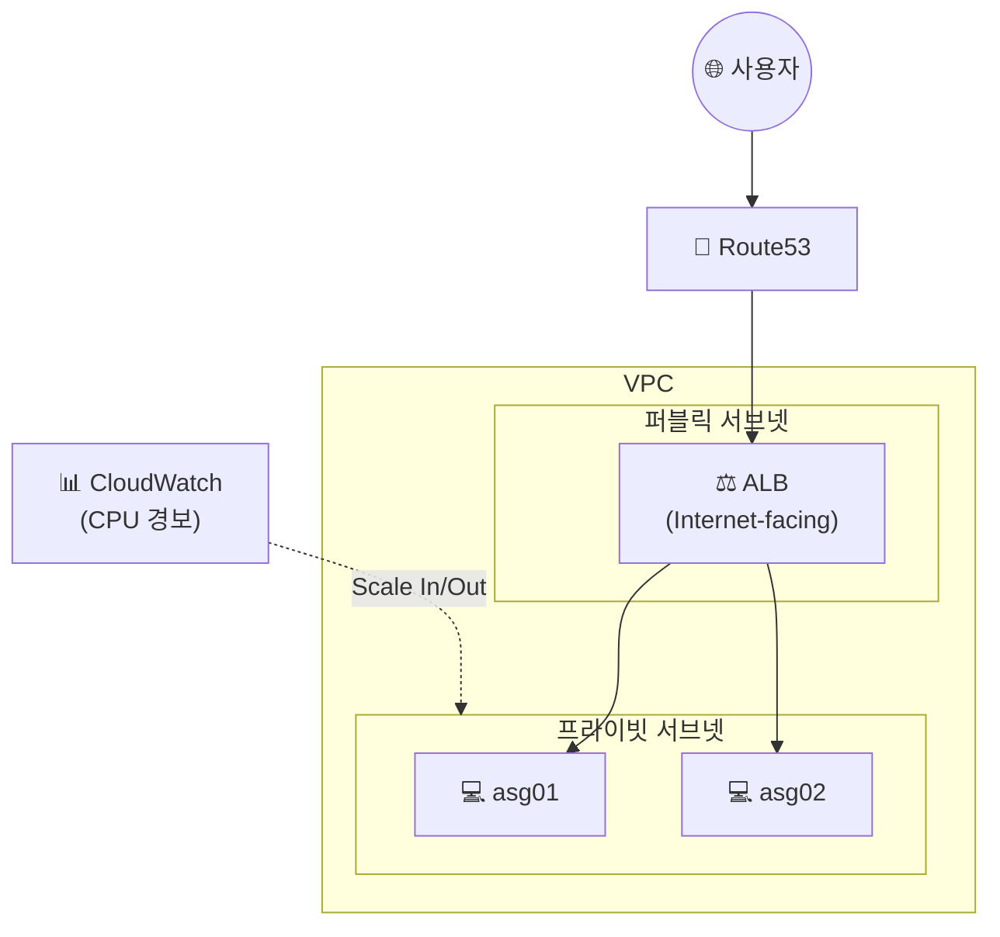

## 📌 들어가며

이번 글에서는 **프라이빗 서브넷에 인스턴스를 두고, ALB를 통해서만 접근**하는 아키텍처를 구성한다. 여기에 **동적 크기 조정 정책(Scale Out/In)**을 CloudWatch 경보로 연결해, CPU 부하에 따라 인스턴스가 자동으로 늘고 주는 것까지 실습한다. 앞선 [Auto Scaling](/posts/AWS-Auto-Scaling/)의 심화판이다.

> **왜 프라이빗 서브넷인가?** 실제 서버(EC2)를 **인터넷에서 직접 접근할 수 없는 프라이빗 서브넷**에 숨기고, 외부 트래픽은 **퍼블릭 서브넷의 ALB만** 받게 하면 보안이 크게 강화된다. 사용자는 ALB만 알고, 뒤의 서버는 알 수 없다.

---

## 1. 전체 아키텍처

사용자 → (Route53) → **퍼블릭 서브넷의 ALB** → **프라이빗 서브넷의 EC2(ASG)** 구조다.




---

## 2. 프라이빗 서브넷 & 라우팅 테이블

`VPC → 서브넷`에서 4개 AZ에 각각 **프라이빗 서브넷**을 만든다. CIDR은 기존 퍼블릭 서브넷 대역 이후로 이어서 할당한다.


`VPC → 라우팅 테이블`에서 프라이빗용 라우팅 테이블을 만든다. 이 테이블에는 내부 통신용 **로컬 라우팅**만 있고, 앞서 만든 프라이빗 서브넷들을 **연결**한다.


> ⚠️ 프라이빗 라우팅 테이블에는 **인터넷 게이트웨이(IGW) 경로가 없다.** 그래서 프라이빗 서브넷의 인스턴스는 외부에서 직접 접근할 수 없고, 오직 로컬 통신(같은 VPC 안)만 가능하다.

---

## 3. AMI & 시작 템플릿

EC2를 이미지화(AMI)한다. 이미지 생성 시 **'재부팅 안 함'** 옵션을 체크한다.


시작 템플릿을 만들 때 **Auto Scaling 지침 옵션**을 체크한다(그래야 AMI 선택이 필수가 된다). 내 AMI를 선택하고, **네트워크는 나중에 설정해야 하므로 '포함하지 않음'**으로 둔다.


---

## 4. Auto Scaling 그룹 생성 (핵심 함정)

ASG 생성에서 시작 템플릿을 고른다. **네트워크 매핑이 핵심 함정**인데, 프라이빗 서브넷을 만들었다고 프라이빗을 고르는 게 아니라 **퍼블릭 서브넷을 선택**해야 한다.


> ⚠️ **왜 퍼블릭 서브넷을 고르나?** 여기서 지정하는 서브넷은 **ALB가 배치될 위치**다. 외부 트래픽을 받는 ALB는 반드시 퍼블릭 서브넷에 있어야 하므로, 프라이빗 아키텍처라도 이 단계에서는 **퍼블릭 서브넷**을 선택한다.

로드밸런서는 **ALB(Internet-facing)**, 리스너의 대상 그룹은 새로 만들고, 상태 확인을 체크한다(나중에 CloudWatch로 볼 것이다).


그룹 크기는 **최소 2 / 최대 4**로 하고, 크기 조정 정책은 나중에 세팅한다. 알림은 기존 SNS 주제로, 태그는 `Name=asg`로 통일한다.


---

## 5. Route53 & HTTPS 설정

Route53에서 ALB 별칭 레코드를 만든다. 그리고 `EC2 → 로드 밸런서`에서 만든 ALB의 리스너에 **HTTPS를 추가**하고, ASG 대상 그룹으로 전달하도록 한 뒤 **ACM 인증서**를 선택한다.


---

## 6. Scale Out 정책 (CPU 70% 초과 → +1)

`my-asg`로 이동하면 아직 정책이 없다. **동적 크기 조정 정책**을 만드는데, 먼저 **확장(Scale Out)**부터. 유형은 **단순 크기 조정**이다.


**CloudWatch 경보 생성**으로 이동해 지표를 `EC2 → Auto Scaling 그룹별 → CPUUtilization`으로 선택한다. 조건은 **CPU 사용률 70% 초과 시 경보**, 트리거는 `my-sns` 주제로 설정한다.


동적 크기 조정으로 돌아와 생성한 경보를 선택하고, 작업은 **'추가' 1개**로 한다. 이제 CPU가 70%를 넘으면 인스턴스가 하나 추가된다.


---

## 7. Scale In 정책 (CPU 30% 미만 → −1)

이번엔 축소(Scale In)다. 같은 방식으로 CloudWatch 경보를 만들되, 조건을 **CPU 30% 미만**으로 한다. 트리거는 `my-sns`, 작업은 **인스턴스 1개 제거**다.


이제 `my-asg`에 **동적 크기 조정 정책이 2개**(Out/In) 존재한다.


| 정책 | 조건 | 작업 |
|------|------|------|
| **Scale Out** | CPU > 70% | 인스턴스 **+1** |
| **Scale In** | CPU < 30% | 인스턴스 **−1** |

---

## 8. 트래픽 부하 테스트

최소 용량이 2라서 인스턴스가 2개 있다. `asg01`, `asg02`로 구분하고, 각 인스턴스에서 부하 명령을 준다.

```bash
yes > /dev/null &   # CPU를 최대로 점유(무한 출력)
```


Scale Out 경보를 보면 **임계치(70%)를 넘겨 새 인스턴스가 자동 생성**된 것을 확인할 수 있다.


> 💡 `yes > /dev/null &`는 `yes`의 무한 출력을 버림으로 보내 **CPU를 100%로 태우는** 간단한 부하 테스트 방법이다. `&`로 백그라운드 실행하며, 테스트 후에는 `kill`로 종료해야 Scale In이 동작한다.

---

## 📝 정리

```
Private + Auto Scaling
├─ 네트워크  프라이빗 서브넷(IGW 경로 없음) + 라우팅
├─ ASG       ALB는 퍼블릭 서브넷에! (핵심 함정)
├─ HTTPS     ALB 리스너 + ACM 인증서
├─ 정책      Scale Out(>70% +1) / Scale In(<30% -1)
└─ 테스트    yes > /dev/null & 로 CPU 부하
```

| 개념 | 한 줄 정의 |
|------|------|
| **프라이빗 아키텍처** | 서버는 숨기고 ALB만 노출 |
| **동적 크기 조정** | CloudWatch 경보 → 자동 증감 |
| **부하 테스트** | `yes > /dev/null &` |

이 아키텍처의 핵심은 **서버를 프라이빗에 숨기고 ALB만 외부에 두는 것**, 그리고 **CloudWatch 경보로 Scale Out/In을 자동화**하는 것이다. 특히 ASG 생성 시 **ALB용으로 퍼블릭 서브넷을 선택**해야 한다는 함정을 기억하자.
