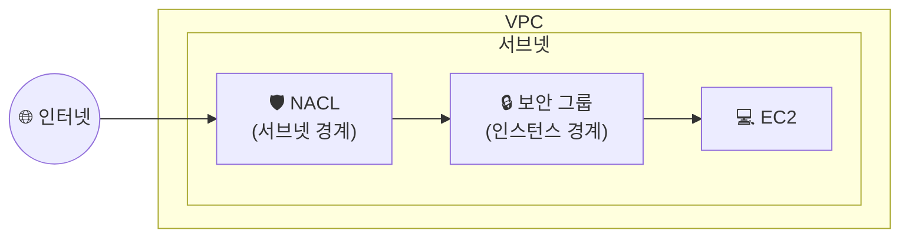

## 📌 들어가며

이번 글에서는 AWS의 **네트워크 ACL(NACL)**을 정리한다. NACL은 **서브넷 수준**에서 트래픽을 통제하는 방화벽으로, **인스턴스 수준**에서 동작하는 보안 그룹(Security Group)과 함께 VPC의 이중 보안 계층을 구성한다.

> **NACL(Network ACL)이란?** **서브넷 수준**에서 특정 인바운드/아웃바운드 트래픽을 **허용하거나 거부**하는 네트워크 접근 제어 목록. VPC에 보안 계층을 하나 더 추가하며, 사용에 **추가 요금이 없다**.


---

## 1. NACL vs 보안 그룹(Security Group)

두 방화벽은 **동작하는 계층**과 **거부 규칙 지원 여부**가 다르다. NACL의 가장 큰 특징은 보안 그룹과 달리 **명시적 '거부(Deny)'가 가능**하다는 점이다.

| 구분 | **NACL** | **보안 그룹(SG)** |
|------|----------|-------------------|
| 적용 대상 | **서브넷** | **인스턴스(ENI)** |
| 규칙 유형 | **허용 + 거부** | **허용만** |
| 상태 | **Stateless**(비상태) | **Stateful**(상태 유지) |
| 규칙 평가 | **번호 순서대로** | 모든 규칙 종합 |
| 반환 트래픽 | 규칙 별도 필요 | 자동 허용 |



> ⚠️ **Stateless vs Stateful** — NACL은 **비상태**라서 요청을 허용해도 **응답(반환 트래픽)에 대한 규칙을 따로** 열어줘야 한다. 보안 그룹은 **상태를 기억**해서 허용한 요청의 응답을 자동으로 통과시킨다.

---

## 2. NACL 생성 및 서브넷 연결

`VPC → 네트워크 ACL`에서 NACL을 생성하고, **연결 대상**으로 앞서 만든 서브넷을 지정한다.


---

## 3. 인바운드/아웃바운드 규칙 편집

규칙 편집에서 허용/거부할 **프로토콜과 소스(CIDR)**를 지정한다. 규칙은 **규칙 번호가 낮은 순서대로** 평가되며, 일치하는 규칙을 만나면 그 즉시 적용된다.


> 💡 규칙 번호는 **100, 200, 300…** 처럼 간격을 두고 매기는 것이 관례다. 나중에 사이에 규칙을 끼워 넣을 여지를 남기기 위함이다. 마지막 `*` 규칙은 어떤 규칙에도 걸리지 않은 트래픽을 **모두 거부**한다.

---

## 📝 정리

```
NACL(Network ACL)
├─ 계층    서브넷 수준 (SG는 인스턴스 수준)
├─ 규칙    허용 + 거부 모두 가능 (SG는 허용만)
├─ 상태    Stateless → 반환 트래픽도 규칙 필요
└─ 평가    규칙 번호 낮은 순 → 첫 일치 규칙 적용
```

| 개념 | 한 줄 정의 |
|------|------|
| **NACL** | 서브넷 수준의 허용/거부 방화벽 |
| **Stateless** | 반환 트래픽 규칙을 따로 열어야 함 |
| **규칙 번호** | 낮은 순서대로 평가, 첫 일치 적용 |

NACL은 서브넷이라는 **넓은 경계**에서 거부까지 포함해 트래픽을 걸러내고, 보안 그룹은 인스턴스라는 **좁은 경계**에서 허용을 관리한다. 이 둘을 겹쳐 쓰는 것이 AWS 네트워크 보안의 기본 패턴이다.
