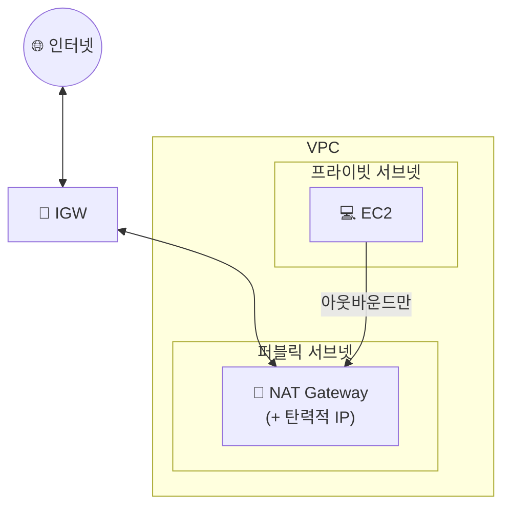

## 📌 들어가며

이번 글에서는 AWS의 **NAT Gateway**를 정리한다. 프라이빗 서브넷의 EC2는 외부에서 접근하지 못하도록 숨겨두되, **자신은 인터넷으로 나가야 하는**(패키지 설치·업데이트 등) 상황이 생긴다. 이 **"나가기는 되고 들어오기는 안 되는"** 통로를 만들어 주는 것이 NAT Gateway다.

> **NAT Gateway란?** 프라이빗 서브넷의 인스턴스가 **VPC 외부(인터넷·AWS 서비스)로 나갈 수 있게** 하되, 외부에서 그 인스턴스로 **먼저 접근하지는 못하게** 하는 관리형 NAT 서비스. 즉 **아웃바운드는 허용, 인바운드 개시는 차단**한다.

---

## 1. IGW vs NAT Gateway

퍼블릭 서브넷은 **인터넷 게이트웨이(IGW)**로 양방향 통신을 하지만, 프라이빗 서브넷은 **NAT Gateway**를 통해 나가기만 한다.



| 구분 | **IGW** | **NAT Gateway** |
|------|---------|-----------------|
| 위치 | VPC 경계 | **퍼블릭 서브넷** |
| 방향 | 양방향 | **아웃바운드만** |
| 대상 | 퍼블릭 서브넷 | **프라이빗 서브넷** |
| 목적 | 공개 서비스 | 내부 EC2의 외부 접근 |

> ⚠️ NAT Gateway는 **퍼블릭 서브넷**에 두고 **탄력적 IP(EIP)**를 할당해야 한다. NAT 자신은 IGW를 통해 인터넷과 통신하고, 프라이빗 EC2는 라우팅 테이블을 통해 이 NAT로 트래픽을 보낸다.

---

## 2. NAT Gateway 생성

`VPC → NAT 게이트웨이` 탭에서 **생성**을 누른다. 연결 유형은 **퍼블릭**으로 하고, **탄력적 IP 할당** 버튼으로 EIP를 붙인다.


---

## 3. 프라이빗 라우팅 테이블에 경로 추가

프라이빗 서브넷의 라우팅 테이블을 선택하고, **라우팅 편집**에서 `0.0.0.0/0`의 대상으로 방금 만든 NAT Gateway를 지정한다.


설정이 끝나면 프라이빗 EC2에서 외부로 나가는 통신이 된다. `ping`으로 확인해보자.

```bash
[ec2-user@ip-10-0-68-6 ~]$ ping google.com
PING google.com (142.250.207.110) 56(84) bytes of data.
64 bytes from kix06s11-in-f14.1e100.net (142.250.207.110): icmp_seq=1 ttl=47 time=41.0 ms
64 bytes from kix06s11-in-f14.1e100.net (142.250.207.110): icmp_seq=2 ttl=47 time=40.4 ms
64 bytes from kix06s11-in-f14.1e100.net (142.250.207.110): icmp_seq=3 ttl=47 time=40.3 ms
^C
--- google.com ping statistics ---
3 packets transmitted, 3 received, 0% packet loss, time 2003ms
rtt min/avg/max/mdev = 40.360/40.632/41.093/0.366 ms
```

> 💡 프라이빗 EC2가 인터넷과 통신하려면 **① NAT를 퍼블릭 서브넷에 생성 → ② 프라이빗 라우팅 테이블에 `0.0.0.0/0 → NAT` 경로 추가**, 이 두 단계가 반드시 세트로 필요하다. 라우팅 경로를 빠뜨리면 NAT가 있어도 나가지 못한다.

---

## 📝 정리

```
NAT Gateway
├─ 목적   프라이빗 EC2의 아웃바운드(인터넷) 허용
├─ 방향   나가기 O / 외부에서 들어오기 X
├─ 위치   퍼블릭 서브넷 + 탄력적 IP(EIP)
└─ 설정   프라이빗 라우팅에 0.0.0.0/0 → NAT
```

| 개념 | 한 줄 정의 |
|------|------|
| **NAT Gateway** | 프라이빗 EC2의 단방향 인터넷 통로 |
| **아웃바운드 전용** | 나가기만 허용, 외부 개시 차단 |
| **퍼블릭 서브넷 배치** | EIP를 달고 IGW로 통신 |

NAT Gateway는 프라이빗 EC2를 **외부에 숨긴 채로 인터넷에 내보내는** 장치다. 핵심은 **퍼블릭 서브넷에 두고, 프라이빗 라우팅 테이블에 NAT 경로를 추가**하는 두 단계다.
