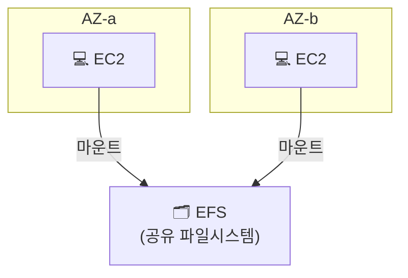

## 📌 들어가며

이번 글에서는 AWS의 **EFS(Elastic File System)**를 정리한다. EBS가 **한 인스턴스에만** 붙는 블록 스토리지라면, EFS는 **여러 인스턴스가 동시에 공유**하는 파일 스토리지(NFS)다. 여러 대의 웹 서버가 같은 파일을 함께 봐야 할 때 쓴다.

> **EFS란?** AWS가 제공하는 **완전 관리형 NFS 파일 시스템**. 용량을 미리 프로비저닝할 필요 없이 **파일 추가/삭제에 따라 자동으로 확장·축소**되며, 여러 AZ의 여러 인스턴스에서 **동시 마운트**해 공유할 수 있다.

---

## 1. EBS vs EFS

둘 다 EC2에 붙이는 스토리지지만, **동시 공유 여부**와 **AZ 범위**가 근본적으로 다르다.

| 구분 | **EBS** | **EFS** |
|------|---------|---------|
| 유형 | 블록 스토리지 | **파일 스토리지(NFS)** |
| 연결 | **1개 인스턴스** | **여러 인스턴스 동시** |
| AZ | 같은 AZ만 | **여러 AZ 걸쳐 공유** |
| 용량 | 미리 지정 | **자동 확장/축소** |
| 비유 | 개인 하드디스크 | 공용 네트워크 드라이브 |



> 💡 여러 웹 서버가 **업로드된 이미지·정적 파일을 공유**해야 하는 오토스케일링 환경에서 EFS가 특히 유용하다. 각 서버가 EBS에 따로 저장하면 서버마다 파일이 달라지지만, EFS는 **하나의 공유 공간**을 바라본다.

---

## 2. EFS 생성

`EFS` 탭에서 파일 시스템을 생성하고, VPC는 내가 만든 VPC를 선택한다.


생성한 EFS의 **상세 → 네트워크** 탭으로 가면, 각 가용 영역마다 **마운트 대상(서브넷)**이 만들어진 것을 볼 수 있다.


---

## 3. 보안 그룹 (NFS 포트 개방)

EFS 전용 보안 그룹을 만들고, 타입은 **NFS(2049 포트)**로 설정한다.


생성한 EFS의 **네트워크 → 관리**로 가서 기본 보안 그룹을 지우고, 방금 만든 NFS 보안 그룹으로 교체한다.


> ⚠️ EFS는 **NFS 프로토콜(TCP 2049)**로 통신한다. 인스턴스에서 마운트가 안 된다면 십중팔구 **보안 그룹에서 2049 포트가 막힌 것**이니, EFS 보안 그룹이 인스턴스의 접근을 허용하는지 먼저 확인하자.

---

## 4-A. 인스턴스 생성 시 자동 마운트

우분투 인스턴스를 생성하면서 네트워크는 내 VPC·프라이빗 서브넷, 보안 그룹은 웹 서버용으로 지정한다.


**파일 시스템 추가**에서 만든 EFS와 마운트 지점을 고르고, **"사용자 데이터 스크립트로 공유 파일 시스템 자동 탑재"** 옵션을 체크한다.


그러면 아래 **사용자 데이터**에 자동 마운트 스크립트가 미리 채워진다.


SSH로 접속해 디스크를 조회하면 EFS가 `/mnt/efs/fs1`에 마운트된 것을 확인할 수 있다.


---

## 4-B. 수동 마운트 (DNS 사용)

기존 인스턴스에 나중에 붙이려면, EFS **상세 → 연결** 버튼을 누른다.


**DNS를 통한 마운트** 옵션을 고르고 `NFS 클라이언트 사용` 명령을 복사한다.


원하는 마운트 지점에 실행하면 자동 마운트 때와 동일하게 연결된다.


---

## 📝 정리

```
EFS(Elastic File System)
├─ 개념   여러 인스턴스가 공유하는 관리형 NFS
├─ 특징   여러 AZ 동시 마운트 + 용량 자동 확장
├─ 통신   NFS(TCP 2049) → 보안 그룹 개방 필수
└─ 마운트 생성 시 자동(사용자 데이터) / DNS로 수동
```

| 개념 | 한 줄 정의 |
|------|------|
| **EFS** | 여러 EC2가 공유하는 파일 스토리지 |
| **NFS 2049** | EFS 통신 포트(보안 그룹) |
| **자동 확장** | 용량 프로비저닝 불필요 |

EFS는 **여러 서버가 하나의 파일 공간을 공유**해야 할 때의 답이다. EBS(개인 디스크)와 달리 AZ를 넘어 동시 마운트되며, 핵심 체크포인트는 **NFS 2049 포트 개방**과 **마운트 방식(자동/수동)**이다.
