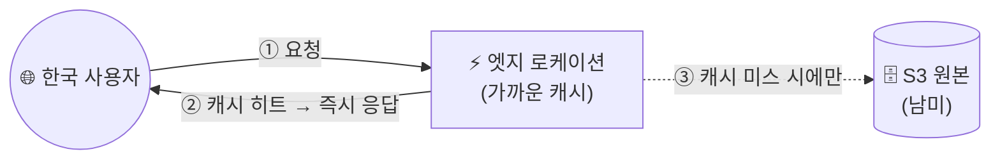

## 📌 들어가며

이번 글에서는 AWS의 **CloudFront(CDN)**로 [S3 정적 웹 호스팅](/posts/AWS-S3/)의 응답 속도를 끌어올린다. 일부러 **먼 리전(남미)**에 버킷을 만들어 느린 응답을 체감한 뒤, CloudFront를 붙여 **엣지 캐싱**으로 얼마나 빨라지는지 비교한다.

> **CloudFront란?** HTML·CSS·JS·이미지 같은 콘텐츠를 사용자에게 더 빨리 배포하는 **CDN(Content Delivery Network)** 서비스. 전 세계 **엣지 로케이션**에 콘텐츠를 캐싱해, 사용자와 **가장 가까운 엣지**에서 응답하므로 지연 시간이 크게 줄어든다.


---

## 1. CDN이 빠른 이유

원본(남미 S3)까지 매번 왕복하는 대신, 사용자 근처 엣지에 캐시된 사본을 내려준다.



| 구분 | **S3 직접** | **CloudFront 경유** |
|------|------------|---------------------|
| 응답 경로 | 남미 원본까지 왕복 | **가까운 엣지에서 응답** |
| 응답 속도(실측) | **668ms** | **77ms** |
| 부하 | 원본에 집중 | 엣지가 분산 |

---

## 2. 먼 리전(남미)에 S3 버킷 생성

CloudFront 효과를 체감하기 위해 일부러 **남미(상파울루)** 리전에 버킷을 만든다. 구분을 위해 이름 앞에 `paulo`를 붙이고, 퍼블릭 액세스를 열어준다.


---

## 3. 파일 업로드 & 정적 웹 호스팅

`index.html`을 업로드하고 퍼블릭으로 열고, 이미지용 폴더(구분자 `/`)를 만들어 이미지도 올린다.


`속성 → 정적 웹사이트 호스팅`을 활성화하고 인덱스 문서를 `index.html`로 지정한 뒤, Route53 레코드로 버킷을 연결한다.


접속은 되지만 응답 시간이 **668ms**로 느리다. 이제 CloudFront를 붙여보자.


---

## 4. ACM 인증서 (⚠️ 버지니아 북부 필수)

CloudFront에 HTTPS를 적용할 ACM 인증서를 만든다.


> ⚠️ **CloudFront용 ACM 인증서는 반드시 '버지니아 북부(us-east-1)' 리전에서 생성**해야 한다. 다른 리전에서 만든 인증서는 CloudFront에서 **선택 목록에 아예 뜨지 않는다.** CloudFront에서 가장 자주 걸리는 함정이다.

---

## 5. CloudFront 배포 생성

CloudFront 탭에서 배포를 생성하고, 원본으로 앞서 만든 **S3 버킷**을 선택한다.


**뷰어 프로토콜 정책**을 `HTTPS only`로 한다(ACM 인증서로 접속하므로). 캐시 정책·WAF 등은 기본으로 두되, **WAF는 과금되므로 설정하지 않는다.**


설정에서 **대체 도메인 이름(CNAME)**을 지정하고, 인증서는 버지니아 북부에서 만든 것을 선택한다. 나머지는 기본값으로 생성한다.


'마지막 수정'이 '배포 중'이 아니라 시각으로 바뀌면 배포 완료다.


---

## 6. Route53 연결 & 속도 비교

Route53에서 레코드 대상을 **CloudFront 엔드포인트**로 지정한다. 동일한 버킷인데 응답이 **77ms**로 엄청나게 빨라졌다!


> 💡 첫 요청은 엣지에 캐시가 없어(**캐시 미스**) 원본까지 다녀오지만, 이후 요청은 **엣지 캐시(캐시 히트)**로 즉시 응답한다. 그래서 두 번째 접속부터 체감 속도가 극적으로 빨라진다.

---

## 📝 정리

```
CloudFront(CDN)
├─ 개념   엣지 로케이션에 캐싱해 가까운 곳에서 응답
├─ 효과   남미 S3 직접 668ms → CloudFront 77ms
├─ 인증서 ACM은 반드시 버지니아 북부(us-east-1)
└─ 연결   S3 원본 → 배포 → Route53(CloudFront 엔드포인트)
```

| 개념 | 한 줄 정의 |
|------|------|
| **CloudFront** | 엣지 캐싱 CDN |
| **엣지 로케이션** | 사용자 근처 캐시 서버 |
| **us-east-1 인증서** | CloudFront ACM 필수 리전 |

CloudFront의 핵심은 **원본과 먼 사용자도 가까운 엣지에서 응답받게** 해 속도를 끌어올리는 것이다. 668ms → 77ms의 실측 차이가 CDN의 가치를 그대로 보여준다. 단, **ACM 인증서는 반드시 버지니아 북부**라는 점만은 꼭 기억하자.
