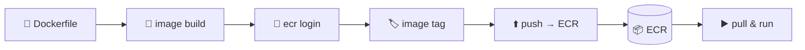

## 📌 들어가며

이번 글에서는 AWS의 **ECR(Elastic Container Registry)**에 컨테이너 이미지를 올리고, 다시 내려받아 실행하는 전체 흐름을 실습한다. **Dockerfile 작성 → 이미지 빌드 → ECR push → pull & run**의 컨테이너 배포 사이클을 다룬다.

> **ECR이란?** 컨테이너 이미지와 아티팩트를 **저장·관리·공유·배포**할 수 있는 완전 관리형 **컨테이너 레지스트리**. Docker Hub의 AWS 버전이라고 보면 되며, 자체 레지스트리 인프라를 운영할 필요 없이 고가용 아키텍처에서 이미지를 안정적으로 배포한다.

---

## 1. 전체 흐름

로컬(Cloud9)에서 만든 이미지를 ECR에 올리고, 어디서든 그 이미지를 받아 컨테이너로 실행한다.



---

## 2. Dockerfile 만들기

먼저 AWS Cloud9 콘솔에서 작업 폴더를 만들고, 정적 웹 자료(`index.html` + 이미지)를 **tar로 압축**한다.

```bash
$ sudo mkdir dockerfile-lab && cd $_
$ sudo cp ~/index.html .
$ sudo mkdir images
$ sudo cp ~/two-rabbit.jpg ./images
$ sudo tar -cvf web-site-v1.tar index.html images/    # 웹 자료 압축
```

이어서 nginx 웹 서버 이미지를 만드는 **Dockerfile**을 작성한다.

```dockerfile
FROM ubuntu:latest                          # 베이스 이미지
RUN apt update && apt install -y -q nginx   # nginx 설치
ADD web-site-v1.tar /var/www/html           # ADD는 tar 압축 해제 포함
CMD ["nginx", "-g", "daemon off;"]          # 컨테이너 실행 명령
```

| Dockerfile 명령 | 역할 |
|------|------|
| `FROM` | 베이스 이미지 지정 |
| `RUN` | 빌드 시 실행할 명령(패키지 설치 등) |
| `ADD` | 파일 복사(+ tar 자동 해제) |
| `CMD` | 컨테이너 시작 시 실행할 명령 |

이미지를 빌드하고 컨테이너로 실행해 확인한다.

```bash
$ docker image build -t web-site:v1.0 ./
$ docker container run -d -p 80:80 --name webserver web-site:v1.0
```


> ⚠️ Cloud9 인스턴스의 **보안 그룹에서 80 포트를 열어야** 브라우저로 접속해 확인할 수 있다.

---

## 3. ECR 레포지토리 생성

`ECS → ECR → 퍼블릭 레포`에서 레포지토리를 생성하고, 생성된 **레포 URI(ID)**를 확인한다.


---

## 4. 이미지 태깅 & Push

ECR에 **로그인 → 이미지 태그(레포 URI로 이름 변경) → push**의 순서로 올린다.

```bash
# ① 로그인 (인증 토큰 → docker login)
$ aws ecr-public get-login-password --region us-east-1 \
  | docker login --username AWS --password-stdin public.ecr.aws/h8y2y3u1

# ② 기존 이미지를 ECR 레포 URI로 태깅
$ docker image tag web-site:v1.0 public.ecr.aws/h8y2y3u1/web-site:v1.0
$ docker image tag web-site:v2.0 public.ecr.aws/h8y2y3u1/web-site:v2.0

# ③ ECR에 push
$ docker image push public.ecr.aws/h8y2y3u1/web-site:v1.0
$ docker image push public.ecr.aws/h8y2y3u1/web-site:v2.0
```


> 💡 push하려면 이미지 이름이 반드시 **`레지스트리주소/레포:태그`** 형식이어야 한다. 그래서 로컬 이미지(`web-site:v1.0`)를 곧바로 push할 수 없고, **`docker tag`로 ECR URI를 붙인 이름**으로 다시 태깅한 뒤 올린다.

---

## 5. ECR 이미지로 컨테이너 실행

push된 이미지를 받아 새 컨테이너로 실행한다.

```bash
$ docker container run -d -p 8080:80 --name webserver2 \
  public.ecr.aws/h8y2y3u1/web-site:v2.0
```

---

## 📝 정리

```
ECR 배포 사이클
├─ 빌드   Dockerfile → docker image build
├─ 로그인 aws ecr-public get-login-password | docker login
├─ 태깅   docker tag → 레지스트리/레포:태그
├─ Push   docker push → ECR 저장
└─ 실행   docker run (ECR URI 이미지)
```

| 개념 | 한 줄 정의 |
|------|------|
| **ECR** | AWS 관리형 컨테이너 레지스트리 |
| **tag** | 이미지에 ECR URI 이름 부여 |
| **push/pull** | 레지스트리에 올리고 받기 |

ECR은 컨테이너 이미지의 **중앙 저장소**다. 핵심은 **로그인 → URI로 태깅 → push** 순서이며, 이렇게 올린 이미지는 어느 환경에서든 pull해서 동일하게 실행할 수 있다.
