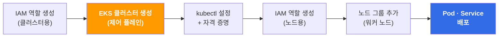
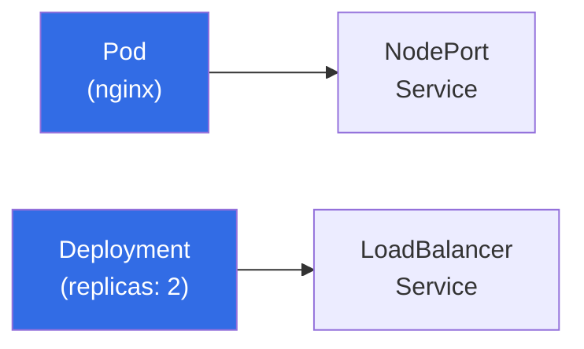

## 📌 들어가며

쿠버네티스를 직접 운영하려면 **제어 플레인(control plane)**을 설치하고, 고가용성을 위해 여러 대로 이중화하고, 버전 업그레이드와 패치까지 챙겨야 한다. 이건 그 자체로 하나의 전문 영역이다. **Amazon EKS(Elastic Kubernetes Service)**는 이 부담스러운 제어 플레인 운영을 AWS가 대신 맡아주는 **관리형 쿠버네티스 서비스**다.

> **EKS 한 줄 정의**
> 제어 플레인을 직접 설치·운영할 필요 없이 AWS 위에서 쿠버네티스를 손쉽게 실행하는 관리형 서비스.

EKS는 여러 가용 영역(AZ)에 제어 플레인 인스턴스를 분산 배치해 **고가용성**을 보장하고, 비정상 인스턴스를 자동 감지·교체하며, 버전 업그레이드와 패치를 자동화해준다. 이번 글에서는 **IAM 역할 생성 → 클러스터 생성 → 노드 그룹 추가 → Pod·서비스 배포**까지 한 번에 실습한다.


---

## 1. 전체 흐름 한눈에 보기

EKS 실습은 크게 3단계로 나뉜다. **① 클러스터(제어 플레인) 만들기 → ② 워커 노드(노드 그룹) 붙이기 → ③ 그 위에 애플리케이션 배포**.



| 단계 | 작업 | 필요한 IAM 정책 |
|:---:|------|------|
| 1 | 클러스터용 IAM 역할 | `AmazonEKSClusterPolicy` |
| 2 | EKS 클러스터 생성 | (위 역할 사용) |
| 3 | kubectl 설치 & 자격 증명 | — |
| 4 | 노드 그룹용 IAM 역할 | `AmazonEKSWorkerNodePolicy`, `AmazonEC2ContainerRegistryReadOnly`, `AmazonEKS_CNI_Policy` |
| 5 | 노드 그룹 추가 | (위 역할 사용) |
| 6 | Pod · Service 배포 | — |

> 💡 **역할이 두 번 필요한 이유**: EKS는 **제어 플레인**(클러스터)과 **데이터 플레인**(워커 노드)이 분리되어 있다. 클러스터가 AWS 리소스를 다룰 권한과, 워커 노드가 이미지를 받아오고 네트워킹을 구성할 권한이 각각 필요하기 때문에 IAM 역할을 두 종류 만든다.

---

## 2. EKS 설정

### 2.1 클러스터용 IAM 역할 생성

`IAM → 역할 → 역할 생성`으로 들어가 **사용 사례를 EKS**로 선택한다.


역할 이름을 지어주고 신뢰 관계(trust policy)를 JSON 형식으로 설정한다. 권한 정책은 **`AmazonEKSClusterPolicy`**를 붙인다.

### 2.2 클러스터 생성

`EKS 탭 → 클러스터 추가`로 이동한다. 클러스터가 사용할 역할은 방금 만든 역할로 지정한다.


나머지 옵션은 기본값으로 둔다.


**네트워크**는 퍼블릭 서브넷의 `a`, `c` 영역을 사용하고, **보안 그룹**은 기존에 쓰던 `web` 보안 그룹을 지정한다.


로깅 설정도 기본값 그대로 둔다.


나머지도 기본 설정으로 두고 생성한다.


EKS 클러스터가 생성되었다.

> ⚠️ 클러스터 생성은 **수 분에서 십수 분**이 걸린다. 상태가 `Active`가 될 때까지 기다린 뒤 다음 단계로 넘어가자.

### 2.3 kubectl 설치

클러스터를 조작하려면 `kubectl`이 필요하다. Cloud9 인스턴스에서 아래를 실행해 설치하고 간단한 설정을 해준다.

```bash
# kubectl 다운로드
curl -o kubectl https://s3.us-west-2.amazonaws.com/amazon-eks/1.25.6/2023-01-30/bin/linux/amd64/kubectl

# 실행 권한 부여
chmod +x ./kubectl

# 전역에서 사용하도록 이동
sudo mv ./kubectl /usr/local/bin/

# 자동완성 활성화
source <(kubectl completion bash)

# 셸 재시작 시에도 유지되도록 등록
echo "source <(kubectl completion bash)" >> ~/.bashrc
```

### 2.4 자격 증명 설정

`kubectl`이 클러스터에 접근하려면 AWS 자격 증명이 필요하다. `IAM → 사용자 → 대상 사용자 → 보안 자격 증명 → 액세스 키 만들기`로 들어간다.


발급된 **액세스 키**와 **비밀 액세스 키**를 복사한 뒤, 아래처럼 환경 변수로 등록하고 `update-kubeconfig`로 클러스터 접속 정보를 kubeconfig에 반영한다.

```bash
export AWS_ACCESS_KEY_ID=[액세스 키]
export AWS_SECRET_ACCESS_KEY=[비밀 액세스 키]

# kubeconfig에 EKS 클러스터 접속 정보 등록
aws eks --region ap-northeast-2 update-kubeconfig --name EKS-CLUSTER

# 정상 연결 확인
kubectl get svc
```

`kubectl get svc`가 응답하면 제어 플레인과의 연결이 정상이라는 뜻이다.

### 2.5 노드 그룹용 IAM 역할 생성

이번엔 **워커 노드(EC2)**가 사용할 역할이다. `IAM → 역할 생성 → EC2` 사용 사례로 만든다.


아래 3개 정책을 선택해 역할을 생성한다.

| 정책 | 역할 |
|------|------|
| `AmazonEKSWorkerNodePolicy` | 워커 노드가 클러스터에 조인 |
| `AmazonEC2ContainerRegistryReadOnly` | ECR에서 컨테이너 이미지 pull |
| `AmazonEKS_CNI_Policy` | Pod 네트워킹(CNI) 구성 |

### 2.6 노드 그룹 추가

`EKS → 클러스터 → 대상 클러스터 → 노드 그룹`에서 이름과 역할(방금 만든 노드용 역할)을 설정하고 나머지는 기본값으로 둔다.


인스턴스 유형은 `t2.micro`로 설정한다.


노드 그룹 조정(스케일링) 설정은 기본값으로 둔다.


**네트워크**는 내가 만든 VPC와 퍼블릭 `a`, `c` 서브넷을 지정하고, **노드 원격 액세스 활성화**를 체크한다.

---

## 3. EKS에 컨테이너 배포

클러스터와 노드가 준비됐으니 이제 그 위에 애플리케이션을 올린다. 배포 리소스 3종을 순서대로 실습한다.



| 리소스 | 역할 | 노출 방식 |
|------|------|------|
| **Pod** | 컨테이너 실행 단위 | NodePort (노드 IP:30080) |
| **Deployment** | Pod를 replicas만큼 유지 | LoadBalancer (CLB) |

### 3.1 Pod 배포

```bash
mkdir test && cd $_
```

Pod 매니페스트(YAML)를 작성한다.

```yaml
# pod.yaml
apiVersion: v1
kind: Pod
metadata:
  name: nginx-pod
  labels:
    app: nginx-pod
spec:
  containers:
  - name: nginx-pod-container
    image: nginx
```

작성한 YAML을 적용하고 상태를 조회한다.

```bash
kubectl apply -f pod.yaml

# 조회
kubectl get pod -o wide
kubectl describe pod nginx-pod
```

### 3.2 NodePort 서비스로 Pod 노출

Pod를 외부에서 접근할 수 있도록 **NodePort** 서비스를 만든다.

```yaml
# nodeport-pod.yaml
apiVersion: v1
kind: Service
metadata:
  name: nodeport-service-pod
spec:
  type: NodePort
  selector:
    app: nginx-pod
  ports:
  - protocol: TCP
    port: 80
    targetPort: 80
    nodePort: 30080
```

```bash
kubectl apply -f nodeport-pod.yaml
kubectl get svc -o wide
kubectl describe svc nodeport-service-pod
```


> ⚠️ **잊기 쉬운 함정**: NodePort로 노출하는 포트(`30080`)는 **노드(EC2)의 보안 그룹 인바운드**에도 열려 있어야 실제로 접근된다. nginx Pod가 떠 있는 인스턴스의 보안 그룹에서 `30080` 인바운드를 추가한다.

### 3.3 Deployment 배포

단일 Pod가 아니라 **여러 개의 Pod를 항상 유지**하려면 Deployment를 쓴다. `replicas: 2`로 두 개를 유지하도록 설정한다.

```yaml
# deployment.yaml
apiVersion: apps/v1
kind: Deployment
metadata:
  name: web-site-deployment
spec:
  replicas: 2
  selector:
    matchLabels:
      app: web-site-deployment
  template:
    metadata:
      name: web-site-deployment
      labels:
        app: web-site-deployment
    spec:
      containers:
      - name: web-site-deployment-container
        image: public.ecr.aws/[ECR 레포 ID]/web-site:v1.0
```

```bash
kubectl apply -f deployment.yaml
```

### 3.4 LoadBalancer 서비스로 Deployment 노출

Deployment를 외부에 노출할 때는 **LoadBalancer** 타입 서비스를 쓴다.

```yaml
# loadbalancer-deployment.yaml
apiVersion: v1
kind: Service
metadata:
  name: loadbalancer-service-deployment
spec:
  type: LoadBalancer
  selector:
    app: web-site-deployment
  ports:
  - protocol: TCP
    port: 80
    targetPort: 80
```

```bash
kubectl apply -f loadbalancer-deployment.yaml
```

### 3.5 로드밸런서 레코드 생성 (Route 53)

위 YAML로 생성된 로드밸런서는 **CLB(Classic Load Balancer)**다. 이에 맞춰 Route 53에서 레코드를 생성해 도메인과 연결한다.


---

## 4. 업데이트 (이미지 버전 교체)

서비스가 떠 있는 상태에서 새 버전을 배포하려면 Deployment의 이미지 태그만 바꾸면 된다.

```bash
kubectl edit deployments.apps web-site-deployment
```

에디터에서 `image` 부분을 찾아 `v2.0`으로 바꿔 저장하면, 쿠버네티스가 **자동으로 롤링 업데이트**를 수행해 새 버전으로 교체된다.

> 💡 이렇게 이미지 태그만 바꿔도 재배포가 되는 이유는, Deployment가 "선언된 상태(원하는 이미지)"와 "현재 상태"를 항상 일치시키려 하기 때문이다. 매니페스트를 고치면 그 차이를 스스로 메꾸는 것이 쿠버네티스의 핵심 동작 방식이다.

---

## 📝 정리

```
EKS 실습 흐름
├─ 제어 플레인   IAM 역할(ClusterPolicy) → 클러스터 생성
├─ 접속 준비     kubectl 설치 → 액세스 키 → update-kubeconfig
├─ 데이터 플레인 IAM 역할(3종 정책) → 노드 그룹 추가
└─ 배포          Pod + NodePort  /  Deployment + LoadBalancer → Route 53
```

| 개념 | 한 줄 정의 |
|------|------|
| **EKS** | AWS가 제어 플레인을 관리해주는 관리형 쿠버네티스 |
| **제어 플레인 / 데이터 플레인** | 클러스터 두뇌 / 실제 Pod가 도는 워커 노드 |
| **노드 그룹** | 워커 노드(EC2)들의 묶음 |
| **NodePort** | 노드 IP의 특정 포트로 Pod를 외부 노출 |
| **LoadBalancer** | 클라우드 LB를 통해 서비스를 외부 노출 |
| **롤링 업데이트** | 이미지 태그 교체만으로 무중단에 가깝게 재배포 |

EKS는 결국 "쿠버네티스의 골치 아픈 부분(제어 플레인 운영)은 AWS에 맡기고, 나는 그 위에 애플리케이션을 올리는 데 집중한다"는 서비스다. IAM 역할이 클러스터용·노드용으로 두 번 나온다는 점, 그리고 NodePort는 보안 그룹 인바운드까지 열어야 한다는 점만 확실히 기억하면 실습이 훨씬 매끄러워진다.
