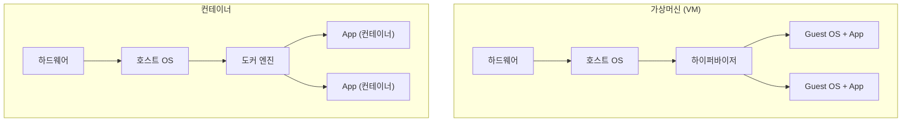

## 📌 들어가며

이번 글에서는 IT 개발·운영의 판도를 바꾼 **컨테이너(Container)** 기술을 정리한다. "내 컴퓨터에서는 되는데…" 같은 환경 차이 문제를 어떻게 해결하는지, 그리고 가상머신(VM)과 무엇이 다른지를 살펴본다.

> **컨테이너란?** 애플리케이션과 그 실행에 필요한 모든 요소(라이브러리·종속성·설정)를 **하나로 패키징한 가상화 기술**. 마치 **택배 상자**처럼 애플리케이션을 담아, 어떤 환경에서든 동일하게 이동·실행할 수 있게 한다.


---

## 1. 왜 컨테이너가 필요한가

전통적 개발에서는 개발자·테스트·운영 서버의 **환경 차이**로 "내 PC에선 되는데 서버에선 안 된다"는 문제가 잦았다. 컨테이너는 앱과 의존성을 함께 묶어, **어디서나 동일한 환경**을 보장한다.

> 💡 컨테이너의 본질은 **"환경째로 배송"**이다. 코드만 옮기면 실행 환경(라이브러리 버전·설정)이 달라 문제가 생기지만, 컨테이너는 실행에 필요한 모든 것을 함께 담아 옮기므로 환경 불일치가 사라진다.

---

## 2. 컨테이너 vs 가상머신(VM)

가장 큰 차이는 **OS를 통째로 올리느냐, 호스트 커널을 공유하느냐**다.



| 구분 | **가상머신(VM)** | **컨테이너** |
|------|------------------|--------------|
| 가상화 대상 | **하드웨어**(OS까지) | **OS 커널 공유** |
| 격리성 | 높음 | 상대적으로 낮음 |
| 무게 | 무거움(GB) | 가벼움(MB) |
| 실행 속도 | 느림(부팅 필요) | **빠름(즉시)** |

> ⚠️ 컨테이너는 **호스트 OS 커널을 공유**하므로 VM보다 가볍고 빠르지만, 그만큼 OS 수준의 완전한 격리는 VM보다 약하다. 강한 격리가 필요한 경우(멀티 테넌트 보안 등)에는 VM을 함께 고려한다.

---

## 3. 컨테이너가 가져온 변화

| 변화 | 내용 |
|------|------|
| **개발 환경 일관성** | 개발·테스트·운영 환경 차이 제거 → 협업·버그 감소 |
| **배포 간소화** | 앱+의존성 패키징 → 복잡한 설정 없이 배포 |
| **자원 효율** | 가볍고 빨라 하드웨어를 효율적으로 사용 |
| **확장성** | 필요 시 생성·삭제 용이 → 트래픽 대응, MSA와 결합 |

> 💡 컨테이너는 **마이크로서비스 아키텍처(MSA)**와 특히 잘 맞는다. 서비스를 작은 컨테이너 단위로 쪼개면, 필요한 서비스만 독립적으로 늘리고 배포·유지보수할 수 있다.

---

## 📝 정리

```
컨테이너
├─ 개념   앱+의존성을 하나로 패키징(택배 상자)
├─ 목적   환경 일관성 → "내 PC에선 되는데" 해결
├─ vs VM  OS 커널 공유 → 가볍고 빠름(격리성은 낮음)
└─ 효과   배포 간소화 · 자원 효율 · 확장성(MSA)
```

| 개념 | 한 줄 정의 |
|------|------|
| **컨테이너** | 앱+환경을 묶은 경량 가상화 |
| **VM** | OS까지 가상화(무겁고 격리성 높음) |
| **커널 공유** | 컨테이너가 가벼운 이유 |

컨테이너의 핵심은 **"환경째로 패키징해 어디서나 동일하게 실행"**하는 것이다. VM보다 가볍고 빠른 이 특성 덕분에, 현대의 배포·확장·MSA가 가능해졌다. 다음 글에서는 실제 도커 설치와 실행을 다룬다.
