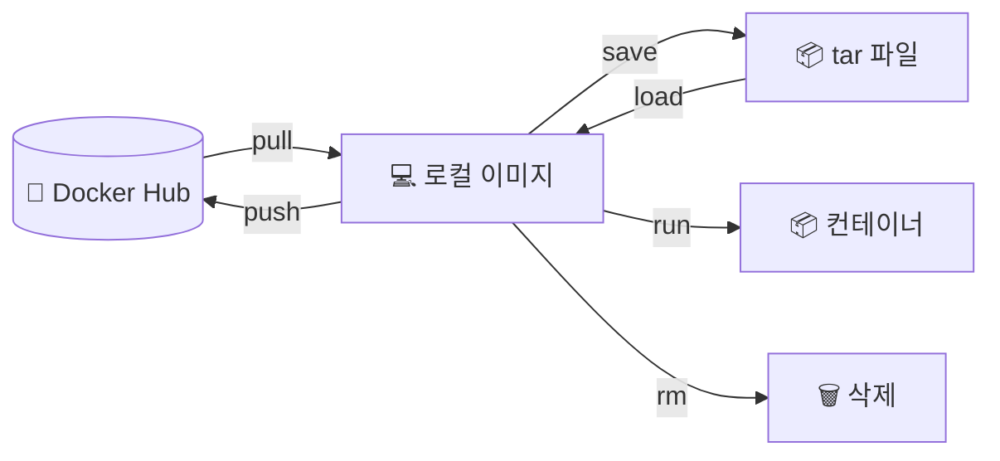

## 📌 들어가며

이번 글에서는 **도커 이미지(Image)**를 다루는 법을 정리한다. 이미지를 **가져오고(pull) → 살펴보고(inspect) → 저장/공유하고(save/push) → 삭제(rm)**하는 전체 수명주기를 명령어 중심으로 익힌다.

> **이미지 vs 컨테이너?** **이미지**는 실행에 필요한 파일·설정을 담은 **정적 템플릿(설계도)**이고, **컨테이너**는 그 이미지를 실행한 **동적 인스턴스**다. 하나의 이미지로 여러 컨테이너를 찍어낼 수 있다.

---

## 1. 이미지 수명주기 한눈에



---

## 2. 이미지 가져오기 (Pull)

**Docker Hub**(중앙 저장소)에서 이미지를 로컬로 가져온다.

```bash
docker pull [이미지 이름]:[태그]

docker pull ubuntu           # 태그 생략 시 latest
docker pull ubuntu:18.04     # 특정 버전
```

| 요소 | 설명 |
|------|------|
| **이미지 이름** | 가져올 이미지 |
| **태그** | 특정 버전(생략 시 `latest`) |

> 💡 **`latest`를 맹신하지 말자.** `latest`는 "가장 최근"이 아니라 단지 태그를 생략했을 때의 기본 이름일 뿐이다. 재현 가능한 배포를 위해서는 `ubuntu:18.04`처럼 **버전 태그를 명시**하는 것이 안전하다.

---

## 3. 이미지 살펴보기 (Inspect)

이미지의 ID·생성일·크기·레이어·환경 변수 등을 JSON으로 확인한다.

```bash
docker image inspect [이미지 이름]:[태그]

# 특정 정보만: OS 정보
docker image inspect --format='{{.Os}}' [이미지 이름]:[태그]
```

---

## 4. 저장하고 공유하기

### 이미지 저장 (Save / Load)

로컬 이미지를 tar 파일로 저장해 다른 환경에서 불러온다.

```bash
docker image save [이미지 이름]:[태그] > [파일 이름].tar
# 다른 환경에서: docker image load < [파일 이름].tar
```

> 💡 tar 파일은 `gzip`·`bzip2`로 압축해 크기를 줄일 수 있다. 인터넷이 안 되는 폐쇄망(offline) 환경으로 이미지를 옮길 때 `save`/`load`가 유용하다.

### 이미지 공유 (Push)

Docker Hub 등 저장소에 업로드한다. **로그인 → 태깅 → push** 순서다.

```bash
docker login
docker image tag [기존 이름]:[태그] [저장소 이름]/[이미지 이름]:[태그]
docker push [저장소 이름]/[이미지 이름]:[태그]
```

> ⚠️ push하려면 이미지 이름이 반드시 **`저장소이름/이미지이름:태그`** 형식이어야 한다. 그래서 로컬 이미지를 그대로 올릴 수 없고, **`docker tag`로 저장소 경로를 붙인 이름**으로 다시 태깅해야 한다.

**프라이빗 레지스트리**를 직접 구축하면, 중요한 이미지를 팀 내부에서만 안전하게 공유할 수 있다.

---

## 5. 이미지 삭제 (rm)

불필요한 이미지를 삭제한다.

```bash
docker image rm [이미지 이름]:[태그]
docker rmi [이미지 이름]:[태그]     # 축약형
```

> ⚠️ **삭제 전 해당 이미지를 쓰는 컨테이너가 없는지 확인**해야 한다. 실행 중인 컨테이너가 있으면 이미지가 삭제되지 않으니, **먼저 컨테이너를 중지·삭제**한 뒤 이미지를 지운다.

---

## 📝 정리

```
도커 이미지 관리
├─ Pull    docker pull 이름:태그 (Docker Hub)
├─ Inspect docker image inspect (--format으로 특정 정보)
├─ Save    tar로 저장/load (오프라인 이전)
├─ Push    login → tag(저장소경로) → push
└─ 삭제    docker rmi (컨테이너 먼저 정리)
```

| 명령 | 역할 |
|------|------|
| `pull` / `push` | 저장소에서 받기 / 올리기 |
| `save` / `load` | 파일로 저장 / 불러오기 |
| `tag` | 저장소 경로 이름 부여 |
| `rmi` | 이미지 삭제 |

이미지 관리의 핵심은 **버전 태그를 명시**하고, 공유 시 **저장소 경로로 태깅 후 push**하는 것이다. 이미지는 설계도, 컨테이너는 실행체라는 관계를 기억하면 명령어들의 역할이 명확해진다.
