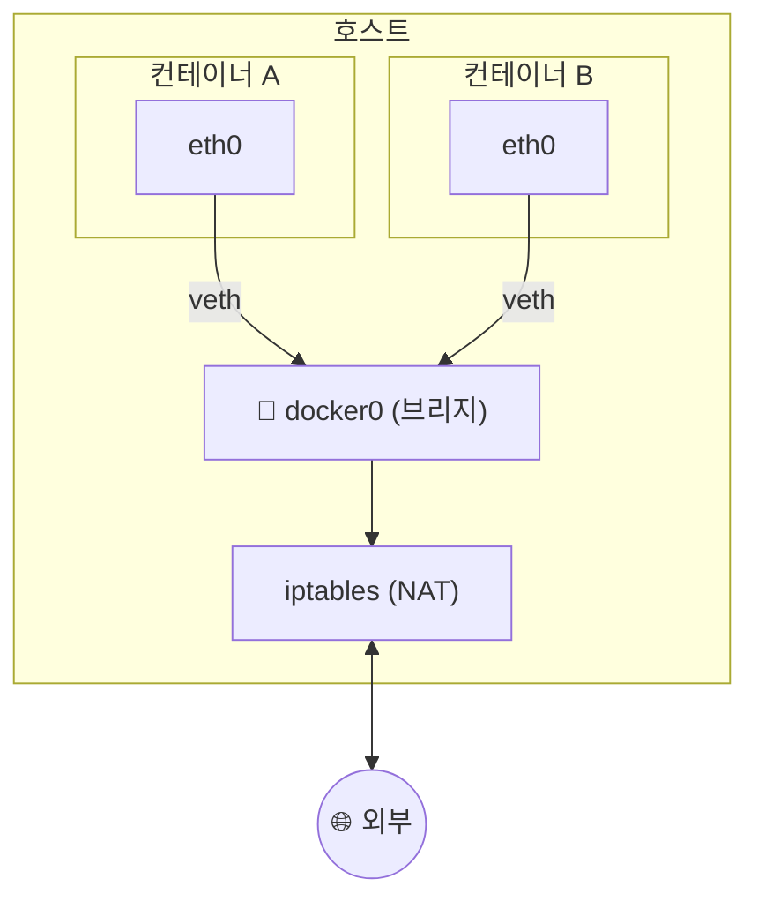

## 📌 들어가며

이번 글에서는 컨테이너들의 소통 창구인 **도커 네트워크**를 정리한다. 기본 브리지 네트워크의 동작 원리부터 네트워크 드라이버 종류, 컨테이너 이름으로 통신하는 **도커 DNS**, 그리고 **컨테이너 프록시(Nginx·HAProxy)**까지 살펴본다.

> **도커 네트워크란?** 컨테이너들이 **서로 통신하고 외부와 연결**되도록 해주는 가상 네트워크. 컨테이너를 실행하면 기본적으로 **브리지 네트워크**에 연결되며, 필요에 따라 다양한 드라이버로 구성할 수 있다.

---

## 1. 브리지 네트워크의 동작 원리

컨테이너를 실행하면 내부에 `eth0`가 생기고, 호스트의 `veth`를 거쳐 **도커 브리지(`docker0`)**에 연결된다. `iptables`가 NAT를 수행해 외부 통신을 가능케 한다.



| 특징 | 설명 |
|------|------|
| **컨테이너 간 통신** | 같은 브리지에 연결된 컨테이너끼리 통신 |
| **외부 연결** | 호스트 인터페이스 통해 외부와 연결(NAT) |
| **격리** | 각 컨테이너는 독립된 네트워크 네임스페이스 |

---

## 2. 네트워크 드라이버 종류

용도에 따라 다양한 드라이버를 선택할 수 있다.

| 드라이버 | 설명 |
|------|------|
| **`bridge`** | 기본 브리지 네트워크 |
| **`host`** | 호스트의 네트워크를 **직접 사용**(격리 없음) |
| **`none`** | 네트워크 인터페이스 생성 안 함 |
| **`overlay`** | **여러 도커 호스트에 걸친** 통신(Swarm) |
| **`macvlan`** | 컨테이너에 물리 네트워크의 MAC 할당 |

**관리 명령어:**

```bash
docker network create <이름>       # 생성
docker network ls                  # 목록
docker network inspect <이름>      # 상세
docker network connect/disconnect  # 연결/해제
docker network rm <이름>           # 삭제
```

> 💡 **`overlay`는 여러 호스트를 아우르는 네트워크**라, Docker Swarm·쿠버네티스 같은 멀티 노드 환경에서 컨테이너 간 통신에 쓰인다. 단일 호스트에서는 `bridge`로 충분하다.

---

## 3. 도커 DNS — 이름으로 통신

도커는 내장 DNS를 제공해, 컨테이너가 **IP 대신 이름으로** 서로를 찾게 한다.

```
① 컨테이너 실행 → 도커가 (이름 ↔ IP)를 DNS에 등록
② 다른 컨테이너가 "이름"으로 통신 시도
③ 도커 DNS가 해당 이름의 IP를 반환 → 통신
```

> ⚠️ **컨테이너 IP는 재시작 때마다 바뀔 수 있다.** 그래서 IP를 하드코딩하면 안 되고, **컨테이너 이름**으로 통신해야 한다. 도커 DNS가 이름→IP를 자동 해석해주므로 IP 변경에 신경 쓸 필요가 없다. `--net-alias`로 여러 컨테이너를 한 이름으로 묶으면 로드 밸런싱·서비스 디스커버리에도 쓸 수 있다.

---

## 4. 컨테이너 프록시 — Nginx vs HAProxy

여러 컨테이너 앞에 **프록시**를 두면 부하 분산과 서비스 안정성을 높일 수 있다.

| 도구 | 계층 | 강점 |
|------|------|------|
| **Nginx** | L7(HTTP) | 리버스 프록시·라우팅·**SSL 종료**·정적 캐싱 |
| **HAProxy** | L4/L7 | **고성능**·다양한 부하 분산 알고리즘·상태 확인 |

- **Nginx**: 웹 서버 겸 리버스 프록시. URL·헤더 기반 라우팅, HTTPS 복호화(SSL termination), 정적 콘텐츠 캐싱에 강하다.
- **HAProxy**: TCP/HTTP 고성능 로드밸런서. 라운드 로빈·가중치·최소 연결 등 알고리즘과 **백엔드 상태 확인(헬스 체크)**, 세션 유지를 제공한다.

> 💡 **선택 기준** — HTTP 라우팅·캐싱·정적 서빙이 필요하면 **Nginx**, 대규모 트래픽에 순수 부하 분산 성능이 중요하면 **HAProxy**가 유리하다. 둘 다 컨테이너 프록시로 널리 쓰인다.

---

## 📝 정리

```
도커 네트워크
├─ 기본   브리지(docker0) + veth + iptables(NAT)
├─ 드라이버 bridge/host/none/overlay/macvlan
├─ DNS    컨테이너 이름으로 통신(IP 하드코딩 X)
└─ 프록시 Nginx(L7·라우팅) / HAProxy(L4·고성능)
```

| 개념 | 한 줄 정의 |
|------|------|
| **브리지 네트워크** | 기본 컨테이너 가상 네트워크 |
| **overlay** | 여러 호스트에 걸친 네트워크 |
| **도커 DNS** | 이름 기반 컨테이너 통신 |

도커 네트워크의 핵심은 **브리지로 컨테이너를 잇고, 이름(DNS)으로 통신**하는 것이다. 규모가 커지면 overlay로 여러 호스트를 잇고, 앞단에 프록시를 두어 부하를 분산하는 구조로 발전한다.
