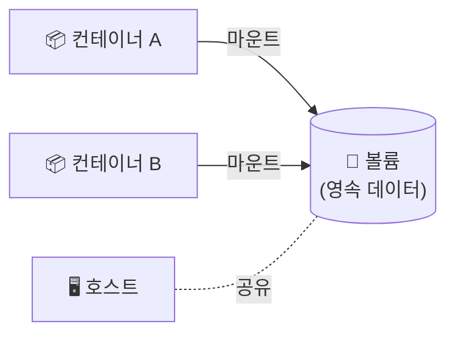

## 📌 들어가며

이번 글에서는 컨테이너의 데이터를 영구적으로 보존하는 **도커 볼륨(Volume)**을 정리한다. 컨테이너는 삭제되면 내부 데이터도 함께 사라지기 때문에, 데이터 영속성이 필요하면 반드시 볼륨을 써야 한다.

> **도커 볼륨이란?** 컨테이너와 **별도로 데이터를 저장**하는 공간. 컨테이너가 삭제·재시작되어도 데이터를 보존하며, 여러 컨테이너 간 또는 호스트와 데이터를 **공유**할 수도 있다.

---

## 1. 왜 볼륨이 필요한가

컨테이너의 파일시스템은 **휘발성**이다. 컨테이너를 지우면 그 안의 데이터도 사라진다. 볼륨은 이 데이터를 컨테이너 바깥에 분리 저장한다.



| 필요성 | 설명 |
|------|------|
| **데이터 영속성** | 컨테이너 삭제·재시작에도 데이터 보존 |
| **컨테이너 간 공유** | 여러 컨테이너가 같은 볼륨 마운트 |
| **호스트와 공유** | 호스트 ↔ 컨테이너 파일 교환 |

---

## 2. 볼륨의 3가지 종류

| 종류 | 저장 위치 | 용도 |
|------|-----------|------|
| **바인드 마운트** | 호스트의 **특정 디렉터리** | 호스트 파일 직접 공유 |
| **도커 관리 볼륨** | **도커가 관리하는 영역** | 표준 데이터 영속(권장) |
| **tmpfs 마운트** | 호스트 **메모리** | 임시·캐시(비영속) |

### 바인드 마운트

호스트의 특정 경로를 컨테이너 디렉터리에 연결한다.

```bash
docker run -v /home/user/data:/app/data my-image
```

### 도커 관리 볼륨

도커가 관리하는 볼륨을 만들어 마운트한다.

```bash
docker volume create my-volume
docker run -v my-volume:/app/data my-image
```

### tmpfs 마운트

호스트 메모리에 마운트한다(컨테이너 종료 시 사라짐).

```bash
docker run --tmpfs /app/cache my-image
```

> 💡 **바인드 마운트 vs 관리 볼륨** — 바인드 마운트는 호스트의 **실제 경로**에 직접 묶여 개발 중 소스 공유에 편하지만 호스트 구조에 의존적이다. **도커 관리 볼륨**은 도커가 위치를 관리해 이식성이 좋아, DB 데이터 같은 영속 저장에 권장된다.

---

## 3. 데이터 지속성 & 사용량 제한

- **데이터 지속성**: MySQL 같은 DB 컨테이너는 데이터 디렉터리를 볼륨으로 마운트하면, 컨테이너를 삭제·재시작해도 DB 데이터가 유지된다.
- **사용량 제한**: `--storage-opt size=` 옵션으로 볼륨 최대 크기를 제한해 디스크 부족을 방지할 수 있다(컨테이너 루트 `/` 용량도 제한 가능).

> ⚠️ **DB 컨테이너는 반드시 볼륨과 함께** 써야 한다. 볼륨 없이 DB를 돌리다 컨테이너를 지우면, 그동안 쌓인 데이터가 통째로 사라진다. 운영에서 가장 흔하고 치명적인 실수다.

---

## 📝 정리

```
도커 볼륨
├─ 이유   컨테이너 삭제 시 데이터 소멸 → 영속성 필요
├─ 종류   바인드 마운트 / 관리 볼륨 / tmpfs
├─ 옵션   -v 호스트경로:컨테이너경로
└─ 제한   --storage-opt size= 로 용량 제한
```

| 개념 | 한 줄 정의 |
|------|------|
| **볼륨** | 컨테이너 밖 영속 저장소 |
| **바인드 마운트** | 호스트 경로 직접 연결 |
| **관리 볼륨** | 도커가 관리(이식성 좋음, 권장) |

볼륨의 핵심은 **휘발성 컨테이너에서 데이터를 분리해 영구 보존**하는 것이다. 특히 DB처럼 데이터가 중요한 컨테이너는 반드시 관리 볼륨을 붙여, 컨테이너 수명과 데이터 수명을 분리해야 한다.
