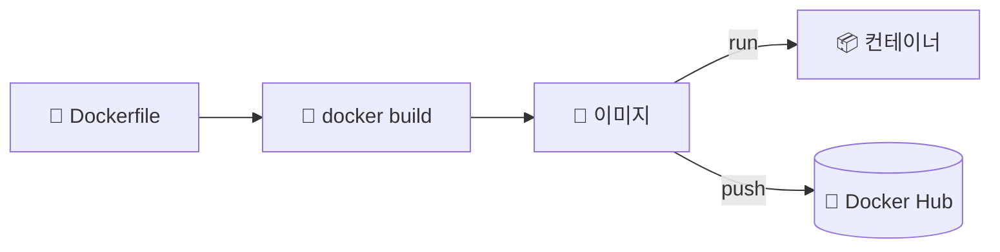

## 📌 들어가며

이번 글에서는 나만의 이미지를 만드는 **Dockerfile**을 정리한다. 이미지 생성의 **설계도** 역할을 하는 Dockerfile의 명령어들과, 이미지 크기를 줄이는 **멀티 스테이지 빌드**, 그리고 다양한 언어별 빌드 예시를 다룬다.

> **Dockerfile이란?** 도커 이미지를 생성하기 위한 **명령어들을 담은 텍스트 파일**. 건축 설계도처럼 베이스 이미지·패키지 설치·파일 복사·실행 명령 등을 정의하고, `docker build`로 명령을 순차 실행해 이미지를 만든다.

---

## 1. 빌드 흐름



---

## 2. 주요 명령어

| 명령어 | 역할 |
|------|------|
| **`FROM`** | 베이스 이미지 지정(**반드시 첫 줄**) |
| **`RUN`** | 이미지 빌드 중 명령 실행(패키지 설치 등) |
| **`COPY`** | 호스트 파일을 이미지로 복사 |
| **`ADD`** | COPY + 압축 해제·URL 다운로드 |
| **`CMD`** | 컨테이너 실행 시 **기본** 명령(덮어쓰기 가능) |
| **`ENTRYPOINT`** | 컨테이너 실행 시 **항상** 실행할 명령 |
| **`ENV`** | 환경 변수 설정 |
| **`EXPOSE`** | 사용할 포트 명시 |
| **`VOLUME`** | 데이터 저장 볼륨 지정 |
| **`WORKDIR`** | 작업 디렉터리 설정 |

> 💡 **`CMD` vs `ENTRYPOINT`** — `CMD`는 `docker run` 뒤에 명령을 주면 **덮어쓰기**되는 기본값이고, `ENTRYPOINT`는 **항상 고정 실행**된다. 둘을 함께 쓰면 `ENTRYPOINT`가 실행 파일, `CMD`가 기본 인자가 되는 조합이 자주 쓰인다.
>
> **`COPY` vs `ADD`** — 단순 복사는 `COPY`가 명확하고 권장된다. `ADD`는 tar 자동 해제·URL 다운로드 같은 부가 기능이 있지만, 예기치 않은 동작을 피하려면 꼭 필요할 때만 쓴다.

---

## 3. 멀티 스테이지 빌드 — 이미지 다이어트

여러 `FROM`을 써서 **빌드 단계와 실행 단계를 분리**한다. 빌드 도구·중간 산출물을 최종 이미지에서 빼, 크기를 줄이고 보안을 높인다.

```dockerfile
# ① 빌드 단계
FROM golang:1.15-alpine3.12 AS gobuilder-stage
WORKDIR /app/
COPY gostart.go /app/
RUN CGO_ENABLED=0 GOOS=linux GOARCH=amd64 go build -o /app/gostart

# ② 실행 단계 (빌드 결과물만 복사)
FROM scratch
COPY --from=gobuilder-stage /app/gostart /app/gostart
CMD ["/app/gostart"]
```

> 💡 **핵심은 `COPY --from`**이다. 빌드 단계(무거운 golang 이미지)에서 컴파일한 **결과 바이너리만** 최종 단계(`scratch`, 거의 빈 이미지)로 가져온다. 컴파일러·소스는 최종 이미지에 남지 않아 크기가 극적으로 줄어든다.

---

## 4. 언어별 빌드 예시

**Nginx 웹 서버:**

```dockerfile
FROM ubuntu:20.04
RUN apt -y update && apt install -y -q nginx
COPY index.html /var/www/html/
EXPOSE 80
CMD ["nginx", "-g", "daemon off;"]
```

**Flask 웹 애플리케이션:**

```dockerfile
FROM python:3.9-slim
WORKDIR /app
COPY requirement.txt .
COPY app/static static
COPY app/template template
COPY app.py .
RUN pip install --no-cache-dir -r requirement.txt
CMD ["python", "app.py"]
```

> 💡 `python:3.9-slim`처럼 **`-slim`/`-alpine` 경량 베이스**를 쓰고, `pip install --no-cache-dir`로 캐시를 남기지 않으면 이미지가 더 가벼워진다. **Nexus** 같은 도구로 프라이빗 레지스트리를 구축하면 이런 이미지를 팀 내부에서 안전하게 관리할 수 있다.

---

## 📝 정리

```
Dockerfile
├─ 개념   이미지 생성 설계도(docker build로 실행)
├─ 명령   FROM/RUN/COPY/CMD/ENTRYPOINT/ENV/EXPOSE...
├─ 최적화 멀티 스테이지 빌드(COPY --from)로 크기↓
└─ 실습   경량 베이스(-slim/-alpine) + 캐시 제거
```

| 개념 | 한 줄 정의 |
|------|------|
| **Dockerfile** | 이미지 빌드 명령서 |
| **CMD vs ENTRYPOINT** | 덮어쓰기 기본값 vs 고정 실행 |
| **멀티 스테이지** | 빌드/실행 분리로 이미지 경량화 |

Dockerfile의 핵심은 **명령어로 이미지를 재현 가능하게 정의**하는 것이다. 특히 **멀티 스테이지 빌드**는 실무에서 이미지 크기와 보안을 동시에 잡는 필수 기법이니 꼭 익혀두자.
