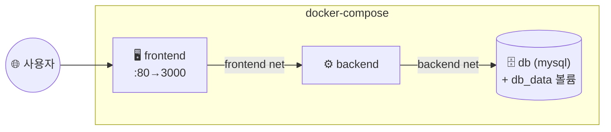

## 📌 들어가며

이번 글에서는 여러 컨테이너로 이뤄진 애플리케이션을 **한 방에 관리**하는 **Docker Compose**를 정리한다. 실제 서비스는 웹·백엔드·DB처럼 여러 컨테이너가 얽혀 동작하는데, 이를 YAML 파일 하나로 정의하고 단일 명령으로 다룬다.

> **Docker Compose란?** **`docker-compose.yml`(YAML 파일) 하나로 여러 컨테이너를 정의**하고, 단일 명령으로 생성·실행·중지·삭제하는 도구. 컨테이너 간 의존성·네트워크·볼륨·환경 변수를 한곳에서 관리한다.

---

## 1. 왜 Compose인가

여러 컨테이너를 `docker run`으로 하나씩 띄우면 번거롭고 실수가 잦다. Compose는 이를 **선언적 YAML**로 묶는다.

| 이점 | 설명 |
|------|------|
| **멀티 컨테이너 관리** | YAML 하나 + 단일 명령으로 전체 제어 |
| **의존성 관리** | `depends_on`으로 실행 순서 지정 |
| **네트워크·볼륨** | 통신 네트워크·영속 볼륨 함께 정의 |
| **환경 변수** | 컨테이너 설정을 YAML에 정의 |
| **확장성** | `scale`/`deploy.replicas`로 개수 조절 |

> 💡 예를 들어 **웹 서버는 DB가 먼저 떠 있어야** 정상 동작한다. `depends_on: [db]`를 쓰면 Compose가 DB를 먼저 실행한 뒤 웹을 띄워, 실행 순서 문제를 자동으로 처리한다.

---

## 2. YAML 기본 구조 & 옵션

```yaml
version: '3.8'          # Compose 파일 버전
services:               # 컨테이너 서비스들
  서비스명1:
    image: 이미지 이름    # 사용할 이미지
    # ... 설정
  서비스명2:
    # ...
networks:               # 네트워크(선택)
volumes:                # 볼륨(선택)
```

| 옵션 | 역할 |
|------|------|
| `build` / `image` | 빌드 설정 / 사용할 이미지 |
| `container_name` | 컨테이너 이름 |
| `depends_on` | 서비스 의존성(실행 순서) |
| `environment` | 환경 변수 |
| `ports` | 호스트:컨테이너 포트 매핑 |
| `volumes` | 볼륨 마운트 |
| `networks` | 연결 네트워크 |
| `restart` | 재시작 정책 |
| `deploy` | 배포 설정(replicas·resources) |
| `healthcheck` | 상태 확인 |

---

## 3. 주요 CLI 명령어

```bash
docker-compose up -d          # 생성 + 실행(백그라운드)
docker-compose down           # 중지 + 삭제
docker-compose ps             # 목록 확인
docker-compose logs           # 로그 확인
docker-compose build          # 이미지 빌드
docker-compose config         # YAML 검증
docker-compose scale <서비스>=N  # 개수 조절
```

---

## 4. 3-Tier 웹 애플리케이션 배포

**프론트엔드 + 백엔드 + DB**의 3계층을 하나의 Compose로 배포한다.



**프로젝트 구조:**

```
my-app/
├─ docker-compose.yml
├─ frontend/  (Dockerfile ...)
└─ backend/   (Dockerfile ...)
```

**`docker-compose.yml`:**

```yaml
version: '3.8'
services:
  frontend:
    build: ./frontend
    ports:
      - "80:3000"
    networks:
      - frontend
    depends_on:
      - backend

  backend:
    build: ./backend
    networks:
      - frontend
      - backend
    depends_on:
      - db

  db:
    image: mysql:5.7
    volumes:
      - db_data:/var/lib/mysql
    environment:
      MYSQL_ROOT_PASSWORD: your_password
    networks:
      - backend

networks:
  frontend:
  backend:

volumes:
  db_data:
```

**실행:**

```bash
docker-compose up --build -d
```

> 💡 **네트워크 분리가 보안 포인트**다. DB는 `backend` 네트워크에만 두어, 프론트엔드가 DB에 직접 접근하지 못하게 했다. 프론트는 백엔드하고만, 백엔드는 DB하고만 통신하는 계층 구조가 자연스럽게 만들어진다. DB 데이터는 `db_data` 볼륨으로 영속화된다.

---

## 📝 정리

```
Docker Compose
├─ 개념   YAML 하나로 멀티 컨테이너 정의·관리
├─ 구조   services / networks / volumes
├─ 명령   up -d / down / ps / logs / scale
└─ 예시   3-Tier(frontend/backend/db) + 네트워크 분리
```

| 개념 | 한 줄 정의 |
|------|------|
| **Compose** | 멀티 컨테이너 선언적 관리 |
| **depends_on** | 서비스 실행 순서 |
| **네트워크 분리** | 계층 간 접근 통제 |

Compose의 핵심은 **여러 컨테이너를 YAML 하나로 선언하고 `up` 한 번으로 띄우는 것**이다. 의존성·네트워크·볼륨을 함께 정의해, 복잡한 멀티 컨테이너 애플리케이션도 재현 가능하게 배포할 수 있다.
