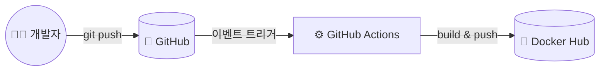

## 📌 들어가며

이번 글에서는 **Docker CI**를 정리한다. Dockerfile로 이미지를 직접 만드는 데서 나아가, **코드를 푸시하면 자동으로 이미지가 빌드·푸시**되도록 GitHub Actions로 파이프라인을 구성한다.

> **Docker CI란?** CI/CD 파이프라인에서 **Docker 이미지 빌드를 자동화**하는 것. 코드를 Git에 푸시할 때마다 자동으로 이미지를 빌드·테스트해, 항상 최신 이미지를 유지한다.

---

## 1. CI/CD & 자동화 흐름

**CI/CD**는 코드 변경을 자주 통합하고, 자동 빌드·테스트를 거쳐 빠르게 배포하는 것이다. 개발 주기를 줄이고 버그를 조기에 잡는다.



> 💡 **GitHub Actions**는 저장소 이벤트(push·PR 등)에 반응해 워크플로를 실행하는 도구다. **YAML로 정의**하고 다양한 액션을 조합해 빌드·테스트·배포를 자동화한다.

---

## 2. 구성 단계

| 단계 | 내용 |
|------|------|
| ① | 로컬에서 Dockerfile 빌드 → Docker Hub push(최초) |
| ② | GitHub 저장소 생성 + 코드 푸시 |
| ③ | `Settings > Secrets`에 `DOCKER_HUB_USERNAME`·`DOCKER_HUB_PASSWORD` 등록 |
| ④ | `.github/workflows/docker-image.yml` 작성 |
| ⑤ | 코드 변경·푸시 → Actions 자동 실행 |
| ⑥ | `Actions` 탭에서 결과 확인 |

> ⚠️ Docker Hub 비밀번호 같은 **민감 정보는 절대 YAML에 직접 쓰지 말고 Secrets에 저장**한다. 워크플로에서는 `${{ secrets.이름 }}`으로 참조해, 코드에 자격 증명이 노출되지 않게 한다.

---

## 3. 워크플로 파일 (`docker-image.yml`)

`master` 브랜치 푸시나 태그 생성 시, 이미지를 빌드해 Docker Hub에 올린다.

```yaml
name: Push Docker Image to Docker Hub
on:
  push:
    branches:
      - 'master'
    tags:
      - '**'
jobs:
  push:
    runs-on: ubuntu-latest
    steps:
    - name: Checkout
      uses: actions/checkout@v2
    - name: Docker meta
      id: docker_meta
      uses: crazy-max/ghaction-docker-meta@v1
      with:
        images: leecloudo/nodejs-ci
        tag-semver: |
          {{version}}
          {{major}}.{{minor}}
    - name: Set up QEMU
      uses: docker/setup-qemu-action@v2
    - name: Set up Docker Buildx
      uses: docker/setup-buildx-action@v2
    - name: Login to Docker Hub
      uses: docker/login-action@v2
      with:
        username: ${{ secrets.DOCKER_HUB_USERNAME }}
        password: ${{ secrets.DOCKER_HUB_PASSWORD }}
    - name: Build and push Docker Image
      uses: docker/build-push-action@v4
      with:
        context: .
        push: true
        tags: ${{ steps.docker_meta.outputs.tags }}
        labels: ${{ steps.docker_meta.outputs.labels }}
```

**주요 스텝 해설:**

| 스텝 | 역할 |
|------|------|
| `checkout` | 소스 코드 체크아웃 |
| `docker_meta` | 태그·라벨 자동 생성(시맨틱 버전) |
| `QEMU`·`Buildx` | **멀티 아키텍처 빌드** 지원 |
| `login-action` | Secrets로 Docker Hub 로그인 |
| `build-push-action` | 이미지 빌드 + push |

> 💡 **QEMU + Buildx**를 쓰면 `amd64`뿐 아니라 `arm64`(예: 애플 실리콘·라즈베리파이) 이미지까지 **한 번에 멀티 아키텍처 빌드**할 수 있다. `docker_meta`는 커밋·태그로부터 버전 태그를 자동으로 만들어준다.

---

## 📝 정리

```
Docker CI (GitHub Actions)
├─ 개념   푸시 → 이미지 자동 빌드·푸시
├─ 트리거 on.push (브랜치·태그)
├─ 보안   Secrets에 Docker Hub 자격 증명
└─ 빌드   Buildx(멀티 아키텍처) + build-push-action
```

| 개념 | 한 줄 정의 |
|------|------|
| **Docker CI** | 이미지 빌드 자동화 |
| **GitHub Actions** | 이벤트 기반 워크플로 |
| **Secrets** | 민감 정보 안전 저장 |

Docker CI의 핵심은 **"푸시하면 이미지가 자동으로 만들어져 레지스트리에 올라가는"** 흐름을 만드는 것이다. GitHub Actions와 Secrets를 활용하면, 수동 빌드·푸시 없이 항상 최신 이미지를 유지할 수 있다.
