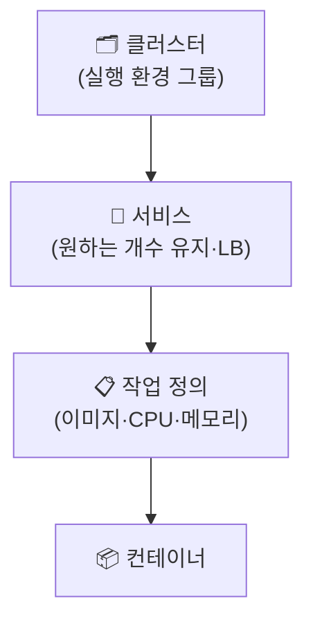

## 📌 들어가며

이번 글에서는 **Amazon ECS(Elastic Container Service)**로 컨테이너를 클라우드에 배포한다. 로컬의 Docker Compose를 넘어, 실제 서비스로 운영하기 위한 **컨테이너 오케스트레이션**을 다룬다. Nginx + Django로 구성한 2-Tier 웹 서비스를 ECS에 올린다.

> **ECS란?** Docker 컨테이너를 클라우드에서 쉽게 실행·관리하는 **완전 관리형 컨테이너 오케스트레이션 서비스**. **Fargate(서버리스)**·확장성·고가용성·CloudWatch 로깅·ELB 로드 밸런싱을 제공한다.

---

## 1. ECS 아키텍처 구성 요소

ECS는 **클러스터 → 서비스 → 작업(Task) → 컨테이너**의 계층으로 이해하면 쉽다.



| 구성 요소 | 역할 |
|------|------|
| **클러스터(Cluster)** | 컨테이너를 실행하는 논리 그룹(EC2/Fargate) |
| **작업 정의(Task Definition)** | 이미지·CPU·메모리·네트워크 등 실행 설정 |
| **서비스(Service)** | 작업을 원하는 수만큼 유지·확장·LB |
| **컨테이너 인스턴스** | EC2 기반 클러스터의 실행 EC2 |
| **ECS 에이전트** | 인스턴스에서 컨테이너 실행·상태 관리 |

> 💡 **작업 정의 = 설계도, 서비스 = 운영자**로 비유할 수 있다. 작업 정의는 "무엇을 어떻게 실행할지"를 적고, 서비스는 그 작업을 "몇 개로, 어떻게 유지할지"를 담당한다.

---

## 2. 사전 준비 — ECR 이미지 push

컨테이너 이미지를 **ECR**에 올려둔다.

```bash
aws ecr create-repository --repository-name fc-django
aws ecr create-repository --repository-name fc-nginx
aws ecr get-login-password | docker login --username AWS --password-stdin <ECR주소>
# Nginx·Django 이미지 빌드 → tag → push
```

---

## 3. 작업 정의 생성 (`2tier-task`)

EC2 시작 유형으로 작업 정의를 만들고, 볼륨 `socket_volume`을 공유해 두 컨테이너를 연결한다.

| 컨테이너 | 설정 |
|------|------|
| **fc-django** | Django 이미지, 메모리 500MB, `/app`을 `socket_volume`에 마운트, 로그 활성화 |
| **fc-nginx** | Nginx 이미지, 메모리 500MB, 포트 **80:80**, `fc-django` 볼륨 공유 |

**시작 종속**: `fc-nginx`가 `fc-django`에 의존(START)하도록 설정한다.

> 💡 Nginx가 Django와 **볼륨(소켓)을 공유**하는 구조다. Nginx가 정적 요청은 직접 처리하고, 동적 요청은 소켓으로 Django에 넘긴다. 그래서 두 컨테이너가 같은 볼륨을 봐야 하고, 시작 순서(Django 먼저)가 중요하다.

---

## 4. 서비스 생성 (`2tier-svc`)

클러스터(`ecs-cluster`)에서 서비스를 만들고, 작업을 **2개(REPLICA)** 유지하도록 한다.

| 항목 | 값 |
|------|------|
| 시작 유형 | EC2 |
| 서비스 유형 | REPLICA |
| 작업 개수 | **2** |
| 로드 밸런서 | 기존 `ecs-alb`(컨테이너 `fc-nginx`, 포트 80) |
| 상태 검사 유예 | 300초 |

약 20초 후 서비스 상태가 **RUNNING**이 되고, 컨테이너 2개가 실행 중인지 확인한다.

---

## 5. 접속 & 트러블슈팅

로드 밸런서(`ecs-alb`)의 **DNS 주소**로 브라우저 접속해 서비스를 확인한다.

> ⚠️ **504 에러가 나면** `ecs-sg-instance` 보안 그룹에 **3000번 포트(Django)** 인바운드 규칙을 추가한다. ALB → Nginx까지는 연결됐지만, 뒤의 Django 포트가 막혀 게이트웨이 타임아웃이 나는 상황이다.

---

## 📝 정리

```
Amazon ECS
├─ 개념   관리형 컨테이너 오케스트레이션(Fargate/EC2)
├─ 구조   클러스터 > 서비스 > 작업 정의 > 컨테이너
├─ 준비   ECR에 이미지 push
├─ 배포   작업 정의(2컨테이너·볼륨공유) → 서비스(2 replica·ALB)
└─ 확인   ALB DNS 접속 (504 시 3000 포트 개방)
```

| 개념 | 한 줄 정의 |
|------|------|
| **ECS** | 관리형 컨테이너 오케스트레이션 |
| **작업 정의** | 컨테이너 실행 설계도 |
| **서비스** | 작업 개수 유지·LB 연동 |

ECS의 핵심은 **작업 정의(무엇을)와 서비스(몇 개·어떻게)를 나눠** 컨테이너를 클라우드에서 안정적으로 운영하는 것이다. Compose가 로컬 멀티 컨테이너라면, ECS는 그 개념을 클라우드 오케스트레이션으로 확장한 것이다.
