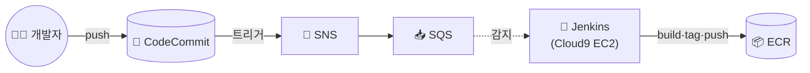

## 📌 들어가며

이번 글에서는 **AWS 서비스 기반 3-Tier CI/CD 파이프라인**을 구축한다. **Jenkins + CodeCommit + SNS/SQS + ECR**를 엮어, 코드를 푸시하면 자동으로 이미지가 빌드되어 ECR에 배포되는 흐름을 만든다.

> **목표 파이프라인** 개발자가 CodeCommit에 코드를 푸시하면 → 이벤트가 감지되어 Jenkins가 트리거되고 → Jenkins가 이미지를 **빌드·태그·push(ECR)**한다. 수동 배포 없이 **"푸시 = 배포"**를 실현한다.

---

## 1. 전체 아키텍처



---

## 2. 1단계 — Cloud9에 Jenkins 설치

Dockerfile로 **도커까지 포함된 Jenkins 이미지**를 만들고, Compose로 실행한다.

```dockerfile
FROM jenkins/jenkins:lts
USER root
RUN apt-get update && \
    apt-get -y install apt-transport-https ca-certificates curl gnupg2 zip unzip software-properties-common && \
    curl -fsSL https://download.docker.com/linux/debian/gpg | apt-key add - && \
    add-apt-repository "deb [arch=amd64] https://download.docker.com/linux/debian $(lsb_release -cs) stable" && \
    apt-get update && \
    apt-get -y install docker-ce
```

```yaml
version: '3.3'
services:
  jenkins:
    build:
      context: .
    container_name: jenkins
    user: root
    restart: always
    ports:
      - 18080:8080
      - 50000:50000
    volumes:
      - /home/ec2-user/jenkins_home:/var/jenkins_home
      - /var/run/docker.sock:/var/run/docker.sock
```

```bash
docker compose up -d
```

퍼블릭 IP:18080으로 접속해 초기 설정과 플러그인(Git·Pipeline·AWS)을 설치한다.

> 💡 **Jenkins 컨테이너에 `docker.sock`을 마운트**하는 이유는, Jenkins가 파이프라인 안에서 **호스트의 도커로 이미지를 빌드**하기 위해서다(Docker-outside-of-Docker). 이게 없으면 컨테이너 안에서 `docker build`를 할 수 없다.

---

## 3. 2~4단계 — 소스·저장소·이벤트 연결

| 단계 | 내용 |
|------|------|
| **2. 앱 배포** | 3-Tier 앱(`my-diary-3`)을 `docker compose up -d`로 실행, `:3000` 접속 확인 |
| **3. CodeCommit** | `mydiary-repo` 저장소 생성 + IAM Git 사용자 권한 부여 → clone·push |
| **4. 이벤트** | **SNS**(`mydiary-notification`) + **SQS**(`mydiary-event-queue`) 생성, CodeCommit **푸시 트리거 → SNS → SQS 구독** |

> 💡 **SNS + SQS를 끼우는 이유** — CodeCommit의 푸시 이벤트를 SNS가 받아 SQS 큐에 쌓아두면, Jenkins가 그 큐를 폴링해 처리한다. 이벤트를 큐에 버퍼링하므로, Jenkins가 잠시 바빠도 이벤트가 유실되지 않는다.

---

## 4. 5단계 — Jenkins 파이프라인 (Jenkinsfile)

AWS·Docker Hub 자격 증명을 **Credentials**에 등록하고, `Pipeline script from SCM`으로 CodeCommit의 `Jenkinsfile`을 읽게 한다.

```groovy
pipeline {
    agent any
    stages {
        stage('Build') {
            steps {
                sh 'docker build -t mydiary-repo .'
            }
        }
        stage('Tag') {
            steps {
                sh 'docker tag mydiary-repo:latest 594682333406.dkr.ecr.ap-northeast-2.amazonaws.com/mydiary-repo:1.0'
            }
        }
        stage('Push') {
            environment {
                AWS_ACCESS_KEY_ID = credentials('awsaccess')
                AWS_SECRET_ACCESS_KEY = credentials('awssecret')
            }
            steps {
                sh 'aws ecr get-login-password --region ap-northeast-2 | docker login --username AWS --password-stdin 594682333406.dkr.ecr.ap-northeast-2.amazonaws.com'
                sh 'docker push 594682333406.dkr.ecr.ap-northeast-2.amazonaws.com/mydiary-repo:1.0'
            }
        }
    }
}
```

| Stage | 역할 |
|------|------|
| **Build** | Dockerfile로 이미지 빌드 |
| **Tag** | ECR URI로 태깅 |
| **Push** | ECR 로그인 후 이미지 push |

> ⚠️ AWS 키는 절대 Jenkinsfile에 직접 쓰지 말고, **`credentials('awsaccess')`처럼 Jenkins Credentials에서 주입**한다. `environment` 블록에 넣으면 실행 시점에만 환경 변수로 안전하게 채워진다.

---

## 5. 6단계 — 자동 배포 테스트

`public/index.ejs`를 수정해 CodeCommit에 푸시하면, **Jenkins 빌드가 자동 실행 → ECR에 이미지 push**된다. 애플리케이션에 접속해 변경 사항이 반영됐는지 확인한다.

---

## 📝 정리

```
Jenkins CI/CD (AWS)
├─ 설치   Cloud9 + Jenkins(docker.sock 마운트)
├─ 소스   CodeCommit(프라이빗 Git)
├─ 이벤트 CodeCommit → SNS → SQS → Jenkins
├─ 빌드   Jenkinsfile: Build → Tag → Push(ECR)
└─ 보안   AWS 키는 Credentials로 주입
```

| 개념 | 한 줄 정의 |
|------|------|
| **Jenkins** | CI/CD 자동화 서버 |
| **SNS/SQS** | 이벤트 전달·버퍼링 |
| **Jenkinsfile** | 파이프라인 코드(as Code) |

이 파이프라인의 핵심은 **CodeCommit 푸시 → (SNS/SQS) → Jenkins 빌드 → ECR push**로 이어지는 자동화다. GitHub Actions와 목적은 같지만, **AWS 관리형 서비스로 구성**해 확장성과 통합성을 확보한 것이 특징이다.
