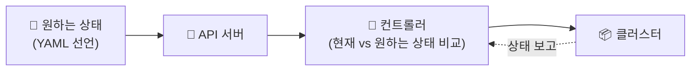

## 📌 들어가며

이번 글에서는 **컨테이너 오케스트레이션**과 그 대표 주자인 **쿠버네티스(Kubernetes)**를 개괄한다. Docker로 컨테이너를 다뤘다면, 이제는 **수많은 컨테이너를 자동으로 배치·관리·확장**하는 단계로 넘어갈 차례다.

> **컨테이너 오케스트레이션이란?** 다수의 컨테이너를 **어느 노드에 배치하고, 상태를 추적하며, 부하에 따라 조절하고, 서로 연결**하는 일을 자동화하는 기술. 컨테이너 수가 늘어날수록 손으로 관리하기 어려워지는데, 이를 해결한다.

---

## 1. 왜 오케스트레이션이 필요한가

컨테이너 하나는 `docker run`으로 충분하지만, 수십~수백 개가 되면 사람이 감당할 수 없다. 오케스트레이션은 다음 4가지 문제를 자동으로 푼다.

| 문제 | 질문 |
|------|------|
| **배포 관리** | 어느 노드에 어떻게 배치할까? |
| **제어·모니터링** | 여러 컨테이너 상태를 어떻게 추적할까? |
| **스케일링** | 부하에 따라 수를 어떻게 조절할까? |
| **네트워킹** | 컨테이너 간 통신을 어떻게 연결할까? |

---

## 2. 쿠버네티스의 핵심 기능

**쿠버네티스**는 Google이 만든 오픈소스 오케스트레이션 플랫폼으로, 현재 사실상 표준이다.

| 기능 | 설명 |
|------|------|
| **자동 배포/롤백** | 배포 자동화 + 문제 시 이전 상태로 복구 |
| **서비스 검색/LB** | DNS·IP 할당 + 트래픽 자동 분산 |
| **자동 복구** | 장애 컨테이너 재시작·교체 |
| **자동 스케일링** | 사용량에 따라 컨테이너 수 조절 |
| **스토리지 오케스트레이션** | 다양한 스토리지 연동 |
| **비밀·구성 관리** | 민감 정보 안전 저장, 구성 제공 |

> 💡 쿠버네티스의 강력함은 **"자동 복구(self-healing)"**에 있다. 컨테이너가 죽으면 알아서 다시 띄우고, 노드가 고장 나면 다른 노드로 옮긴다. 사람이 밤에 자는 동안에도 원하는 상태를 스스로 유지한다.

---

## 3. 쿠버네티스 설계 사상

쿠버네티스를 이해하는 핵심은 **"선언적(declarative)"**이라는 5가지 설계 원칙이다.



| 원칙 | 설명 |
|------|------|
| **선언적 구성** | 원하는 상태를 YAML로 선언 → 쿠버네티스가 자동 유지 |
| **기능 단위 분산** | 기능을 오브젝트로 분리(Node·Pod·Deployment·Service·Namespace) |
| **클러스터 중앙 제어** | 물리 리소스를 클러스터로 추상화, 마스터가 중앙 관리 |
| **동적 그룹화** | Label·Annotation으로 유연하게 그룹화 |
| **API 기반 상호작용** | 모든 통신은 API 서버 경유 → 안정성·확장성 |

> 💡 **선언적 vs 명령적** — "컨테이너를 켜라/꺼라"(명령적)가 아니라 **"컨테이너가 3개 떠 있어야 한다"(선언적)**고 목표만 선언하면, 쿠버네티스가 현재 상태와 비교해 알아서 맞춘다. 이것이 쿠버네티스 전체를 관통하는 사상이다.

---

## 📝 정리

```
컨테이너 오케스트레이션 & 쿠버네티스
├─ 필요성  배포·모니터링·스케일링·네트워킹 자동화
├─ 기능    자동 배포/롤백·복구·스케일링·LB
├─ 사상    선언적 구성 + API 중앙 제어 + 라벨 그룹화
└─ 핵심    "원하는 상태"를 선언 → 자동 유지
```

| 개념 | 한 줄 정의 |
|------|------|
| **오케스트레이션** | 다수 컨테이너 자동 관리 |
| **쿠버네티스** | 표준 오케스트레이션 플랫폼 |
| **선언적 구성** | 목표 상태 선언 → 자동 유지 |

쿠버네티스의 핵심은 **"원하는 상태를 선언하면 알아서 유지한다"**는 선언적 사상이다. 다음 글부터는 이를 구현하는 핵심 구성 요소(Pod·Service·Deployment 등)와 클러스터 아키텍처를 하나씩 살펴본다.

**참고**: [Kubernetes 공식 문서](https://kubernetes.io/ko/docs/home/) · [쿠버네티스 시작하기](https://kubernetes.io/ko/docs/tutorials/kubernetes-basics/)
