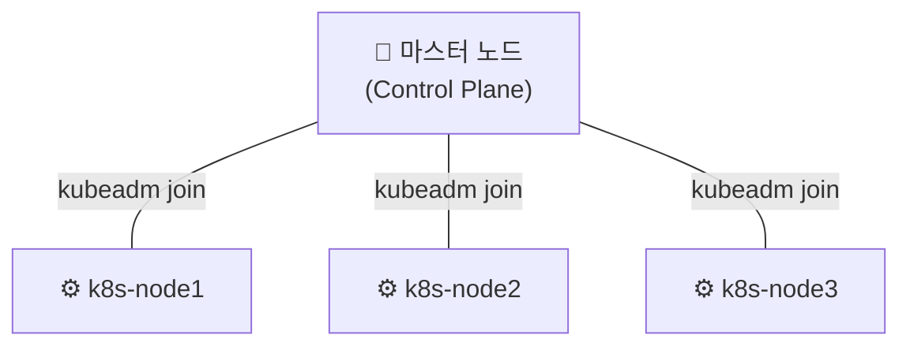

## 📌 들어가며

이번 글에서는 **3-node 쿠버네티스 클러스터**를 직접 구축한다. VirtualBox VM 준비부터 쿠버네티스용 사전 설정, `kubeadm`으로 클러스터 초기화, 그리고 관리형 서비스인 **Amazon EKS** 구성까지 다룬다.

> **클러스터 구성 큰 그림** 마스터 노드 1개(Control Plane) + 워커 노드 3개로 구성한다. 마스터에서 `kubeadm init`으로 초기화하고, 워커들이 `kubeadm join`으로 합류하는 구조다.



---

## 1. VM 환경 구성 (Ubuntu 22.04)

VirtualBox로 VM을 만든다. 쿠버네티스 **최소 사양은 CPU 4개·메모리 4GB**다.

| 항목 | 설정 |
|------|------|
| CPU / 메모리 | 4개 / 4GB(최소) |
| 디스크 | 100GB |
| 네트워크 | 어댑터1(NAT) + 어댑터2(Host-Only) |

Ubuntu 설치 후 필수 도구(`vim`, `openssh-server`, `net-tools`)를 설치하고 Putty·MobaXterm으로 원격 접속한다.

> 💡 **어댑터 2개를 쓰는 이유** — NAT는 VM이 인터넷에 나가는 통로, Host-Only는 호스트 PC ↔ VM 및 VM 간 내부 통신용이다. 노드 간 통신에는 고정 IP를 쓸 수 있는 Host-Only 네트워크가 필요하다.

---

## 2. 쿠버네티스용 사전 설정

쿠버네티스는 몇 가지 커널·시스템 설정을 요구한다. 특히 **SWAP 비활성화**는 필수다.

| 설정 | 명령/내용 |
|------|------|
| **방화벽 해제** | `ufw disable` |
| **SWAP 비활성화** | `swapoff -a` + `/etc/fstab` 수정 |
| **NTP** | `ntp` 설치(시간 동기화) |
| **IP 포워딩** | `/proc/sys/net/ipv4/ip_forward` → 1 |
| **컨테이너 런타임** | `containerd` 구성 |
| **iptables** | 브릿지 설정 추가(노드 간 통신) |
| **도구 설치** | `kubelet`, `kubeadm`, `kubectl` + `apt-mark hold`(버전 고정) |

> ⚠️ **SWAP은 반드시 꺼야 한다.** 쿠버네티스는 메모리를 정확히 관리하기 위해 SWAP이 켜져 있으면 `kubelet`이 기동을 거부한다. `swapoff -a`뿐 아니라 `/etc/fstab`에서도 주석 처리해 **재부팅 후에도 유지**되게 한다.

이후 `/etc/hosts`에 노드 IP·호스트명을 등록하고, 마스터 VM을 복제해 워커 노드(k8s-node1~3)를 만든 뒤 각각의 호스트명·IP를 변경한다.

---

## 3. 클러스터 초기화 & 워커 조인

마스터에서 초기화하고, 네트워크 플러그인(Calico)을 설치한 뒤 워커를 합류시킨다.

```bash
# ① 마스터: 컨트롤 플레인 초기화
kubeadm init --pod-network-cidr=<CIDR> --apiserver-advertise-address=<마스터IP>

# ② kubectl 설정 (admin.conf 복사)
mkdir -p $HOME/.kube && cp /etc/kubernetes/admin.conf $HOME/.kube/config

# ③ 네트워크 플러그인(Calico) 설치
kubectl apply -f calico.yaml

# ④ 노드 상태 확인 (Ready?)
kubectl get nodes

# ⑤ 워커 노드: 클러스터 합류
kubeadm join <마스터IP>:6443 --token <토큰> --discovery-token-ca-cert-hash <해시>
```

> 💡 **네트워크 플러그인(CNI)을 설치하기 전까지 노드는 `NotReady`**다. Calico 같은 CNI가 파드 간 네트워크를 구성해줘야 비로소 `Ready`가 된다. 초기화 직후 노드가 NotReady여도 당황하지 말고 CNI를 먼저 설치하자.

---

## 4. Amazon EKS (관리형)

직접 구축 대신 **AWS 관리형 쿠버네티스(EKS)**를 쓰면 클러스터 구축·관리가 간소화된다.

```bash
# 도구 설치: kubectl, eksctl, aws configure
aws configure                                  # 액세스 키·리전 설정

# EKS 클러스터 생성 (eksctl이 CloudFormation으로 구성)
eksctl create cluster --name <클러스터명> \
  --node-type <인스턴스유형> --nodes <수> --version <버전>
```

> 💡 **직접 구축 vs EKS** — VirtualBox 구축은 내부 동작을 이해하는 데 좋지만, 운영에서는 Control Plane 관리·업그레이드·고가용성을 AWS가 대신해주는 **EKS**가 훨씬 편하다. `eksctl` 한 줄로 클러스터가 만들어진다.

---

## 📝 정리

```
클러스터 구축
├─ VM      Ubuntu 22.04(CPU4·RAM4G), NAT+Host-Only
├─ 사전설정 SWAP off · containerd · iptables · 도구 설치
├─ 초기화   kubeadm init → CNI(Calico) → kubeadm join
└─ 관리형   eksctl create cluster (EKS)
```

| 개념 | 한 줄 정의 |
|------|------|
| **kubeadm init/join** | 클러스터 초기화/합류 |
| **SWAP off** | kubelet 기동 필수 조건 |
| **CNI** | 파드 네트워크(설치해야 Ready) |

클러스터 구축의 핵심은 **사전 설정(SWAP off 등) → `kubeadm init` → CNI 설치 → `kubeadm join`**의 순서다. 이 과정을 이해하면, EKS 같은 관리형 서비스가 무엇을 대신해주는지도 명확해진다.
