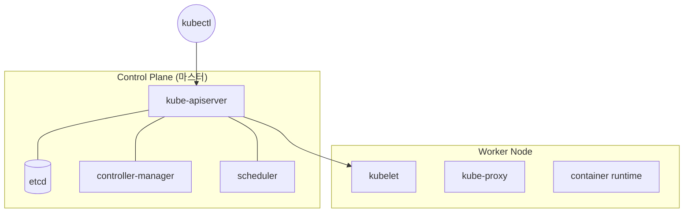

## 📌 들어가며

이번 글에서는 쿠버네티스의 **아키텍처**를 정리한다. 클러스터가 **Control Plane(관리)**과 **Worker Node(실행)**로 나뉘는 구조, 각 구성 요소의 역할, 그리고 애플리케이션 배포 과정과 CNI(Calico)·컨테이너 런타임까지 살펴본다.

> **큰 그림** 쿠버네티스는 **"두뇌(Control Plane)"**가 명령하고 **"팔다리(Worker Node)"**가 실행하는 구조다. 모든 통신은 **API 서버**를 거치고, 클러스터의 상태는 **etcd**에 저장된다.

---

## 1. 전체 아키텍처



---

## 2. Control Plane 구성 요소

클러스터 전체를 **관리·조율**하는 두뇌다.

| 구성 요소 | 역할 |
|------|------|
| **kube-apiserver** | 모든 요청이 거치는 **중심 API 서버** |
| **etcd** | 클러스터 상태를 저장하는 **분산 키-값 저장소** |
| **controller-manager** | 원하는 상태 유지(예: 레플리카 수 관리) |
| **scheduler** | 파드를 적절한 노드에 **배치** |
| **cloud-controller-manager** | 클라우드 리소스 연동 |

> 💡 **etcd는 클러스터의 "단일 진실 공급원(single source of truth)"**이다. 모든 오브젝트 상태가 여기 저장되므로, etcd가 손상되면 클러스터 전체가 위험하다. 그래서 실무에서는 etcd를 반드시 백업하고 고가용성으로 구성한다.

---

## 3. Worker Node 구성 요소

실제 애플리케이션(파드)이 **실행**되는 곳이다.

| 구성 요소 | 역할 |
|------|------|
| **kubelet** | 노드 에이전트. API 서버 명령대로 컨테이너 실행·감시 |
| **kube-proxy** | 서비스 ↔ 파드 **네트워크 통신** 처리 |
| **container runtime** | 실제 컨테이너 실행(Docker·containerd) |

---

## 4. 애플리케이션 배포 과정

**개발 → 이미지 push → 배포(Deployment) → 서비스 노출 → 확인**의 흐름이다.

```bash
# ① 이미지 빌드 & 레지스트리 push
docker build -t myapp:v1 .
docker push myrepo/myapp:v1
```

```yaml
# ② Deployment (파드 3개)
apiVersion: apps/v1
kind: Deployment
metadata:
  name: myapp-deployment
spec:
  replicas: 3
  selector:
    matchLabels:
      app: myapp
  template:
    metadata:
      labels:
        app: myapp
    spec:
      containers:
      - name: myapp-container
        image: myrepo/myapp:v1
        ports:
        - containerPort: 3000
```

```yaml
# ③ Service (외부 노출)
apiVersion: v1
kind: Service
metadata:
  name: myapp-service
spec:
  selector:
    app: myapp
  ports:
  - protocol: TCP
    port: 80
    targetPort: 3000
  type: LoadBalancer
```

```bash
# ④ 배포 확인
kubectl get pods
kubectl get svc
kubectl logs <pod-name>
```

---

## 5. CNI (Calico) & 컨테이너 런타임

### CNI — Calico

**CNI(Container Network Interface)**는 파드 간 네트워크를 담당한다. Calico는 널리 쓰이는 CNI로, **네트워크 정책**까지 관리한다.

```bash
kubectl apply -f https://docs.projectcalico.org/manifests/calico.yaml
kubectl get pods -n kube-system | grep calico          # 상태 확인
```

### 컨테이너 런타임 — CRI

쿠버네티스는 **CRI(Container Runtime Interface)**를 통해 런타임(containerd 등)과 gRPC로 통신하며 컨테이너를 제어한다.

```bash
pstree | grep containerd
kubectl get pods -o wide
```

> 💡 **CNI와 CRI는 쿠버네티스의 "표준 콘센트"**다. CRI 덕분에 Docker든 containerd든 갈아 끼울 수 있고, CNI 덕분에 Calico든 Flannel이든 네트워크 플러그인을 바꿀 수 있다. 쿠버네티스가 특정 구현에 묶이지 않는 이유다.

---

## 📝 정리

```
쿠버네티스 아키텍처
├─ Control Plane  apiserver·etcd·controller·scheduler
├─ Worker Node    kubelet·kube-proxy·런타임
├─ 배포           빌드→push→Deployment→Service→확인
└─ 표준 인터페이스 CNI(네트워크)·CRI(런타임)
```

| 개념 | 한 줄 정의 |
|------|------|
| **apiserver** | 모든 통신의 중심 |
| **etcd** | 클러스터 상태 저장소 |
| **CNI / CRI** | 네트워크 / 런타임 표준 |

쿠버네티스 아키텍처의 핵심은 **Control Plane(두뇌)과 Worker Node(실행)의 분리**, 그리고 **모든 통신이 API 서버를 거치는** 구조다. CNI·CRI 같은 표준 인터페이스가 유연성을 부여한다.
