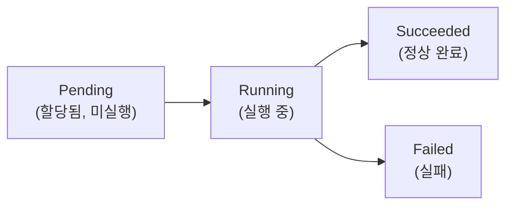

## 📌 들어가며

이번 글에서는 쿠버네티스의 **기본 실행 단위인 파드(Pod)**를 정리한다. 생성 방법(선언형·명령형), 라이프사이클, 멀티 컨테이너 설계 패턴(사이드카·init), Label/Selector, 노드 스케줄링, Probe까지 파드의 핵심을 훑는다.

> **Pod란?** 쿠버네티스에서 애플리케이션이 실행되는 **가장 작은 단위**. 하나 이상의 컨테이너를 묶으며, 그 컨테이너들은 **같은 네트워크 네임스페이스와 단일 IP**를 공유한다.

---

## 1. 파드 생성 — 선언형 vs 명령형

| 방식 | 특징 |
|------|------|
| **선언형(Declarative)** | YAML로 정의 → `kubectl apply` (권장, 재현 가능) |
| **명령형(Imperative)** | `kubectl run`으로 즉시 생성 (빠른 테스트) |

```yaml
# 선언형 — myweb1-pod.yaml
apiVersion: v1
kind: Pod
metadata:
  name: myweb1
  labels:
    app: myweb1
spec:
  containers:
  - name: nginx-container
    image: nginx:1.25.3-alpine
    ports:
    - containerPort: 80
```

```bash
kubectl apply -f myweb1-pod.yaml          # 선언형
kubectl run myweb2 --image=nginx:1.25.3-alpine --port=80   # 명령형
kubectl get po -o wide | grep myweb1      # 확인
```

> 💡 **실무는 선언형**이 원칙이다. YAML로 관리하면 Git으로 버전 관리·리뷰가 되고, 같은 파일로 언제든 동일하게 재현할 수 있다. 명령형은 빠른 테스트·학습용으로만 쓴다.

---

## 2. 파드 라이프사이클



| 상태 | 의미 |
|------|------|
| **Pending** | 클러스터에 할당됐지만 아직 실행 전 |
| **Running** | 정상 실행 중 |
| **Succeeded** | 작업 완료(주로 Job) |
| **Failed** | 컨테이너 실패 |

```bash
kubectl get po -o wide          # 상태 확인
kubectl describe pod mypod      # 문제 원인(이벤트) 진단
```

---

## 3. 멀티 컨테이너 패턴 — Sidecar & Init

한 파드에 여러 컨테이너를 두어 역할을 나눈다.

### Sidecar — 보조 컨테이너 (함께 실행)

로깅·모니터링 등 보조 작업을 담당한다.

```yaml
apiVersion: v1
kind: Pod
metadata:
  name: log-pod
spec:
  containers:
  - name: app-container
    image: nginx:1.25.3
    volumeMounts:
    - name: html-log
      mountPath: /usr/share/nginx/html
  - name: sidecar-container
    image: debian:10
    volumeMounts:
    - name: html-log
      mountPath: /date-log
    command: ["/bin/sh", "-c"]
    args:
    - while true; do date >> /date-log/index.html; sleep 1; done
  volumes:
  - name: html-log
    emptyDir: {}
```

### Init — 초기화 컨테이너 (먼저 실행)

메인 컨테이너 실행 **전에** 초기화(설정 다운로드 등)를 마친다.

```yaml
apiVersion: v1
kind: Pod
metadata:
  name: weather-pod
spec:
  volumes:
  - name: weather-data
    emptyDir: {}
  initContainers:
  - name: download-config
    image: curlimages/curl:7.85.0
    args: ["https://api.open-meteo.com/v1/forecast?...", "-o", "/usr/share/nginx/html/index.html"]
    volumeMounts:
    - mountPath: /usr/share/nginx/html
      name: weather-data
  containers:
  - name: nginx-container
    image: nginx:1.25.3-alpine
    ports:
    - containerPort: 80
    volumeMounts:
    - mountPath: /usr/share/nginx/html
      name: weather-data
```

> 💡 **Sidecar는 "함께", Init은 "먼저"**다. Init 컨테이너는 완료되어야 메인 컨테이너가 시작되고(순차), Sidecar는 메인과 나란히 계속 실행된다(병렬). 초기 데이터 준비는 Init, 상시 보조 작업은 Sidecar다.

---

## 4. Label & Selector

**Label**로 리소스를 그룹화하고, **Selector**로 필터링한다. 서비스가 파드를 찾는 것도 이 라벨 매칭이다.

```yaml
metadata:
  name: label-pod
  labels:
    app: myapp
    tier: backend
```

```bash
kubectl get po --selector=app=myapp
```

---

## 5. 노드 스케줄링 & Probe

### nodeSelector — 특정 노드 지정

```yaml
spec:
  nodeSelector:
    kubernetes.io/hostname: k8s-node1
```

### Probe — 컨테이너 상태 검사

```yaml
readinessProbe:
  httpGet:
    path: /testpath
    port: 8080
  initialDelaySeconds: 15
  periodSeconds: 10
```

| Probe | 판단 | 실패 시 |
|------|------|------|
| **Readiness** | 트래픽 받을 준비됐나? | 서비스에서 제외 |
| **Liveness** | 살아 있나? | 컨테이너 재시작 |

> 💡 **Readiness와 Liveness는 목적이 다르다.** Readiness 실패는 "아직 준비 안 됨"이라 트래픽만 끊고 기다리지만, Liveness 실패는 "죽었음"이라 컨테이너를 재시작한다. 둘을 혼동하면 정상 파드를 계속 재시작하는 문제가 생긴다.

---

## 📝 정리

```
Pod
├─ 생성   선언형(YAML·권장) vs 명령형(run)
├─ 수명   Pending→Running→Succeeded/Failed
├─ 패턴   Sidecar(함께) / Init(먼저)
├─ 그룹화 Label + Selector
└─ 스케줄 nodeSelector / Probe(Readiness·Liveness)
```

| 개념 | 한 줄 정의 |
|------|------|
| **Pod** | 최소 실행 단위(컨테이너 묶음) |
| **Init/Sidecar** | 먼저 / 함께 실행 컨테이너 |
| **Readiness/Liveness** | 준비 / 생존 검사 |

파드의 핵심은 **컨테이너를 묶는 최소 단위**라는 점, 그리고 **Label로 묶고 Probe로 상태를 관리**한다는 점이다. 실무에서는 파드를 직접 만들기보다 Deployment 등으로 감싸 쓰지만, 그 안의 파드 설계 원리는 이 글의 내용이 그대로 적용된다.
