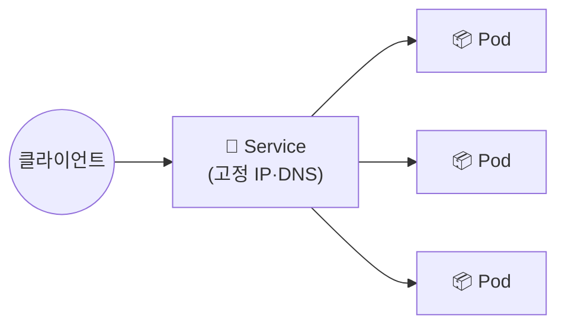

## 📌 들어가며

이번 글에서는 쿠버네티스 네트워킹의 핵심인 **서비스(Service)**를 정리한다. 파드는 재생성될 때마다 IP가 바뀌는데, 서비스는 **고정된 접점**을 제공해 안정적인 통신을 보장한다. 종류(ClusterIP·NodePort·LoadBalancer·ExternalName)와 동작 방식을 살펴본다.

> **Service란?** 여러 파드에 대한 네트워크 접속을 안정적으로 관리하는 **추상 객체**. 파드 IP는 변할 수 있지만, 서비스는 **고정 IP + DNS 이름**을 제공하고, 트래픽을 파드에 **부하 분산**한다.

---

## 1. 왜 서비스가 필요한가

파드의 IP는 재생성 시 바뀐다. 파드 IP를 직접 참조하면 통신이 끊긴다. **서비스**가 그 앞에서 고정 접점 역할을 한다.



| 기능 | 설명 |
|------|------|
| **고정 IP/DNS** | 파드 IP가 변해도 서비스는 그대로 |
| **부하 분산** | 여러 파드에 트래픽 분산 |
| **자동 DNS 등록** | 서비스 이름으로 접근 |

---

## 2. 서비스 종류

**노출 범위**에 따라 4가지로 나뉜다. NodePort는 ClusterIP를, LoadBalancer는 NodePort를 포함하는 **누적 구조**다.

| 종류 | 노출 범위 | 용도 |
|------|-----------|------|
| **ClusterIP** | 클러스터 **내부만**(기본값) | 파드 간 내부 통신 |
| **NodePort** | 노드 IP:포트로 **외부** | 간단한 외부 노출 |
| **LoadBalancer** | 클라우드 **외부 IP** | 실서비스 외부 노출 |
| **ExternalName** | 외부 도메인 별칭 | 외부 서비스 참조 |

### ClusterIP (기본)

```yaml
apiVersion: v1
kind: Service
metadata:
  name: my-clusterip-svc
spec:
  selector:
    app: myapp
  ports:
    - port: 80          # Service 포트
      targetPort: 8080  # Pod 컨테이너 포트
  type: ClusterIP
```

### NodePort

```yaml
apiVersion: v1
kind: Service
metadata:
  name: my-nodeport-svc
spec:
  selector:
    app: myapp
  ports:
    - port: 80
      targetPort: 8080
      nodePort: 30000   # 외부 접근 포트(30000~32767)
  type: NodePort
```

### LoadBalancer

```yaml
apiVersion: v1
kind: Service
metadata:
  name: my-loadbalancer-svc
spec:
  selector:
    app: myapp
  ports:
    - port: 80
      targetPort: 8080
  type: LoadBalancer
```

> 💡 **누적 구조**를 기억하자. NodePort는 내부적으로 ClusterIP를 갖고, LoadBalancer는 NodePort를 갖는다. 즉 LoadBalancer를 만들면 ClusterIP·NodePort 기능도 함께 딸려온다. 외부 노출은 **클라우드면 LoadBalancer, 온프레미스 테스트면 NodePort**가 일반적이다.

---

## 3. 실습 — 명령어로 서비스 생성

`kubectl expose`로 간단히 만들 수 있다.

```bash
# 파드 생성
kubectl run mypod --image=nginx --port=80

# ClusterIP (내부)
kubectl expose pod mypod --name=mypod-svc --type=ClusterIP --port=80

# NodePort (외부: 노드IP:30001)
kubectl expose pod mypod --name=mypod-svc-nodeport --type=NodePort \
  --port=80 --target-port=80 --node-port=30001
curl <노드 IP>:30001

# LoadBalancer (클라우드 외부 IP)
kubectl expose pod mypod --name=mypod-svc-lb --type=LoadBalancer --port=80 --target-port=80
kubectl get svc mypod-svc-lb
```

---

## 4. 서비스 동작 원리 — kube-proxy

서비스는 내부적으로 각 노드의 **kube-proxy**가 처리한다. kube-proxy는 **iptables·IPVS** 규칙으로 서비스의 ClusterIP로 온 트래픽을 적절한 파드로 라우팅한다.

> 💡 **서비스는 실체가 있는 프록시 서버가 아니다.** ClusterIP는 가상 IP이고, 실제 라우팅은 각 노드의 kube-proxy가 만든 **iptables 규칙**이 담당한다. 그래서 파드가 늘거나 줄어도 kube-proxy가 규칙을 갱신해 자동으로 반영된다.

---

## 📝 정리

```
쿠버네티스 서비스
├─ 이유    파드 IP 변동 → 고정 접점 필요
├─ 종류    ClusterIP(내부) ⊂ NodePort(노드포트) ⊂ LoadBalancer(외부IP)
├─ 부하분산 selector로 파드 그룹에 분산
└─ 원리    kube-proxy + iptables/IPVS
```

| 종류 | 한 줄 정의 |
|------|------|
| **ClusterIP** | 내부 전용 고정 IP |
| **NodePort** | 노드 포트로 외부 노출 |
| **LoadBalancer** | 클라우드 외부 IP |

서비스의 핵심은 **변하는 파드 IP 앞에 고정 접점을 두고 부하를 분산**하는 것이다. 노출 범위에 따라 ClusterIP → NodePort → LoadBalancer로 확장되며, 실제 동작은 kube-proxy가 담당한다.
