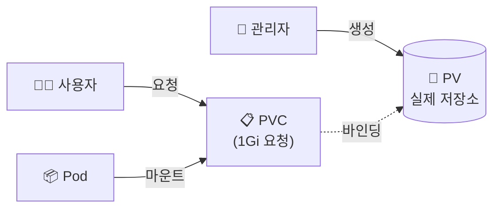

## 📌 들어가며

이번 글에서는 쿠버네티스의 **스토리지 볼륨(Volume)**을 정리한다. 파드의 컨테이너는 재시작되면 데이터가 사라지므로, **볼륨**으로 데이터를 지속 저장하고 공유한다. 임시 볼륨(emptyDir)부터 **PV/PVC**, 동적 할당(StorageClass), NFS까지 살펴본다.

> **왜 볼륨인가?** 컨테이너 파일시스템은 **일시적(ephemeral)**이라, 재시작하면 초기화된다. 데이터를 지키거나 컨테이너 간에 공유하려면 **볼륨**을 마운트해야 한다.

---

## 1. 볼륨 유형 개요

| 유형 | 수명 | 용도 |
|------|------|------|
| **emptyDir** | 파드와 함께(삭제 시 소멸) | 컨테이너 간 임시 공유 |
| **hostPath** | 노드에 종속 | 호스트 파일시스템 접근 |
| **PV / PVC** | 파드와 독립 | 영구 저장(핵심) |
| **StorageClass** | 동적 | PV 자동 생성 |

---

## 2. emptyDir — 임시 공유

파드 생성 시 빈 디렉터리가 생기고, **파드가 삭제되면 함께 사라진다.** 한 파드 내 여러 컨테이너가 데이터를 공유할 때 유용하다.

```yaml
apiVersion: v1
kind: Pod
metadata:
  name: temp-pod1
spec:
  volumes:
  - name: temp-vol
    emptyDir: {}
  containers:
  - name: container1
    image: ubuntu:14.04
    volumeMounts:
    - name: temp-vol
      mountPath: /mount1
  - name: container2
    image: ubuntu:14.04
    volumeMounts:
    - name: temp-vol
      mountPath: /mount2
```

두 컨테이너가 같은 `emptyDir`을 `/mount1`·`/mount2`에 마운트해 데이터를 공유한다.

---

## 3. hostPath — 노드 파일시스템

**호스트 노드의 경로**를 파드에 마운트한다.

```yaml
apiVersion: v1
kind: Pod
metadata:
  name: host-pod1
spec:
  containers:
  - name: container
    image: ubuntu:20.04
    volumeMounts:
    - name: host-path
      mountPath: /mnt/host
  volumes:
  - name: host-path
    hostPath:
      path: /data
      type: DirectoryOrCreate
```

> ⚠️ **hostPath는 노드에 종속적**이라, 파드가 다른 노드로 옮겨가면 데이터를 못 찾는다. 특정 노드의 파일에 접근해야 하는 특수한 경우에만 쓰고, 일반적인 영구 저장에는 PV/PVC를 쓰는 것이 안전하다.

---

## 4. PV & PVC — 영구 저장의 핵심

**PV(관리자가 제공하는 저장소) ↔ PVC(사용자의 요청)**로 저장소를 추상화한다. 사용자는 저장소 내부 구현을 몰라도 **PVC로 "1Gi 주세요"**라고 요청만 하면 된다.



```yaml
# PV — 관리자가 제공
apiVersion: v1
kind: PersistentVolume
metadata:
  name: pv1
spec:
  capacity:
    storage: 1Gi
  accessModes:
    - ReadWriteOnce
  persistentVolumeReclaimPolicy: Retain
  storageClassName: ""
  local:
    path: /mnt/data
---
# PVC — 사용자가 요청
apiVersion: v1
kind: PersistentVolumeClaim
metadata:
  name: pvc1
spec:
  accessModes:
    - ReadWriteOnce
  resources:
    requests:
      storage: 1Gi
  storageClassName: ""
```

```yaml
# 파드에서 PVC 사용
apiVersion: v1
kind: Pod
metadata:
  name: mypod
spec:
  containers:
  - name: myapp
    image: nginx
    volumeMounts:
    - name: mypvc
      mountPath: /usr/share/nginx/html
  volumes:
  - name: mypvc
    persistentVolumeClaim:
      claimName: pvc1
```

> 💡 **PV/PVC 분리의 이점** — 개발자(사용자)는 저장소가 EBS인지 NFS인지 몰라도 된다. **"얼마나 필요한지(PVC)"만 선언**하면, 관리자가 준비한 PV에 바인딩된다. 인프라와 애플리케이션의 관심사를 깔끔하게 분리하는 설계다.

---

## 5. StorageClass — 동적 할당

PV를 미리 만들어두지 않고, PVC 요청 시 **자동으로 PV를 생성**한다.

```yaml
apiVersion: storage.k8s.io/v1
kind: StorageClass
metadata:
  name: standard
provisioner: kubernetes.io/gce-pd
parameters:
  type: pd-standard
  replication-type: none
```

> 💡 **정적 vs 동적** — 정적은 관리자가 PV를 미리 만들어두는 방식, 동적은 StorageClass가 요청 시 즉석에서 만드는 방식이다. 클라우드(EBS·GCE PD)에서는 동적 할당이 표준이라, 관리자가 매번 PV를 만들 필요가 없다.

---

## 6. NFS — 여러 노드 공유

여러 노드가 **동시에 읽고 쓰는(`ReadWriteMany`)** 공유 스토리지가 필요하면 NFS를 쓴다.

```yaml
apiVersion: v1
kind: PersistentVolume
metadata:
  name: nfs-pv
spec:
  capacity:
    storage: 10Gi
  accessModes:
    - ReadWriteMany
  nfs:
    path: /data
    server: nfs-server.example.com
```

> 💡 **접근 모드 차이** — `ReadWriteOnce`(RWO)는 한 노드만, `ReadWriteMany`(RWX)는 여러 노드가 동시에 마운트할 수 있다. EBS는 RWO, NFS·EFS는 RWX를 지원한다. 여러 파드가 같은 파일을 공유해야 하면 RWX가 필요하다.

---

## 📝 정리

```
쿠버네티스 스토리지
├─ emptyDir   파드 수명 임시(컨테이너 간 공유)
├─ hostPath   노드 경로(노드 종속)
├─ PV/PVC     영구 저장(제공 vs 요청 분리)
├─ StorageClass 동적 PV 자동 생성
└─ NFS/RWX    여러 노드 동시 공유
```

| 개념 | 한 줄 정의 |
|------|------|
| **PV / PVC** | 저장소 제공 / 요청 |
| **StorageClass** | 동적 프로비저닝 |
| **RWO / RWX** | 단일 / 다중 노드 마운트 |

스토리지의 핵심은 **PV/PVC로 저장소를 추상화**하고, 클라우드에서는 **StorageClass로 동적 할당**하는 것이다. 사용자는 "얼마나 필요한지"만 선언하면 되도록 설계된 점이 쿠버네티스답다.
