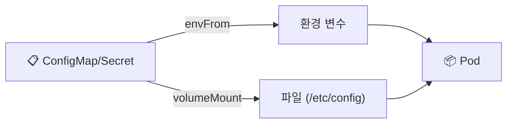

## 📌 들어가며

이번 글에서는 파드의 설정을 코드에서 분리하는 **ConfigMap**과 **Secret**을 정리한다. 환경별로 달라지는 설정값과 민감 정보를 애플리케이션 이미지에 박아 넣지 않고, 외부 오브젝트로 관리하는 방법이다.

> **왜 분리하나?** 설정값(DB URL 등)을 코드/이미지에 하드코딩하면, 환경(개발/운영)이 바뀔 때마다 이미지를 다시 빌드해야 한다. **ConfigMap(일반 설정) · Secret(민감 정보)**으로 분리하면, 같은 이미지에 설정만 갈아 끼울 수 있다.

---

## 1. ConfigMap vs Secret

| 구분 | **ConfigMap** | **Secret** |
|------|---------------|------------|
| 용도 | 일반 설정값 | **민감 정보**(비밀번호·토큰) |
| 저장 | 평문 | **base64 인코딩** |
| 예 | APP_ENV, DB_URL | username, password |

```yaml
# ConfigMap
apiVersion: v1
kind: ConfigMap
metadata:
  name: app-config
data:
  APP_ENV: production
  DATABASE_URL: postgres://user:password@db:5432/mydatabase
---
# Secret
apiVersion: v1
kind: Secret
metadata:
  name: db-secret
type: Opaque
data:
  username: dXNlcm5hbWU=   # base64("username")
  password: cGFzc3dvcmQ=   # base64("password")
```

> ⚠️ **Secret의 base64는 암호화가 아니다.** 그저 인코딩일 뿐이라 누구나 디코딩할 수 있다. 실무에서는 **etcd 암호화**·외부 비밀 관리(Vault·KMS)·RBAC로 접근 제한을 함께 적용해야 진짜 안전하다. 그래도 ConfigMap보다는 Secret에 민감 정보를 두는 것이 기본이다.

---

## 2. 사용 방법 — 환경 변수 vs 볼륨

ConfigMap·Secret은 파드에 **① 환경 변수(envFrom)** 또는 **② 파일(볼륨 마운트)**로 주입한다.



### 환경 변수로 주입

```yaml
apiVersion: v1
kind: Pod
metadata:
  name: config-secret-pod
spec:
  containers:
    - name: myapp-container
      image: nginx:1.25.3-alpine
      envFrom:
        - configMapRef:
            name: app-config
        - secretRef:
            name: db-secret
```

### 볼륨(파일)로 마운트

```yaml
# ConfigMap을 파일로: 각 키 = 파일명, 값 = 파일 내용
volumeMounts:
  - name: config-volume
    mountPath: /etc/config
volumes:
  - name: config-volume
    configMap:
      name: app-config
```

> 💡 **환경 변수 vs 파일** — 짧은 설정값은 환경 변수(`envFrom`)가 편하고, 설정 파일 전체(nginx.conf 등)나 인증서는 볼륨 마운트가 적합하다. 볼륨으로 마운트하면 **각 키가 파일 이름**, 값이 파일 내용이 된다.

---

## 3. 명령어로 생성 & 동적 반영

```bash
# ConfigMap 생성
kubectl create configmap app-config \
  --from-literal=APP_ENV=production \
  --from-literal=DATABASE_URL=postgres://user:password@db:5432/mydatabase

# Secret 생성
kubectl create secret generic db-secret \
  --from-literal=username=admin \
  --from-literal=password=secret123

# 수정 후 파드에 반영(재시작)
kubectl edit configmap app-config
kubectl rollout restart pod <pod-name>
```

> 💡 **환경 변수로 주입한 값은 파드 재시작이 필요**하다. ConfigMap을 수정해도 이미 뜬 파드의 환경 변수는 안 바뀌므로, `rollout restart`로 새로 띄워야 반영된다. (볼륨 마운트는 일정 시간 후 자동 갱신되기도 한다.)

---

## 4. Ambassador Pod 패턴

한 파드에 **프록시 컨테이너(Ambassador)**를 함께 두어, 앱 컨테이너가 외부 서비스(DB·API)에 접근하는 복잡성을 대신 처리하게 한다.

```yaml
apiVersion: v1
kind: Pod
metadata:
  name: ambassador-pod
spec:
  containers:
    - name: app-container
      image: nginx:1.25.3-alpine
    - name: ambassador-container
      image: nginx:1.25.3-alpine
```

> 💡 앱은 `localhost`의 Ambassador만 바라보고, Ambassador가 실제 외부 연결(주소·인증·재시도)을 처리한다. 앱 코드에서 외부 연결의 복잡함을 걷어내는 **사이드카 계열 패턴**이다.

---

## 📝 정리

```
ConfigMap & Secret
├─ 목적   설정을 코드/이미지에서 분리
├─ 구분   ConfigMap(평문) / Secret(base64·민감)
├─ 주입   envFrom(환경변수) / volume(파일)
└─ 반영   수정 후 rollout restart
```

| 개념 | 한 줄 정의 |
|------|------|
| **ConfigMap** | 일반 설정 저장 |
| **Secret** | 민감 정보(base64) |
| **envFrom/volume** | 환경변수/파일 주입 |

핵심은 **설정을 이미지 밖으로 빼내** 같은 이미지를 여러 환경에 재사용하는 것이다. 일반 설정은 ConfigMap, 민감 정보는 Secret에 두되, Secret의 base64는 암호화가 아님을 명심하고 추가 보호를 적용하자.
