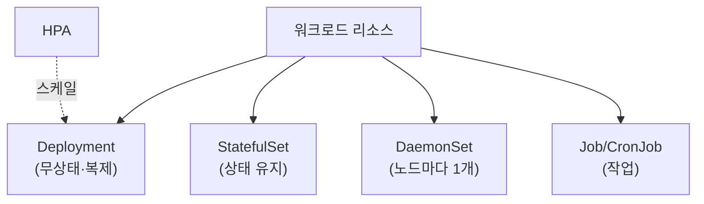

## 📌 들어가며

이번 글에서는 파드를 효율적으로 관리하는 **워크로드 리소스(Workload Resource)**를 정리한다. 파드를 직접 다루는 대신, 목적에 맞는 상위 리소스(**Deployment·StatefulSet·DaemonSet·Job·CronJob·HPA**)로 관리하는 것이 쿠버네티스의 방식이다.

> **왜 파드를 직접 안 만드나?** 파드는 죽으면 그걸로 끝이라, 직접 만들면 자동 복구·확장이 안 된다. 그래서 **워크로드 리소스로 파드를 "감싸서"** 관리한다. 각 리소스는 파드를 다루는 목적이 다르다.

---

## 0. 워크로드 리소스 한눈에

| 리소스 | 용도 |
|------|------|
| **Deployment** | 무상태 앱, 복제·롤링 업데이트 (가장 일반적) |
| **StatefulSet** | 상태 유지 앱(DB 등), 고유 ID·영구 스토리지 |
| **DaemonSet** | 모든 노드에 하나씩(로그·모니터링 에이전트) |
| **Job** | 일회성 작업(완료까지 실행) |
| **CronJob** | 예약·반복 작업 |
| **HPA** | 부하 기반 파드 수 자동 조절 |



---

## 1. Deployment — 가장 일반적

무상태 앱의 **복제·롤링 업데이트·롤백**을 담당한다.

```yaml
apiVersion: apps/v1
kind: Deployment
metadata:
  name: example-deployment
spec:
  replicas: 3
  selector:
    matchLabels:
      app: example-app
  template:
    metadata:
      labels:
        app: example-app
    spec:
      containers:
      - name: example-container
        image: nginx:1.21
        ports:
        - containerPort: 80
```

`nginx:1.21` 파드 **3개 복제본**을 유지한다. 하나가 죽으면 자동으로 다시 만든다.

> 💡 **롤링 업데이트**가 Deployment의 핵심 강점이다. 이미지를 새 버전으로 바꾸면, 기존 파드를 한 번에 다 내리지 않고 **하나씩 교체**해 무중단 배포가 된다. 문제가 생기면 `kubectl rollout undo`로 즉시 롤백할 수 있다.

---

## 2. StatefulSet — 상태 유지

DB처럼 **각 파드가 고유 정체성과 영구 스토리지**를 가져야 하는 앱에 쓴다.

```yaml
apiVersion: apps/v1
kind: StatefulSet
metadata:
  name: example-statefulset
spec:
  serviceName: "example-service"
  replicas: 3
  selector:
    matchLabels:
      app: example-app
  template:
    metadata:
      labels:
        app: example-app
    spec:
      containers:
      - name: example-container
        image: nginx:1.21
        ports:
        - containerPort: 80
  volumeClaimTemplates:
  - metadata:
      name: data
    spec:
      accessModes: ["ReadWriteOnce"]
      resources:
        requests:
          storage: 1Gi
```

| 특징 | 설명 |
|------|------|
| **고유 네트워크 ID** | `pod-0`, `pod-1`처럼 안정적 이름 |
| **영구 스토리지** | 재생성돼도 데이터 유지 |
| **순차 배포** | 정해진 순서로 생성·종료 |

> 💡 **Deployment는 파드가 다 똑같아도(무상태) 되지만, StatefulSet은 파드마다 정체성이 있다.** 예를 들어 DB 클러스터의 primary/replica처럼 순서와 개별 저장소가 중요할 때 StatefulSet을 쓴다.

---

## 3. DaemonSet — 노드마다 하나

로그 수집기·모니터링 에이전트처럼 **모든 노드에 하나씩** 떠야 하는 것에 쓴다.

```yaml
apiVersion: apps/v1
kind: DaemonSet
metadata:
  name: example-daemonset
spec:
  selector:
    matchLabels:
      app: example-app
  template:
    metadata:
      labels:
        app: example-app
    spec:
      containers:
      - name: example-container
        image: fluentd-elasticsearch:v2.5.2
        resources:
          limits:
            memory: 200Mi
          requests:
            cpu: 100m
            memory: 200Mi
```

노드가 **추가되면 자동으로** 해당 노드에도 파드가 배포된다.

---

## 4. Job & CronJob — 작업

**Job**은 완료가 목적인 일회성 작업, **CronJob**은 예약·반복 작업이다.

```yaml
# Job — 한 번 실행 후 완료
apiVersion: batch/v1
kind: Job
metadata:
  name: example-job
spec:
  template:
    spec:
      containers:
      - name: example-container
        image: busybox
        command: ["echo", "Hello, Kubernetes!"]
      restartPolicy: Never
```

```yaml
# CronJob — 매 1분마다 실행
apiVersion: batch/v1
kind: CronJob
metadata:
  name: example-cronjob
spec:
  schedule: "*/1 * * * *"
  jobTemplate:
    spec:
      template:
        spec:
          containers:
          - name: example-container
            image: busybox
            command: ["date"]
          restartPolicy: OnFailure
```

> 💡 일반 워크로드(Deployment 등)는 파드가 **계속 떠 있는 것**이 목표지만, Job은 **끝나는 것**이 목표다. 그래서 `restartPolicy`가 `Never`/`OnFailure`이고, 작업이 완료되면 파드가 종료 상태로 남는다.

---

## 5. HPA — 자동 스케일링

파드의 **CPU/메모리 사용량에 따라 파드 수를 자동 조절**한다.

```yaml
apiVersion: autoscaling/v1
kind: HorizontalPodAutoscaler
metadata:
  name: example-hpa
spec:
  scaleTargetRef:
    apiVersion: apps/v1
    kind: Deployment
    name: example-deployment
  minReplicas: 1
  maxReplicas: 10
  targetCPUUtilizationPercentage: 80
```

`example-deployment`의 CPU가 **80%를 넘으면 최대 10개까지** 파드를 자동 확장한다.

> ⚠️ HPA가 동작하려면 **metrics-server**가 설치되어 있어야 한다. HPA는 metrics-server가 수집한 CPU/메모리 지표를 보고 판단하므로, 이게 없으면 스케일링이 작동하지 않는다.

---

## 📝 정리

```
워크로드 리소스
├─ Deployment   무상태·복제·롤링 업데이트(기본)
├─ StatefulSet  상태 유지(고유 ID·영구 스토리지)
├─ DaemonSet    노드마다 1개(에이전트)
├─ Job/CronJob  일회성 / 예약 작업
└─ HPA          부하 기반 파드 수 자동 조절
```

| 리소스 | 한 줄 정의 |
|------|------|
| **Deployment** | 무상태 앱 관리(롤링) |
| **StatefulSet** | 상태 유지 앱 |
| **HPA** | 자동 수평 확장 |

워크로드 리소스의 핵심은 **파드를 직접 다루지 않고, 목적에 맞는 상위 리소스로 감싸 관리**하는 것이다. 무상태는 Deployment, 상태 유지는 StatefulSet, 에이전트는 DaemonSet, 작업은 Job — 이 매핑을 기억하면 된다.
