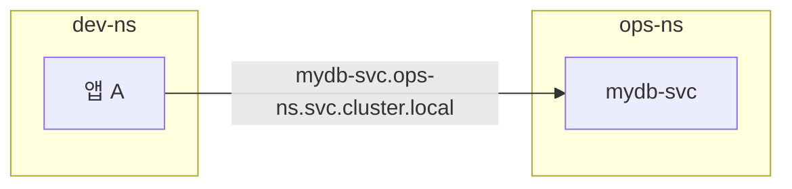

## 📌 들어가며

이번 글에서는 클러스터 리소스를 논리적으로 나누는 **네임스페이스(Namespace)**를 정리한다. 여러 팀·환경이 하나의 클러스터를 공유할 때, 네임스페이스로 리소스를 격리하고 **ResourceQuota·LimitRange**로 자원을 통제한다.

> **Namespace란?** 클러스터 내 리소스를 **논리적으로 분리하는 단위**. 하나의 물리 클러스터를 여러 가상 클러스터처럼 나눠, 개발/운영/테스트 환경이나 팀별로 격리해 관리할 수 있다.

---

## 1. 기본 네임스페이스 & 생성

| 기본 네임스페이스 | 용도 |
|------|------|
| **default** | 지정 안 하면 여기에 생성 |
| **kube-system** | 쿠버네티스 시스템 구성 요소 |
| **kube-public** | 모든 사용자가 읽는 리소스 |
| **kube-node-lease** | 노드 heartbeat 정보 |

```bash
kubectl create namespace dev-ns      # 생성
kubectl get namespaces               # 목록
kubectl get all -n dev-ns            # 특정 NS 리소스
```

---

## 2. 네임스페이스와 DNS

같은 네임스페이스면 **서비스 이름만**으로 통신하지만, 다른 네임스페이스면 **전체 도메인**을 써야 한다.

```
<service-name>.<namespace>.svc.cluster.local
```



> 💡 **같은 NS 안**에서는 `mydb-svc`처럼 짧게, **다른 NS**로는 `mydb-svc.dev.svc.cluster.local`처럼 길게 부른다. DNS 이름에 네임스페이스가 포함되므로, 이름만 봐도 어느 네임스페이스의 서비스인지 알 수 있다.

---

## 3. ResourceQuota — 네임스페이스 총량 제한

네임스페이스가 쓸 수 있는 **자원 총량**(CPU·메모리·파드 수 등)을 제한한다.

```yaml
apiVersion: v1
kind: ResourceQuota
metadata:
  name: rq-1
  namespace: dev-ns
spec:
  hard:
    requests.cpu: "1000m"     # 총 1 CPU
    requests.memory: "1Gi"    # 총 1GB
    limits.cpu: "2000m"       # 최대 2 CPU
    limits.memory: "2Gi"      # 최대 2GB
```

```bash
kubectl apply -f rq-1.yaml
kubectl describe resourcequotas -n dev-ns
```

---

## 4. LimitRange — 컨테이너 개별 제한

**개별 컨테이너/파드**의 최소·최대·기본 자원 값을 정한다.

```yaml
apiVersion: v1
kind: LimitRange
metadata:
  name: limitr-1
  namespace: dev-ns
spec:
  limits:
    - type: Container
      max:       {cpu: "1",    memory: "1Gi"}
      min:       {cpu: "100m", memory: "256Mi"}
      default:   {cpu: "500m", memory: "512Mi"}
      defaultRequest: {cpu: "200m", memory: "256Mi"}
```

> 💡 **ResourceQuota vs LimitRange** — ResourceQuota는 "**네임스페이스 전체가 쓸 수 있는 총량**"을, LimitRange는 "**컨테이너 하나가 쓸 수 있는 범위(및 기본값)**"를 정한다. 둘을 함께 쓰면, 한 컨테이너가 자원을 독점하는 것도, 네임스페이스가 클러스터를 잠식하는 것도 막을 수 있다.

---

## 5. 네임스페이스 전환 & 실습

매번 `-n`을 붙이기 번거로우면 기본 네임스페이스를 바꾼다.

```bash
kubectl config set-context --current --namespace=dev-ns   # 전환
kubectl config view --minify | grep namespace:            # 현재 확인
```

**네임스페이스 간 통신 실습:**

```bash
# 각 네임스페이스에 동일 이름 배포
kubectl create deployment nstest -n ops-ns --image=nginx --port=80 --replicas=2
kubectl expose deployment nstest --name=nstest-svc --port=80 -n ops-ns
kubectl create deployment nstest -n dev-ns --image=nginx --port=80 --replicas=2
kubectl expose deployment nstest --name=nstest-svc --port=80 -n dev-ns

# DNS로 네임스페이스 구분해 통신
curl http://nstest-svc.ops-ns.svc.cluster.local
curl http://nstest-svc.dev-ns.svc.cluster.local
```

같은 이름(`nstest-svc`)이라도 **네임스페이스가 다르면 별개의 서비스**로 동작함을 확인할 수 있다.

---

## 📝 정리

```
네임스페이스
├─ 개념   리소스 논리 분리(팀·환경별)
├─ 기본   default / kube-system / kube-public
├─ DNS    <svc>.<ns>.svc.cluster.local
├─ Quota  네임스페이스 총량 제한
└─ LimitRange 컨테이너 개별 범위·기본값
```

| 개념 | 한 줄 정의 |
|------|------|
| **Namespace** | 리소스 논리 격리 단위 |
| **ResourceQuota** | NS 전체 자원 총량 |
| **LimitRange** | 컨테이너 개별 자원 범위 |

네임스페이스의 핵심은 **하나의 클러스터를 여러 논리 공간으로 나눠 격리**하는 것이다. 여기에 ResourceQuota(총량)와 LimitRange(개별)를 더하면, 여러 팀이 자원을 두고 충돌하지 않고 클러스터를 공유할 수 있다.
