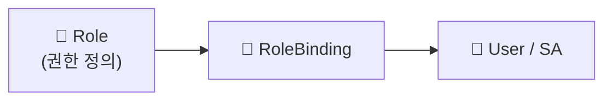

## 📌 들어가며

이번 글에서는 쿠버네티스의 **보안 3요소**를 정리한다. **RBAC**(누가 무엇을 할 수 있는가), **ServiceAccount**(파드의 신원), **NetworkPolicy**(파드 간 통신 통제)를 통해 클러스터와 애플리케이션을 보호한다.

> **보안의 두 축** — **RBAC**는 *"누가 어떤 리소스에 무슨 작업을 할 수 있는가"*(접근 제어)를, **NetworkPolicy**는 *"어떤 파드가 어떤 파드와 통신할 수 있는가"*(네트워크 제어)를 담당한다. 둘은 서로 다른 계층을 지킨다.

---

## 1. RBAC — Role & Binding

**RBAC(Role-Based Access Control)**는 **역할(Role/ClusterRole)**을 정의하고 **바인딩(RoleBinding/ClusterRoleBinding)**으로 사용자에게 부여한다.



| 오브젝트 | 범위 |
|------|------|
| **Role** / **RoleBinding** | 특정 **네임스페이스** |
| **ClusterRole** / **ClusterRoleBinding** | **클러스터 전체** |

### Role & RoleBinding (네임스페이스 범위)

```yaml
# Role — dev-ns에서 파드 조회 권한
apiVersion: rbac.authorization.k8s.io/v1
kind: Role
metadata:
  namespace: dev-ns
  name: pod-reader
rules:
- apiGroups: [""]
  resources: ["pods"]
  verbs: ["get", "list", "watch"]
---
# RoleBinding — dev-user에게 부여
apiVersion: rbac.authorization.k8s.io/v1
kind: RoleBinding
metadata:
  name: read-pods
  namespace: dev-ns
subjects:
- kind: User
  name: "dev-user"
  apiGroup: rbac.authorization.k8s.io
roleRef:
  kind: Role
  name: pod-reader
  apiGroup: rbac.authorization.k8s.io
```

### ClusterRole & ClusterRoleBinding (클러스터 범위)

```yaml
apiVersion: rbac.authorization.k8s.io/v1
kind: ClusterRole
metadata:
  name: cluster-admin-role
rules:
- apiGroups: [""]
  resources: ["pods"]
  verbs: ["get", "list", "watch", "delete"]
```

> 💡 **Role은 "권한의 정의", Binding은 "권한의 부여"**로 분리되어 있다. 이 분리 덕분에 하나의 Role을 여러 사용자에게 재사용할 수 있다. `verbs`(get/list/delete 등)와 `resources`(pods 등)의 조합으로 세밀하게 권한을 정한다.

---

## 2. ServiceAccount — 파드의 신원

**ServiceAccount(SA)**는 파드가 **API 서버와 상호작용할 때 쓰는 계정**이다. 사람이 아니라 **애플리케이션(파드)의 신원**이다.

```bash
kubectl create serviceaccount dev-sa -n dev-ns
```

```yaml
apiVersion: v1
kind: Pod
metadata:
  name: sa-pod
  namespace: dev-ns
spec:
  serviceAccountName: dev-sa      # 이 SA의 권한으로 API 접근
  containers:
  - name: nginx
    image: nginx
    ports:
    - containerPort: 80
```

> 💡 **User는 사람, ServiceAccount는 파드(앱)**의 계정이다. 파드가 API 서버에 요청할 때 SA의 권한을 따르므로, SA에 RBAC를 바인딩해 **파드가 할 수 있는 일을 제한**한다.

---

## 3. NetworkPolicy — 파드 통신 통제

**NetworkPolicy**는 파드 간·외부와의 트래픽을 제어한다.

```yaml
# 모든 트래픽 차단 (myapp 파드)
apiVersion: networking.k8s.io/v1
kind: NetworkPolicy
metadata:
  name: deny-all-traffic
  namespace: default
spec:
  podSelector:
    matchLabels:
      app: myapp
  policyTypes:
  - Ingress
  - Egress
  ingress: []
  egress: []
```

```yaml
# 특정 대역·포트만 허용
apiVersion: networking.k8s.io/v1
kind: NetworkPolicy
metadata:
  name: allow-specific-traffic
  namespace: default
spec:
  podSelector:
    matchLabels:
      app: myapp
  policyTypes:
  - Ingress
  ingress:
  - from:
    - ipBlock:
        cidr: 192.168.1.0/24
    ports:
    - protocol: TCP
      port: 80
```

> ⚠️ **NetworkPolicy는 CNI가 지원해야 동작한다.** Calico 같은 정책 지원 CNI가 없으면 정책을 만들어도 무시된다. 또 기본값은 "모두 허용"이라, 한 번이라도 정책이 붙은 파드는 **명시적으로 허용한 트래픽만** 통과시키는 화이트리스트 방식이 된다.

---

## 4. Dashboard 보안 구성 예시

Dashboard에 관리자 권한을 주려면 SA를 만들고 `cluster-admin`을 바인딩한다.

```yaml
apiVersion: v1
kind: ServiceAccount
metadata:
  name: admin-user
  namespace: kubernetes-dashboard
---
apiVersion: rbac.authorization.k8s.io/v1
kind: ClusterRoleBinding
metadata:
  name: admin-user
roleRef:
  apiGroup: rbac.authorization.k8s.io
  kind: ClusterRole
  name: cluster-admin
subjects:
- kind: ServiceAccount
  name: admin-user
  namespace: kubernetes-dashboard
```

> ⚠️ `cluster-admin`은 **모든 권한**을 가진 최강 역할이다. 편의상 Dashboard 실습에 쓰지만, 실무에서는 필요한 권한만 담은 **커스텀 ClusterRole**을 만들어 최소 권한 원칙을 지켜야 한다.

---

## 📝 정리

```
쿠버네티스 보안
├─ RBAC          Role(정의) + Binding(부여), NS/클러스터 범위
├─ ServiceAccount 파드의 신원(앱의 API 접근 권한)
├─ NetworkPolicy  파드 간 통신 화이트리스트(CNI 필요)
└─ 원칙          최소 권한(cluster-admin 남용 X)
```

| 개념 | 한 줄 정의 |
|------|------|
| **RBAC** | 누가·무엇을·할 수 있는가 |
| **ServiceAccount** | 파드(앱)의 계정 |
| **NetworkPolicy** | 파드 통신 방화벽 |

쿠버네티스 보안의 핵심은 **RBAC로 접근을, NetworkPolicy로 통신을 통제**하는 것이다. 파드에는 ServiceAccount로 신원을 부여하고, 모든 권한은 최소 권한 원칙으로 좁게 주는 것이 안전하다.
