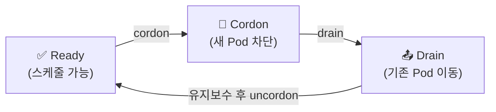

## 📌 들어가며

이번 글에서는 쿠버네티스 **노드(Node) 유지관리**를 정리한다. 노드는 애플리케이션(Pod)이 실제로 실행되는 물리·가상 서버로, 주기적인 유지보수가 필요하다. **Drain·Cordon·Uncordon**으로 노드를 안전하게 관리하고, 문제 해결과 버전 업그레이드까지 다룬다.

> **Node란?** 쿠버네티스에서 **Pod가 실제로 실행되는 워커 머신**(물리/가상). 유지보수·업그레이드 시 노드 위의 Pod를 안전하게 다른 노드로 옮기고 되돌리는 절차가 중요하다.

---

## 1. Cordon · Drain · Uncordon

노드를 유지보수할 때는 **① 새 Pod를 막고(Cordon) → ② 기존 Pod를 비우고(Drain) → ③ 작업 후 되돌린다(Uncordon)**.



| 명령 | 동작 |
|------|------|
| **cordon** | 노드를 **예약 불가**로(새 Pod 안 들어옴, 기존은 유지) |
| **drain** | 실행 중 Pod를 **다른 노드로 이동**(+ 자동 cordon) |
| **uncordon** | 예약 불가 해제(다시 스케줄 가능) |

```bash
kubectl cordon k8s-node1                                              # 새 Pod 차단
kubectl drain k8s-node1 --delete-emptydir-data --ignore-daemonsets --force  # Pod 비우기
kubectl uncordon k8s-node1                                            # 복귀
```

> 💡 **drain 옵션 해설** — `--ignore-daemonsets`는 노드마다 하나씩 떠야 하는 DaemonSet Pod는 옮기지 않고 무시하고, `--delete-emptydir-data`는 emptyDir 임시 데이터를 지운다. 이 옵션들이 없으면 drain이 거부되는 경우가 많다.

---

## 2. 노드 문제 해결 (NotReady)

노드가 `NotReady`가 되면 **상태 확인 → 상세 진단 → 로그 확인 → kubelet 재시작** 순으로 접근한다.

```bash
kubectl get no                       # ① 상태 확인 (NotReady?)
kubectl describe no k8s-node2        # ② 상세 원인(이벤트)
journalctl -u kubelet                # ③ kubelet 로그
sudo systemctl restart kubelet.service   # ④ kubelet 재시작
```

> ⚠️ 노드가 `NotReady`인 원인은 대부분 **kubelet**(노드 에이전트)에 있다. `describe`로 이벤트를 보고, `journalctl`로 kubelet 로그를 확인한 뒤 재시작하면 상당수가 해결된다. 네트워크·디스크 부족도 흔한 원인이다.

---

## 3. 클러스터 버전 업그레이드 (kubeadm)

보안 패치·신기능을 위해 주기적으로 업그레이드한다. **Control Plane 먼저 → kubelet/kubectl 나중**이 순서다.

```bash
# ① 계획 확인
kubeadm upgrade plan

# ② Control Plane 업그레이드
kubeadm upgrade apply v1.28.5

# ③ 모든 노드에서 kubelet/kubectl 업그레이드
apt-mark unhold kubeadm kubectl kubelet
apt install -y kubeadm=1.28.5-1.1 kubectl=1.28.5-1.1 kubelet=1.28.5-1.1
sudo systemctl restart kubelet.service

# ④ 상태 확인 (모두 Ready면 완료)
kubectl get no
```

> 💡 업그레이드 시 **노드 하나씩 drain → 업그레이드 → uncordon**을 반복하면, 서비스 중단 없이(rolling) 클러스터 전체를 올릴 수 있다. 앞서 배운 Cordon/Drain이 여기서 실전으로 쓰인다.

---

## 📝 정리

```
Node 유지관리
├─ Cordon    새 Pod 차단(기존 유지)
├─ Drain     Pod를 다른 노드로 이동
├─ Uncordon  예약 가능 복귀
├─ 문제해결   get→describe→journalctl→kubelet 재시작
└─ 업그레이드 kubeadm(Control Plane → kubelet/kubectl)
```

| 명령 | 역할 |
|------|------|
| `cordon`/`uncordon` | 예약 차단/해제 |
| `drain` | Pod 비우기(유지보수) |
| `kubeadm upgrade` | 버전 업그레이드 |

노드 관리의 핵심은 **Cordon → Drain → 유지보수 → Uncordon**의 안전한 순환이다. 이 절차를 노드마다 반복하면 무중단으로 업그레이드·유지보수를 수행할 수 있다.
